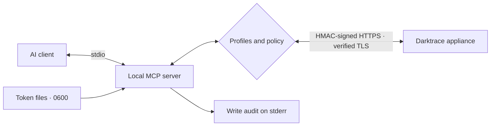
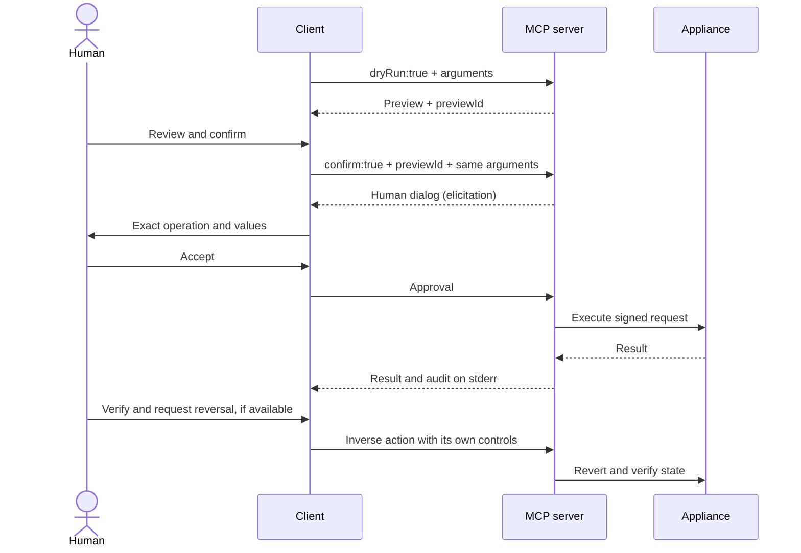
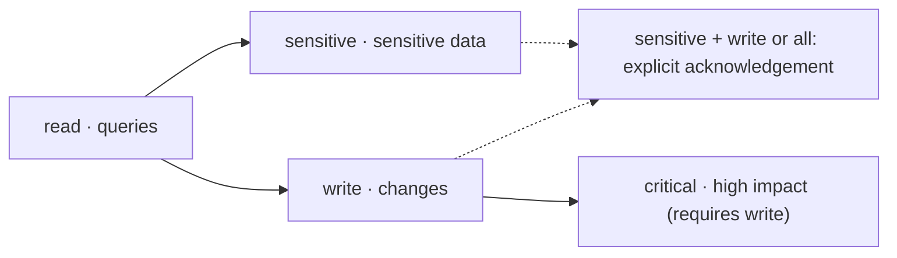

# Darktrace MCP

[Español](README.md) · **English**

<picture><source media="(max-width: 600px)" srcset="docs/assets/banner-variants/b/readme-banner-en-mobile.svg">
  </picture>

An unofficial Darktrace MCP server connecting the **Darktrace Threat Visualizer API** to Claude, Cursor, Codex and VS Code through **Model Context Protocol**. It helps your SOC with incident response: investigation, Antigena / RESPOND and still-unvalidated Darktrace/Email queries. It is not an official product and is not affiliated with Darktrace.

**Investigate in natural language, with explicit permissions and human approval for critical actions.**

[](LICENSE)
[](docs/en/getting-started.md)
[](docs/en/configuration.md#human-approval)
[](https://github.com/nuoframework/darktrace-mcp/actions/workflows/ci.yml)
[](https://www.bestpractices.dev/projects/15261)
[](https://scorecard.dev/viewer/?uri=github.com/nuoframework/darktrace-mcp)
[](docs/en/releases.md)
[](https://github.com/nuoframework/darktrace-mcp/releases)

[Get started](docs/en/getting-started.md) · [Tools](docs/en/tools.md) · [Configuration](docs/en/configuration.md) · [Security](docs/en/security.md) · [Troubleshooting](docs/en/troubleshooting.md)

## Install in one minute

1. **Prepare the connection.** Node.js 22+, `https://<your-appliance>` and two API tokens (public and private, from **System Config → Settings → API Token**).
2. **Run the wizard** and choose `read` to start:

   ```sh
   npx -y @nuoframework/darktrace-mcp@1.1.2 setup
   ```

3. **Restart your client** and ask: “Summarize model breaches from the last hour.”

[Installation guide](docs/en/install.md) · [Getting started](docs/en/getting-started.md) · [Troubleshooting](docs/en/troubleshooting.md). Windows: see [token-protection options](docs/en/getting-started.md#windows).

<details><summary>Choose your client: install commands and buttons</summary>

| Your client | Direct installation |
|---|---|
| Claude Desktop | Open the `.mcpb` from [release v1.1.2](https://github.com/nuoframework/darktrace-mcp/releases/tag/v1.1.2); tokens go to the keychain |
| Claude Code | `npx -y @nuoframework/darktrace-mcp@1.1.2 setup --client claude-code` |
| Codex (CLI and IDE) | `npx -y @nuoframework/darktrace-mcp@1.1.2 setup --client codex` |
| Cursor | `npx -y @nuoframework/darktrace-mcp@1.1.2 setup --client cursor` |
| VS Code | `npx -y @nuoframework/darktrace-mcp@1.1.2 setup --client vscode` |
| Windsurf | `npx -y @nuoframework/darktrace-mcp@1.1.2 setup --client windsurf` |
| OpenCode | `npx -y @nuoframework/darktrace-mcp@1.1.2 setup --client opencode` |
| Gemini CLI | `npx -y @nuoframework/darktrace-mcp@1.1.2 setup --client gemini` |
| Docker (any client) | `npx -y @nuoframework/darktrace-mcp@1.1.2 setup --runtime docker` |

[](docs/en/clients.md#claude-desktop) [](docs/en/clients.md#claude-code) [](docs/en/clients.md#codex) [](docs/en/clients.md#cursor) [](docs/en/clients.md#vs-code) [](docs/en/clients.md#windsurf) [](docs/en/clients.md#opencode) [](docs/en/clients.md#gemini-cli) [](docs/en/clients.md#docker)
<p align="left"><a href="cursor://anysphere.cursor-deeplink/mcp/install?name=darktrace&amp;config=eyJjb21tYW5kIjoibnB4IiwiYXJncyI6WyIteSIsIkBudW9mcmFtZXdvcmsvZGFya3RyYWNlLW1jcEAxLjEuMiJdLCJlbnYiOnsiREFSS1RSQUNFX1BST0ZJTEVTIjoicmVhZCJ9fQ%3D%3D"></a>
<a href="vscode:mcp/install?%7B%22name%22%3A%22darktrace%22%2C%22type%22%3A%22stdio%22%2C%22command%22%3A%22npx%22%2C%22args%22%3A%5B%22-y%22%2C%22%40nuoframework%2Fdarktrace-mcp%401.1.2%22%5D%2C%22env%22%3A%7B%22DARKTRACE_URL%22%3A%22%24%7Binput%3Adarktrace-url%7D%22%2C%22DARKTRACE_PUBLIC_TOKEN%22%3A%22%24%7Binput%3Adarktrace-public-token%7D%22%2C%22DARKTRACE_PRIVATE_TOKEN%22%3A%22%24%7Binput%3Adarktrace-private-token%7D%22%2C%22DARKTRACE_PROFILES%22%3A%22read%22%7D%2C%22inputs%22%3A%5B%7B%22type%22%3A%22promptString%22%2C%22id%22%3A%22darktrace-url%22%2C%22description%22%3A%22Darktrace%20appliance%20URL%20(https%3A%2F%2F...)%22%2C%22password%22%3Afalse%7D%2C%7B%22type%22%3A%22promptString%22%2C%22id%22%3A%22darktrace-public-token%22%2C%22description%22%3A%22Darktrace%20API%20public%20token%22%2C%22password%22%3Atrue%7D%2C%7B%22type%22%3A%22promptString%22%2C%22id%22%3A%22darktrace-private-token%22%2C%22description%22%3A%22Darktrace%20API%20private%20token%22%2C%22password%22%3Atrue%7D%5D%7D"></a>
<a href="vscode-insiders:mcp/install?%7B%22name%22%3A%22darktrace%22%2C%22type%22%3A%22stdio%22%2C%22command%22%3A%22npx%22%2C%22args%22%3A%5B%22-y%22%2C%22%40nuoframework%2Fdarktrace-mcp%401.1.2%22%5D%2C%22env%22%3A%7B%22DARKTRACE_URL%22%3A%22%24%7Binput%3Adarktrace-url%7D%22%2C%22DARKTRACE_PUBLIC_TOKEN%22%3A%22%24%7Binput%3Adarktrace-public-token%7D%22%2C%22DARKTRACE_PRIVATE_TOKEN%22%3A%22%24%7Binput%3Adarktrace-private-token%7D%22%2C%22DARKTRACE_PROFILES%22%3A%22read%22%7D%2C%22inputs%22%3A%5B%7B%22type%22%3A%22promptString%22%2C%22id%22%3A%22darktrace-url%22%2C%22description%22%3A%22Darktrace%20appliance%20URL%20(https%3A%2F%2F...)%22%2C%22password%22%3Afalse%7D%2C%7B%22type%22%3A%22promptString%22%2C%22id%22%3A%22darktrace-public-token%22%2C%22description%22%3A%22Darktrace%20API%20public%20token%22%2C%22password%22%3Atrue%7D%2C%7B%22type%22%3A%22promptString%22%2C%22id%22%3A%22darktrace-private-token%22%2C%22description%22%3A%22Darktrace%20API%20private%20token%22%2C%22password%22%3Atrue%7D%5D%7D"></a></p>

**Cursor:** adds the entry ([complete setup](docs/en/install.md#what-the-badge-does)). **VS Code / Insiders:** prompt for details.

</details>

To uninstall: `npx -y @nuoframework/darktrace-mcp@1.1.2 uninstall`. It shows the plan and asks for confirmation; `--dry-run` only displays it and `--docker` includes the pinned image.

## How it works



The server opens no ports. It pins one HTTPS destination, rejects proxies and redirects, and never exceeds token permissions. Results reach the client and its provider: review provider eligibility, data processing, retention and residency before production use.



A preview lasts **5 minutes** and can be used once. Declining, cancelling or being unable to display the dialog prevents execution. Reversal depends on the operation: **there is no automatic rollback**, comments cannot be deleted, and an unknown outcome requires checking the appliance before retrying.



This is a risk ladder, not automatic inheritance: choose comma-separated profiles. `critical` requires `write`; `all` or `sensitive` + `write` requires `DARKTRACE_ACKNOWLEDGE_SENSITIVE_WRITE=true`. There is no data isolation between sensitive reads and writes. [Profiles and approval](docs/en/configuration.md#profiles).

<details><summary>Three demos: connect, investigate and decline an action</summary>

Recordings use an HTTPS mock and synthetic data; they show the flow, not appliance validation. [Sources and transcripts](scripts/demo/README.md).

<p><br><strong>Connect once.</strong> The wizard verifies the connection and configures the client.</p>

<p><br><strong>Investigate.</strong> Query devices and model breaches and decide what to examine next.</p>

<p><br><strong>Stay in control.</strong> The demo declines the critical dialog; no write is sent.</p>

</details>

## What you can do

**50 tools · 77 executable operations**. By minimum profile: `read` 38, `sensitive` 18, `write` 16, `critical` 5. The [generated reference](docs/en/tools.md) details each operation, its limits and evidence.

| Area | Tools | Operations | Examples | Profiles | ✓ / ◐ / — |
|---|---:|---:|---|---|---:|
| [System and reference data](docs/en/tools.md#system-and-reference-data) | 5 | 6 | Health, network statistics, enums | `read` | 3 / 1 / 2 |
| [Devices](docs/en/tools.md#devices) | 9 | 9 | Search, connections, metrics, labels | `read`, `write` | 9 / 0 / 0 |
| [Model breaches](docs/en/tools.md#model-breaches) | 4 | 7 | Read, acknowledge, comment | `read`, `write` | 7 / 0 / 0 |
| [Models and metrics](docs/en/tools.md#models-and-metrics) | 3 | 6 | Model, component and metric definitions | `read` | 4 / 2 / 0 |
| [AI Analyst](docs/en/tools.md#ai-analyst) | 8 | 11 | Incidents, pinning, investigations | `read`, `write` | 11 / 0 / 0 |
| [Autonomous Response (Antigena)](docs/en/tools.md#autonomous-response-antigena) | 3 | 4 | List, activate, extend, clear | `read`, `critical` | 3 / 1 / 0 |
| [Tags](docs/en/tools.md#tags) | 3 | 10 | List, create, assign, remove, delete | `read`, `write`, `critical` | 7 / 0 / 3 |
| [Intel feed and subnets](docs/en/tools.md#intel-feed-and-subnets) | 4 | 4 | Watched Domains, subnet settings | `read`, `critical` | 2 / 2 / 0 |
| [Packet captures](docs/en/tools.md#packet-captures) | 3 | 3 | List, request, download | `read`, `sensitive`, `write` | 3 / 0 / 0 |
| [Advanced Search](docs/en/tools.md#advanced-search) | 1 | 4 | Queries, field analysis, graphs | `sensitive` | 4 / 0 / 0 |
| [Darktrace/Email](docs/en/tools.md#darktraceemail) | 7 | 13 | Dashboards, metadata, search, audit | `sensitive` | 0 / 0 / 13 |

**✓** full evidence · **◐** partial evidence · **—** unvalidated; the figures count operations. Each tool groups variants of the same API (for example, list and detail by ID), which is why there are fewer tools than operations.

## Validation status by area

**53 operations have full evidence, 6 partial evidence and 18 are unvalidated**. That is **59 with evidence**, not 59 fully validated. Campaigns used Darktrace **7.1.0**; they do not establish all argument combinations or other versions.

- **Devices, model breaches, AI Analyst, PCAP and Advanced Search:** evidence for the listed operations. PCAP returns complete Base64 only within the limit (about 45 KB); above it, only size and SHA-256 are returned.
- **System, models and metrics:** `models`, `components` and `enums` only with `responsedata`; CVEs returned 500 on the non-OT lab and `filtertypes` returned a rejected 302 redirect.
- **Response, intel feed and subnets:** partial parameter coverage; see the [1.1.1 campaign](docs/security/lab-gap-campaign-1.1.1.md).
- **Tags:** three deletions applied but returned 502: reported as `write_outcome_unknown`, not success.
- **Darktrace/Email in 1.1.1:** **14 inventoried operations: 13 reads available behind `sensitive` and one action excluded from every profile**. None is validated against a live appliance. All 13 `/agemail` API routes tested with tokens returned 403; later the service returned 503 with “Darktrace Labs” HTML, preventing validation. The console uses a separate host and session authentication; opening it does not prove API access. Email download returns size and SHA-256 only, never content.

Validating Email requires an enabled deployment, a token with **Email Logs** permissions, a reviewed and pinned instance OpenAPI schema, and tests of the 13 reads through MCP with lab data. The action additionally needs a restrictive schema, signing and effect/reversal evidence, and a new design review; releasing an email creates irreversible exposure. [403-blocked test](docs/security/lab-email-validation.md) · [Console-observed API and open work](docs/security/email-api-observed.md).

## Compatibility

Matrix of documented paths; it does not certify every client or OS version. **N**: Node with private token files; **D**: Docker; **W**: WSL. On native Windows the wizard cannot guarantee POSIX `0600` permissions. WSL runs the server and client in Linux; Windows clients need an explicit WSL launcher. The [full matrix](docs/en/install-matrix.md) documents 21 clients and separates the 13 adapters planned for 1.1.3. [Manual snippets](docs/en/clients.md).

| Client | macOS | Linux | Windows | Path |
|---|---|---|---|---|
| Claude Desktop | N / D | Not documented | `.mcpb` / D | Extension or `setup` |
| Claude Code / Codex | N / D | N / D | W / D | `setup` or plugin; Codex needs a separate connection |
| Cursor / VS Code | N / D | N / D | W / D | `setup` or install link |
| Windsurf / OpenCode | N / D | N / D | W / D | `setup` or JSON |
| Gemini CLI | N / D | N / D | W / D | `setup` or CLI |

| Component | Compatibility and evidence |
|---|---|
| Node.js | Minimum 22; documented CI on 22 and 24. Check OpenSSL as well as the Node version |
| Docker | Linux `amd64` and `arm64`; local stdio execution, no ports. Docker Desktop on macOS/Windows |
| Native Windows | POSIX token-file protection not guaranteed; `.mcpb` uses the keychain. Alternatives: Docker or WSL |
| WSL | Linux path; use Node and private files inside WSL |
| Darktrace | 7.1.0 labs; inventory based on Threat Visualizer API 6.1 and SDK. Other versions unvalidated |
| Signing | `compact` and `spaced` observed on 7.1.0. The wizard probes the alternative after 400; the server never switches silently |

| Client / capability | Server dialog | Alternative and limits |
|---|---|---|
| Claude Code 2.1.289 | Verified: protocol 2026-07-28, `input_required`, per-call form | Non-interactive: cancels; automatic rules weaken human involvement |
| Client with MCP 2025 and form capability | `elicitation/create` if declared at initialization | Verify the specific client version |
| Desktop, Codex, Cursor, VS Code, Windsurf, OpenCode, Gemini CLI | No individual approval test recorded here | Without support: `approval_unavailable`; `host` relies on per-tool permission |

Critical `host` mode requires `DARKTRACE_ACKNOWLEDGE_HOST_APPROVAL=true` and keeps preview and confirmation. It does not prove human involvement. [Configuration](docs/en/configuration.md#human-approval) · [Clients](docs/en/clients.md#claude-code) · [HTTP-client remediation notes](docs/security/client-remediation-notes.md).

## Security

Mandatory TLS, private tokens, startup profiles, input/output limits, no write retries and hash-chained auditing on stderr. Three consecutive failed or unknown writes block new writes until restart. Auditing does not cover sensitive reads and has no external anchor. No filter guarantees removal of every sensitive field or all prompt injection.

Dated evidence: [threat model](docs/security/threat-model-writes.md), [independent review](docs/security/design-review-writes.md), [adversarial rounds](docs/security/adversarial-results-writes.md), [lab campaigns](docs/security/final-lab-campaign-1.1.0.md) and [final gate](docs/security/final-gate-review-1.1.0.md). The [1.1.0 release pins](docs/security/release-pins-1.1.0.md) report 230 functional tests and 1,150 security subcases; macOS skips three for platform reasons. OpenSSF badges link to their results; they are not certification. [Overview and limits](docs/en/security.md) · [Audit index (Spanish)](docs/security/README.md).

## Versions and releases

npm package: **`@nuoframework/darktrace-mcp`**; the unscoped name is not this project. Tags `vX.Y.Z`, titles `Darktrace MCP vX.Y.Z`. [GitHub Releases](https://github.com/nuoframework/darktrace-mcp/releases) distributes `.tgz`, `.mcpb`, `SHA256SUMS`, SBOM and evidence; ghcr supplies both architectures. Pin the npm version and image digest, and verify checksums and provenance. [Channel status and procedure](docs/en/releases.md) · [Changelog](CHANGELOG.md).

## Use cases

### Investigate Darktrace model breaches with AI

Query alerts, comments and device context to prioritize a SOC investigation.
Start with `read` and the [tool reference](docs/en/tools.md#model-breaches).

### Isolate a device with Antigena from Claude with human approval

In Claude Code, preview an Antigena / RESPOND connection block; full device isolation is not validated.
Use `write,critical` and review [human approval](docs/en/configuration.md#human-approval).

### Query Darktrace Advanced Search in natural language

Ask your client to translate an investigation question into a bounded traffic query.
Enable `sensitive` and read the [Advanced Search limits](docs/en/tools.md#advanced-search).

### Automate AI Analyst triage

Summarize incidents and events for triage; adding comments requires `write`.
See the [AI Analyst operations](docs/en/tools.md#ai-analyst) and preview changes.

### Integrate Darktrace with Cursor, VS Code and Codex

Connect your client using the wizard or manual configuration with private token files and absolute paths.
Follow the [client guide](docs/en/clients.md) and distinguish 1.1.2 from upcoming 1.1.3 features.

### A secure local MCP server for SOC teams

Run over stdio, limit profiles and review which data reaches your client's provider.
Read the [security model and its limits](docs/en/security.md) before production use.

## Contributing, support and license

Read [CONTRIBUTING.md](CONTRIBUTING.md). For questions or bugs, open an [issue](https://github.com/nuoframework/darktrace-mcp/issues) with synthetic data. For vulnerabilities, use the [private channel](SECURITY.md). Licensed under [Apache-2.0](LICENSE).

Darktrace and its logo belong to Darktrace; their use identifies the integrated product and implies neither endorsement nor authorization. [Logo provenance](docs/assets/brand/darktrace/README.md). Trademark or removal requests: [contacto@pabloarrabal.com](mailto:contacto@pabloarrabal.com).

**Related:** [npm](https://www.npmjs.com/package/@nuoframework/darktrace-mcp) · [GHCR image](https://github.com/nuoframework/darktrace-mcp/pkgs/container/darktrace-mcp) · [MCP Registry](https://registry.modelcontextprotocol.io/) · [Official Darktrace API docs (portal access required)](https://customerportal.darktrace.com/guides/api-tokens).
