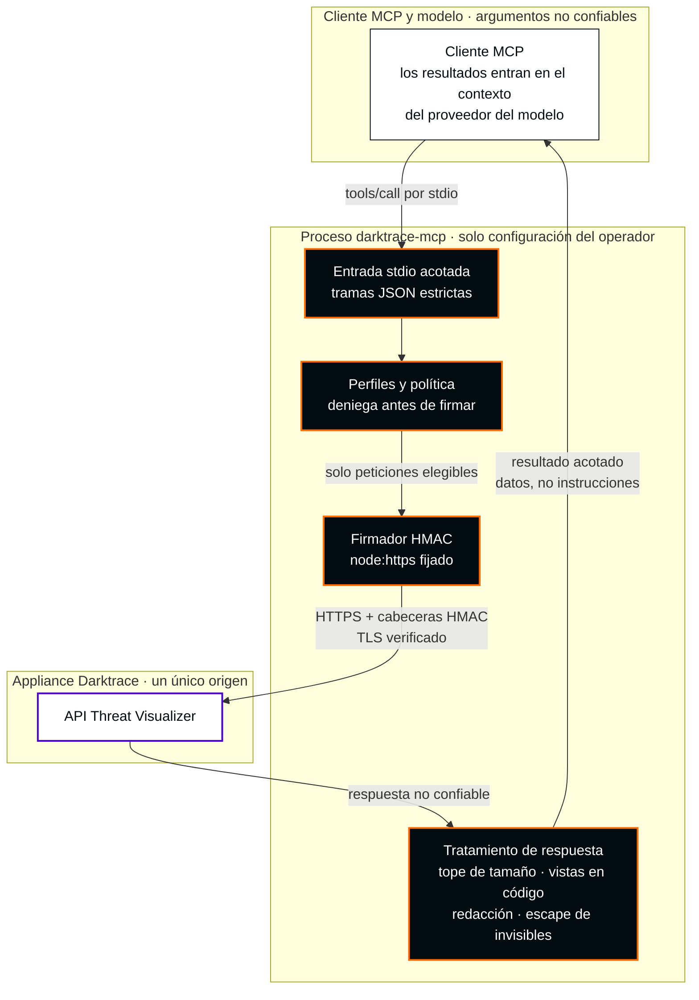

[English](README.md) · **Español**

<picture>
  <source media="(max-width: 600px)" srcset="docs/assets/readme-banner-es-mobile.svg">
  
</picture>

# Darktrace MCP

**MCP no oficial. Desarrollado por un tercero ajeno a Darktrace, sin afiliación ni autorización de Darktrace.**

**Herramientas de investigación acotadas para Darktrace en tu entorno MCP.**

<p>
  <a href="docs/architecture.md#91-baseline-stdio"></a>
  <a href="package.json"></a>
  <a href="LICENSE"></a>
  <a href="docs/docker.md"></a>
  <a href="docs/security/mcp-corrections-acceptance.md"></a>
</p>

[Empieza en cinco minutos](docs/es/getting-started.md) · [Configuración de clientes](docs/clients.md) · [Configuración](docs/configuration.md) · [Inicio rápido en inglés](docs/getting-started.md)

## Investigación con límites

Investiga dispositivos, infracciones de modelos e incidentes de analistas desde un cliente MCP, con un inventario fijo de operaciones, perfiles controlados por el operador y salida acotada. Es un **candidato de versión privado** de `nuoframework/darktrace-mcp`. No hay publicación en npm ni en un registro público, y no se ha verificado ningún despliegue de producción.

| Área | Candidato actual | Estado |
|---|---|---|
| Herramientas | **15 herramientas MCP / 19 selectores GET validados**, idénticos en `read` y `read` + `sensitiveRead` | [Correspondencia completa](#herramientas-de-esta-versión) |
| Cambios | No hay escrituras, operaciones críticas, email, exportación PCAP ni transporte HTTP | Las escrituras llegarán en una versión posterior con revisión propia |
| Runtime Docker | Alpine 3.24, **Node.js 24.18.1** mantenido por Alpine con **OpenSSL 3.5.9** compartido, en arm64 y amd64 | No root, sin shell, basado en `scratch`. [Guía Docker](docs/docker.md) |
| Pruebas | arm64: 130 funcionales + 325 de seguridad superadas, 0 omitidas. amd64: 130 funcionales superadas | El gate de seguridad de 325 pruebas en amd64 se ejecuta en CI nativa; su resultado consta en las notas de la versión |
| Escaneo de imagen | Trivy: 0 coincidencias. Grype: 1 High (zlib, CVE-2026-85091) + 1 Medium (`ada`, CVE-2024-9410) | Se conservan las coincidencias. Revisión independiente en arm64: la biblioteca zlib está afectada, pero su código `gz*` vulnerable no está en la ruta de ejecución de la aplicación; la coincidencia de `ada` es una colisión de nombre de producto. zlib **no está corregido** (aún sin paquete Alpine). Sin afirmación de cero CVE |
| Lab (Darktrace 7.1.0) | Imagen arm64 `sha256:8cd85604…`: **19/19 consultas reales superadas** el 2026-10-06, sin escrituras, limpieza verificada | El lab está cerrado. Las imágenes publicadas usan la misma implementación de consultas y políticas y las mismas dependencias; la única diferencia en el código de producción es el literal de versión. No se volvieron a probar en vivo. Recetas acotadas, no compatibilidad completa con la API. [Registro de lab](docs/security/patched-runtime-lab-checkpoint.md) |
| Versión | `1.0.0`, privada | Se publica como archivos de una GitHub Release privada solo tras superar la CI nativa y la aceptación de artefactos. Hashes y evidencia de CI en las notas de la versión. [Preparación](docs/stable-readiness.md) |

La lectura sensible no puede ampliar el límite. Advanced Search y todos los demás selectores excluidos, incluidas las escrituras, se rechazan antes de cualquier vista previa, auditoría o acceso de red. El [inventario de cobertura de 79 operaciones](src/coverage/report.generated.json) es contabilidad de diseño, no la superficie habilitada. Los resultados de lab son recetas acotadas y comprobaciones de forma de respuesta, no compatibilidad completa con la API.



Más detalle (en inglés): [perfiles y límites de confianza](docs/architecture.md#32-profiles-and-trust-boundaries) · [runtime Docker](docs/architecture.md#33-docker-runtime).

**Antes de cualquier despliegue:** los resultados del appliance pueden entrar en el contexto del cliente y del proveedor del modelo. Evalúa elegibilidad organizativa, procesamiento del proveedor, retención, residencia y reenvío del cliente para cada despliegue, incluso de solo lectura. La lectura sensible no amplía el límite validado ni certifica la elegibilidad del proveedor.

## Ejecutar con Docker (recomendado)

La imagen ejecuta el servidor por stdio como UID `1000`, sin shell, gestor de paquetes, listener ni puerto publicado. Su sistema de archivos raíz pertenece a root y se ejecuta en solo lectura, con todas las capacidades descartadas y `no-new-privileges`. Los tokens llegan solo como archivos montados en solo lectura. Se recomienda Docker porque incluye OpenSSL 3.5.9 parcheado; las releases oficiales de Node.js upstream examinadas el 2026-10-05 siguen incluyendo 3.5.8.

**Soporte del runtime, sin rodeos.** Node.js es aquí la compilación musl de Alpine, mantenida por la distribución, no un binario Tier 1 de Node.js upstream. Node.js 24 clasifica x64 musl como Experimental y no incluye arm64 musl. Las actualizaciones de seguridad dependen del mantenimiento de paquetes de Alpine. [Detalles](docs/docker.md#runtime-support).

**Opciones de instalación**

1. **Archivo de imagen en una GitHub Release privada (la vía más sencilla).** Descarga el archivo de tu arquitectura (`linux-arm64` o `linux-amd64`) y `SHA256SUMS`, verifica y carga. No hay imagen en un registro público ni se descarga nada de Docker Hub.

```sh
gh release download v1.0.0 --repo nuoframework/darktrace-mcp \
  --pattern 'darktrace-mcp-1.0.0-linux-arm64.tar.gz' --pattern SHA256SUMS
shasum -a 256 --ignore-missing -c SHA256SUMS
docker load --input darktrace-mcp-1.0.0-linux-arm64.tar.gz
docker image inspect --format '{{.Id}}' darktrace-mcp:1.0.0-arm64
```

   En amd64, sustituye `arm64` por `amd64` en el nombre del archivo y en la etiqueta `darktrace-mcp:1.0.0-amd64`. Compara el ID de imagen con el de las notas de la versión antes de configurar un cliente.
2. **Compilar desde el checkout revisado.** Descarga y verifica los paquetes Alpine fijados y compila para tu arquitectura (`arm64` o `amd64`):

```sh
node scripts/prepare-docker-runtime.mjs /absolute/private/darktrace-runtime arm64
docker buildx build --platform linux/arm64 \
  --build-context runtime-apks=/absolute/private/darktrace-runtime/arm64 \
  --load --tag darktrace-mcp:local .
docker image inspect --format '{{.Id}}' darktrace-mcp:local
```

El helper necesita Docker y HTTPS público. Autentica el índice firmado de paquetes de Alpine con las claves Alpine fijadas, comprueba el SHA-256 de los 22 paquetes, los SHA-512 de las fuentes upstream y los hashes de licencias, y no escribe nada en el checkout.

En el cliente MCP, configura `command` con la **ruta absoluta al ejecutable Docker del host** (localízala con `command -v docker` y usa la ruta completa; no dependas de `PATH` ni de un shell). Pasa los argumentos de Docker mediante `args`. Conserva `-i`, omite `-t` y añade `--log-driver=none` para que el daemon no persista el stdio del contenedor; esto no impide que el host MCP envíe resultados al proveedor. No guardes stdout MCP sin filtrar con `docker logs`. Este ejemplo usa el UID no root `1000` de la imagen; los dos archivos token montados deben pertenecer a ese UID dentro del contenedor y tener permisos `0600` o más restrictivos. Como alternativa, configura `--user` con un UID:GID no cero que coincida y haz que ese UID sea propietario de ambos archivos montados. Monta ambos tokens en modo de solo lectura; nunca incluyas sus valores en la configuración del cliente ni en un archivo de entorno.

```json
{
  "command": "/absolute/path/to/docker",
  "args": [
    "run", "--rm", "-i", "--init", "--pull=never", "--log-driver=none",
    "--read-only", "--cap-drop=ALL", "--security-opt=no-new-privileges",
    "--pids-limit=64", "--memory=256m", "--user", "1000:1000",
    "--mount", "type=bind,src=/absolute/private/darktrace/public-token,dst=/run/secrets/public-token,readonly",
    "--mount", "type=bind,src=/absolute/private/darktrace/private-token,dst=/run/secrets/private-token,readonly",
    "-e", "DARKTRACE_URL=https://darktrace.example.internal",
    "-e", "DARKTRACE_PUBLIC_TOKEN_FILE=/run/secrets/public-token",
    "-e", "DARKTRACE_PRIVATE_TOKEN_FILE=/run/secrets/private-token",
    "-e", "DARKTRACE_PROFILES=read",
    "-e", "DARKTRACE_SENSITIVE_READ=false",
    "REPLACE_WITH_IMAGE_ID_FROM_DOCKER_INSPECT"
  ]
}
```


## Instalar desde el código fuente en cinco minutos

Usa una cuenta autenticada de GitHub CLI con acceso al repositorio privado, Node.js 22+ y npm. Revisa el checkout y las versiones fijadas de dependencias antes de compilar.

> **OpenSSL del runtime.** Docker es la vía recomendada. Las releases oficiales de Node.js upstream examinadas el 2026-10-05 incluyen OpenSSL 3.5.8, afectado por CVE-2026-35189. Usar Node 22 o 24 **no** basta por sí solo para tener una instalación nativa parcheada. Para instalar en nativo, usa un runtime Node.js mantenido cuyo OpenSSL hayas verificado de forma independiente como **3.5.9 o posterior**, por ejemplo con `node -p 'process.versions.openssl'` y los registros de paquetes de tu distribución.

```sh
gh auth status
gh repo clone nuoframework/darktrace-mcp
cd darktrace-mcp
npm ci --ignore-scripts
npm run build
node dist/src/index.js --help
node dist/src/index.js --version
```

Provisiona **dos archivos token separados fuera del checkout** mediante el proceso aprobado de gestión de secretos: uno para el token público de API y otro para el privado. Usa rutas absolutas, propietario igual al usuario de ejecución actual, archivos regulares, un máximo de 4.096 bytes y permisos `0600` o más restrictivos. Sin enlaces simbólicos. No pegues tokens en comandos, JSON del cliente, control de versiones ni chat.

```sh
export DARKTRACE_URL='https://darktrace.example.internal'
export DARKTRACE_PUBLIC_TOKEN_FILE='/absolute/private/darktrace/public-token'
export DARKTRACE_PRIVATE_TOKEN_FILE='/absolute/private/darktrace/private-token'
export DARKTRACE_PROFILES='read'
export DARKTRACE_SENSITIVE_READ='false'
node dist/src/index.js --check-config
```

`--check-config` valida localmente sin contactar con el appliance. No valida autenticación, conectividad ni compatibilidad 7.1. Configura tu [cliente MCP](docs/clients.md) con las **rutas absolutas del ejecutable Node y del punto de entrada compilado**. El arranque normal (`node /absolute/checkout/dist/src/index.js`) habla MCP por stdin/stdout; el cliente lo lanza.

## Prerelease privada anterior

La [prerelease privada v0.1.0-alpha.0](https://github.com/nuoframework/darktrace-mcp/releases/tag/v0.1.0-alpha.0) es histórica: es anterior al contrato de 15 herramientas y al runtime parcheado. [Versiones](docs/releases.md) explica la descarga, la verificación de `SHA256SUMS` y `npm install --ignore-scripts --omit=dev`.

## Herramientas de esta versión

Las 15 herramientas son de solo lectura, idempotentes y no destructivas, y aparecen igual en ambos perfiles.

| Herramienta MCP | Selectores GET validados |
|---|---|
| `darktrace_get_status` | `get_status` |
| `darktrace_get_devices` | `get_devices` |
| `darktrace_list_subnets` | `get_subnets` |
| `darktrace_get_ai_analyst_stats` | `get_aianalyst_stats` |
| `darktrace_get_intel_feed` | `get_intelfeed` |
| `darktrace_list_model_breaches` | `get_modelbreaches` |
| `darktrace_search_devices` | `get_devicesearch` |
| `darktrace_get_similar_devices` | `get_similardevices` |
| `darktrace_list_ai_analyst_incidents` | `get_aianalyst_groups`, `get_aianalyst_incidentevents` |
| `darktrace_list_ai_analyst_investigations` | `get_aianalyst_investigations` |
| `darktrace_get_model_breach_comments` | `get_mbcomments` |
| `darktrace_get_connection_details` | `get_details` |
| `darktrace_list_tags` | `get_tags_entities`, `get_tags_tid`, `get_tags_tid_entities` |
| `darktrace_get_endpoint_details` | `get_endpointdetails` |
| `darktrace_list_antigena_actions` | `get_antigena`, `get_antigena_summary` |

## Operar con decisiones explícitas

La aprobación del modelo o del cliente **no es autorización**; las ACL del token en el appliance siguen siendo la autoridad. La firma usa un único modo configurado explícitamente, sin alternativa ante errores de autenticación. La verificación TLS es obligatoria; usa `NODE_EXTRA_CA_CERTS` para una CA privada aprobada. Si una versión posterior revisada habilita escrituras, trata un timeout o una desconexión como resultado **desconocido** y revisa el estado del appliance antes de actuar; nunca repitas solicitudes POST/DELETE.

## Documentación

Salvo el inicio rápido en español, las guías enlazadas están en inglés.

| Guía | Propósito |
|---|---|
| [Inicio rápido en español](docs/es/getting-started.md) · [Getting started](docs/getting-started.md) | Credenciales, comprobaciones locales y artefactos privados verificados |
| [Configuración](docs/configuration.md) | Entorno, perfiles y límites máximos |
| [Clientes](docs/clients.md) | Claude Code/Desktop, VS Code y Codex |
| [Resolución de problemas](docs/troubleshooting.md) | Arranque, TLS, herramientas ocultas y resultados desconocidos |
| [Arquitectura](docs/architecture.md) · [Contrato API](docs/api-contract.md) | Diagramas, herramientas por perfil, diseño y evidencia fuente de 6.1 |
| [Modelo de amenazas](docs/security/threat-model.md) · [Decisiones de diseño](docs/security/design-decisions.md) | Supuestos de seguridad y condiciones pendientes |
| [Política de seguridad](SECURITY.md) · [Contribuir](CONTRIBUTING.md) | Comunicación privada de problemas y desarrollo |
| [Changelog](CHANGELOG.md) | Cambios por versión |
| [Releases](docs/releases.md) · [Preparación de release](docs/release-preparation.md) | Artefactos privados versionados, SBOM y evidencia actual de verificación |

## Empaquetado privado

`private:true` impide la publicación npm. Las GitHub Releases privadas versionadas distribuyen el tarball verificado; sigue disponible la instalación desde el código fuente. El artefacto empaquetado incluye runtime compilado, npm shrinkwrap, README, licencia y política de seguridad. Excluye código fuente TypeScript, tests, scripts de desarrollo, fuentes de documentación y secretos. Consulta el [procedimiento de artefactos](docs/getting-started.md#optional-verified-local-artifact). La integridad de dependencias y las comprobaciones de empaquetado son evidencia sobre el artefacto, no prueba de que el código de las dependencias sea benigno.

CI configura comprobaciones Node 22/24, el harness de seguridad aislado existente y empaquetado verificado. Un workflow manual de solo lectura prepara artefactos candidatos; el propietario publica una prerelease privada de GitHub después de revisarla. No se realiza publicación npm/contenedor ni attestation de artefactos. Consulta [releases](docs/releases.md) para requisitos de protección y límites de la evidencia.

Licencia [Apache-2.0](LICENSE). Este proyecto no está afiliado a Darktrace ni cuenta con su respaldo.

## Límites de salida y destino

La salida de runtime usa vistas conservadoras definidas en código, con hasta ocho campos principales seleccionados. `minimized:true` y `unmodeledFieldsOmitted:true` describen la proyección, sin demostrar que se hayan eliminado todos los datos sensibles arbitrarios anidados. Los objetos desconocidos y mapas se resumen. Se ocultan los valores secretos conocidos y las codificaciones soportadas de un paso; las codificaciones transformadas arbitrariamente quedan fuera de esa garantía. El cliente MCP/proveedor del modelo todavía puede recibir información sensible en los campos retenidos.

El conector HTTPS fija una instantánea DNS de arranque aprobada. Las direcciones de los rangos NAT64 estándar (`64:ff9b::/96`, `64:ff9b:1::/48`), 6to4 (`2002::/16`) y Teredo (`2001::/32`) siempre se bloquean, incluidas traducciones que aparentan apuntar a IPv4 pública. Una respuesta DNS prohibida provoca un fallo terminal del conector hasta que se reinicie el proceso del servidor; corregir DNS no reactiva el conector en ejecución. Los prefijos NAT64 propios del operador no pueden detectarse genéricamente; siguen siendo necesarias allowlists exactas de destino y revisión de la red de despliegue. Este comportamiento de cierre ante fallo puede exigir cambiar el diseño DNS/red del despliegue. Las comprobaciones nativas/Docker acotadas del coordinador validan solo sus selectores y snapshots registrados; el comportamiento más amplio de red privada y appliance sigue sin validar.

## Marcas, logotipo y contacto

**MCP no oficial. Desarrollado por un tercero ajeno a Darktrace, sin afiliación ni autorización de Darktrace.** El nombre y el logotipo de Darktrace pertenecen a Darktrace. La portada muestra el [logotipo oficial sin modificar](docs/assets/brand/darktrace/Darktrace-white.svg) del [paquete público de logotipos del Brand Hub](https://brandhub.darktrace.com/visual-identity/logo), almacenado localmente con [procedencia registrada](docs/assets/brand/darktrace/README.md) y colocado según las reglas publicadas de color único, espacio de protección y tamaño mínimo. Identifica el producto con el que se integra este proyecto independiente. **El uso del logotipo no implica autorización ni carácter oficial.** Referencias de diseño y comparación: [identidad visual](docs/visual-identity.md) (en inglés).

Reclamaciones, quejas y reivindicaciones sobre marcas o uso de la imagen corporativa, incluidas solicitudes del titular de la marca para retirar el logotipo: [contacto@pabloarrabal.com](mailto:contacto@pabloarrabal.com). Esta dirección es solo para esas reclamaciones; no es el canal de comunicación de vulnerabilidades descrito en la [política de seguridad](SECURITY.md). Este proyecto nunca envía correo por sí mismo.
