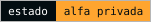
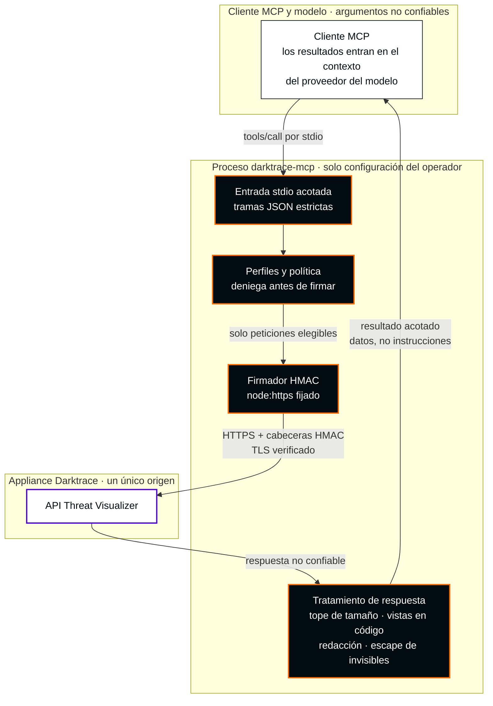

[English](README.md) · **Español**

<picture>
  <source media="(max-width: 600px)" srcset="docs/assets/readme-banner-es-mobile.svg">
  
</picture>

# Darktrace MCP

**MCP no oficial. Desarrollado por un tercero ajeno a Darktrace, sin afiliación ni autorización de Darktrace.**

**Herramientas de investigación acotadas para Darktrace en tu entorno MCP.**

<p>
  <a href="docs/architecture.md#91-baseline-stdio"></a>
  <a href="package.json"></a>
  <a href="LICENSE"></a>
  <a href="docs/docker.md"></a>
  <a href="docs/security/mcp-corrections-acceptance.md"></a>
  <a href="docs/stable-readiness.md"></a>
</p>

[Empieza en cinco minutos](docs/es/getting-started.md) · [Configuración de clientes](docs/clients.md) · [Configuración](docs/configuration.md) · [Inicio rápido en inglés](docs/getting-started.md)

## Investigación con límites

Investiga dispositivos, infracciones de modelos e incidentes de analistas desde un cliente MCP, con un inventario fijo de operaciones, perfiles controlados por el operador y salida acotada. Esta es una **alpha privada con evidencia de laboratorio acotada a 19 selectores** para `nuoframework/darktrace-mcp`. No hay publicación npm, imagen pública ni despliegue de producción verificado.

| Capacidad | Comportamiento de la base | Evidencia/estado |
|---|---|---|
| Investigación | 19 selectores GET validados / 15 herramientas MCP aplicados en ambos perfiles | Fuente y contrato completo fijado aceptados de forma independiente; Advanced Search aplazado |
| Cambios | La política inmutable de primera versión estable deniega todas las capacidades no de lectura | No hay ejecución ni vista previa de escrituras; se aplazan a una versión posterior |
| Operaciones críticas | No disponibles en esta versión | Sin campo `confirm` ni mecanismo para eludir la política |
| Email, exportación PCAP, HTTP | No disponibles; se rechaza su habilitación en configuración | Requieren una revisión de diseño futura y separada |
| Cobertura | Catálogo de diseño de **79 operaciones**; **19 GET / 15 herramientas** habilitados | El catálogo no describe las herramientas habilitadas |
| Compatibilidad | Darktrace **7.1.0: 19/19 selectores PASS nativos y Docker** | Solo recetas acotadas; no compatibilidad completa de API. [Evidencia](docs/security/validated-consultations-lab-checkpoint.md) |
| Seguridad | Aceptación independiente de fuente; revisión de migración y suites/paquete finales pendientes | **Bloqueo OpenSSL 3.5.8; Grype informa 11 High** en componentes OS sin cambios; sin publicación estable |

El [inventario de cobertura](src/coverage/report.generated.json) conserva el catálogo de diseño de 79 operaciones; no define la elegibilidad de esta versión. El candidato aceptado de forma independiente aplica **19 selectores GET validados en 15 herramientas MCP**. `read` y `read` + `sensitiveRead` exponen el mismo contrato completo; la lectura sensible no puede ampliar este límite. Advanced Search y todos los demás selectores excluidos, incluidas las escrituras, se rechazan antes de cualquier vista previa, auditoría o acceso de red. [Herramientas actuales](docs/architecture.md#11-current-implementation-snapshot).

**Estado actual (2026-10-06 Europe/Madrid; evidencia del 5 de octubre UTC):** la fuente aceptada `9e7c7070…` supera los **19 selectores GET permitidos distintos en MCP nativo y Docker endurecido** sobre lab 7.1.0. Son recetas acotadas y comprobaciones de forma de respuesta, no todas las combinaciones de parámetros, variantes con recursos no vacíos ni compatibilidad completa de la API. Se eliminó el volumen secreto exacto de la campaña y se verificó su ausencia de forma independiente. Los rechazos anteriores por falta de identificadores y los fallos de permisos siguen siendo evidencia histórica. [Recibos de lab vinculados](docs/security/validated-consultations-lab-checkpoint.md).

La fuente y el contrato completo cuentan con aceptación independiente; la aceptación de helpers es acotada y la revisión final de migración de pruebas sigue siendo un gate separado. **Aún no se acredita la finalización de la suite del candidato**; el preflight reproducible del paquete debe consumir los bytes finales de documentación. **La publicación estable sigue bloqueada por OpenSSL 3.5.8 / CVE-2026-35189** y los gates finales pendientes. No se ha creado versión ni etiqueta estable. [Preparación](docs/stable-readiness.md).



Más detalle (en inglés): [perfiles y límites de confianza](docs/architecture.md#32-profiles-and-trust-boundaries) · [runtime Docker](docs/architecture.md#33-docker-runtime).

**Antes de cualquier despliegue:** los resultados del appliance pueden entrar en el contexto del cliente y del proveedor del modelo. Evalúa elegibilidad organizativa, procesamiento del proveedor, retención, residencia y reenvío del cliente para cada despliegue, incluso de solo lectura. La lectura sensible no amplía el límite validado ni certifica la elegibilidad del proveedor.

## Instalar una prerelease privada versionada

Descarga la [prerelease privada publicada v0.1.0-alpha.0](https://github.com/nuoframework/darktrace-mcp/releases/tag/v0.1.0-alpha.0). Sigue la guía de [GitHub Releases versionadas](docs/releases.md) para descargar el `.tgz` revisado y `SHA256SUMS`, verificar los checksums e instalar con `npm install --ignore-scripts --omit=dev`. Esa alpha se publicó antes de los cambios actuales de Docker. La release incluye un SBOM de runtime verificable; esa alpha histórica no acredita la compatibilidad 7.1 actual, y la elegibilidad del proveedor y los requisitos de versión estable son independientes.

## Instalar desde el código fuente en cinco minutos

Usa una cuenta autenticada de GitHub CLI con acceso al repositorio privado, Node.js 22+ y npm. Revisa el checkout y las versiones fijadas de dependencias antes de compilar.

```sh
gh auth status
gh repo clone nuoframework/darktrace-mcp
cd darktrace-mcp
npm ci --ignore-scripts
npm run build
node dist/src/index.js --help
node dist/src/index.js --version
```

Provisiona **dos archivos token separados fuera del checkout** mediante el proceso aprobado de gestión de secretos: uno para el token público de API y otro para el privado. Usa rutas absolutas, propietario igual al usuario de ejecución actual, archivos regulares, un máximo de 4.096 bytes y permisos `0600` o más restrictivos. Sin enlaces simbólicos. No pegues tokens en comandos, JSON del cliente, control de versiones ni chat.

```sh
export DARKTRACE_URL='https://darktrace.example.internal'
export DARKTRACE_PUBLIC_TOKEN_FILE='/absolute/private/darktrace/public-token'
export DARKTRACE_PRIVATE_TOKEN_FILE='/absolute/private/darktrace/private-token'
export DARKTRACE_PROFILES='read'
export DARKTRACE_SENSITIVE_READ='false'
node dist/src/index.js --check-config
```

`--check-config` valida localmente sin contactar con el appliance. No valida autenticación, conectividad ni compatibilidad 7.1. Configura tu [cliente MCP](docs/clients.md) con las **rutas absolutas del ejecutable Node y del punto de entrada compilado**. El arranque normal (`node /absolute/checkout/dist/src/index.js`) habla MCP por stdin/stdout; el cliente lo lanza.

## Ejecutar la imagen Docker privada local

Docker es una alternativa opcional a la [instalación desde código](#instalar-desde-el-código-fuente-en-cinco-minutos). Compila desde el checkout revisado; `darktrace-mcp:local` es una etiqueta privada local. Usa el ID exacto inspeccionado con `--pull=never`. La fuente aceptada `9e7c7070…` produjo `sha256:eb3a7681…`: ambos perfiles SDK de 15 herramientas coinciden con el contrato completo fijado y los 19 selectores GET permitidos superaron recetas acotadas de lab por MCP inicializado. [Guía Docker](docs/docker.md) · [Vínculo exacto imagen/runtime](docs/security/validated-consultations-docker-checkpoint.md).

Los escaneos históricos de la imagen anterior `dc9b8f14…` registran las mismas 31 coincidencias en paquetes Debian: Trivy 0.74.0 clasifica 23 MEDIUM y 8 LOW; Grype 0.118.0 clasifica 11 HIGH, 10 MEDIUM, 3 LOW y 7 NEGLIGIBLE, sin corrección indicada por ninguno. La imagen final aceptada conserva esos componentes con igualdad de bytes verificada de forma independiente; no es un escaneo con una base de datos nueva. Su SBOM omite Node y sus bibliotecas incluidas, inventariadas por separado. OpenSSL 3.5.8 incluido está afectado por **CVE-2026-35189 (severidad oficial Low)** durante el procesamiento de certificados TLS; 3.5.9 lo corrige. A 5 de octubre, ninguna release oficial soportada de Node 22/24/26 examinada incluía ese fix. El problema aplicable bloquea la publicación estable pese a las comprobaciones funcionales aprobadas; no es una imagen con cero CVE. [Aviso primario OpenSSL](https://openssl-library.org/news/secadv/20260929.txt). La imagen stdio no tiene listener; no publiques puertos. [Límites del runtime](docs/architecture.md#33-docker-runtime).

```sh
docker build --pull -t darktrace-mcp:local .
docker image inspect --format '{{.Id}}' darktrace-mcp:local
```

En el cliente MCP, configura `command` con la **ruta absoluta al ejecutable Docker del host** (localízala con `command -v docker` y usa la ruta completa; no dependas de `PATH` ni de un shell). Pasa los argumentos de Docker mediante `args`. Conserva `-i`, omite `-t` y añade `--log-driver=none` para que el daemon no persista el stdio del contenedor; esto no impide que el host MCP envíe resultados al proveedor. No guardes stdout MCP sin filtrar con `docker logs`. Este ejemplo usa el UID no root `1000` de la imagen; los dos archivos token montados deben pertenecer a ese UID dentro del contenedor y tener permisos `0600` o más restrictivos. Como alternativa, configura `--user` con un UID:GID no cero que coincida y haz que ese UID sea propietario de ambos archivos montados. Monta ambos tokens en modo de solo lectura; nunca incluyas sus valores en la configuración del cliente ni en un archivo de entorno.

```json
{
  "command": "/absolute/path/to/docker",
  "args": [
    "run", "--rm", "-i", "--init", "--pull=never", "--log-driver=none",
    "--read-only", "--cap-drop=ALL", "--security-opt=no-new-privileges",
    "--pids-limit=64", "--memory=256m", "--user", "1000:1000",
    "--mount", "type=bind,src=/absolute/private/darktrace/public-token,dst=/run/secrets/public-token,readonly",
    "--mount", "type=bind,src=/absolute/private/darktrace/private-token,dst=/run/secrets/private-token,readonly",
    "-e", "DARKTRACE_URL=https://darktrace.example.internal",
    "-e", "DARKTRACE_PUBLIC_TOKEN_FILE=/run/secrets/public-token",
    "-e", "DARKTRACE_PRIVATE_TOKEN_FILE=/run/secrets/private-token",
    "-e", "DARKTRACE_PROFILES=read",
    "-e", "DARKTRACE_SENSITIVE_READ=false",
    "REPLACE_WITH_IMAGE_ID_FROM_DOCKER_INSPECT"
  ]
}
```

Sustituye el marcador por el ID exacto `sha256:...` obtenido arriba. Usa rutas absolutas del host para montar los tokens. No añadas `-p`/`--publish`; esta imagen stdio no tiene listener. El sistema de archivos raíz de solo lectura, las capacidades descartadas, `no-new-privileges` y `--log-driver=none` forman parte de las restricciones de ejecución del ejemplo. El registro del daemon no controla el reenvío del host MCP/proveedor. Comprueba la traducción de UID y permisos de archivos de Docker Desktop en el host; no relajes los permisos de los tokens para resolver una discrepancia. Prefiere un perfil MCP de usuario; revisa todos los comandos, argumentos, valores de entorno y preloads del host antes de habilitar configuración compartida del proyecto. Cuando sea posible, usa un perfil de host MCP o una cuenta del sistema operativo dedicada para este servidor. Antes de compartir un proceso del host, revisa los comandos, el entorno y los montajes de los demás servidores MCP configurados; todos se ejecutan con los privilegios del host. La imagen de runtime incluye la licencia `LICENSE` del proyecto, la licencia de Node.js, los archivos de licencia distribuidos con sus dependencias de producción y los archivos de copyright de los paquetes Debian; revísalas antes de usarla. Consulta la [guía de Docker](docs/docker.md) para verificar la imagen local y las transferencias privadas.

## Operar con decisiones explícitas

El candidato aceptado de forma independiente aplica **19 selectores GET validados en 15 herramientas MCP**. `read` y `read` + `sensitiveRead` exponen el mismo contrato completo; la lectura sensible no puede ampliar este límite. Advanced Search y todos los demás selectores excluidos, incluidas las escrituras, se rechazan antes de cualquier vista previa, auditoría o acceso de red. La aprobación del modelo/cliente **no es autorización**; las ACL del token en el appliance siguen siendo la autoridad.

Esta versión no tiene operaciones de mutación. Si una versión posterior revisada habilita una escritura, trata los timeouts o la pérdida de conexión como un resultado **desconocido** e inspecciona el estado y la auditoría del appliance antes de actuar; el cliente nunca debe reproducir solicitudes POST/DELETE. La firma usa un modo configurado explícitamente, sin probar otro tras errores de autenticación. La verificación TLS es obligatoria; usa `NODE_EXTRA_CA_CERTS` para una CA privada aprobada.

## Documentación

Salvo el inicio rápido en español, las guías enlazadas están en inglés.

| Guía | Propósito |
|---|---|
| [Inicio rápido en español](docs/es/getting-started.md) · [Getting started](docs/getting-started.md) | Credenciales, comprobaciones locales y artefactos privados verificados |
| [Configuración](docs/configuration.md) | Entorno, perfiles y límites máximos |
| [Clientes](docs/clients.md) | Claude Code/Desktop, VS Code y Codex |
| [Resolución de problemas](docs/troubleshooting.md) | Arranque, TLS, herramientas ocultas y resultados desconocidos |
| [Arquitectura](docs/architecture.md) · [Contrato API](docs/api-contract.md) | Diagramas, herramientas por perfil, diseño y evidencia fuente de 6.1 |
| [Modelo de amenazas](docs/security/threat-model.md) · [Decisiones de diseño](docs/security/design-decisions.md) | Supuestos de seguridad y condiciones pendientes |
| [Política de seguridad](SECURITY.md) · [Contribuir](CONTRIBUTING.md) | Comunicación privada de problemas y desarrollo |
| [Changelog](CHANGELOG.md) | Cambios de la alpha versionada |
| [Releases](docs/releases.md) · [Preparación de release](docs/release-preparation.md) | Artefactos privados versionados, SBOM y evidencia actual de verificación |

## Empaquetado privado

`private:true` impide la publicación npm. Las GitHub Releases privadas versionadas distribuyen el tarball verificado; sigue disponible la instalación desde el código fuente. El artefacto empaquetado incluye runtime compilado, npm shrinkwrap, README, licencia y política de seguridad. Excluye código fuente TypeScript, tests, scripts de desarrollo, fuentes de documentación y secretos. Consulta el [procedimiento de artefactos](docs/getting-started.md#optional-verified-local-artifact). La integridad de dependencias y las comprobaciones de empaquetado son evidencia sobre el artefacto, no prueba de que el código de las dependencias sea benigno.

CI configura comprobaciones Node 22/24, el harness de seguridad aislado existente y empaquetado verificado. Un workflow manual de solo lectura prepara artefactos candidatos; el propietario publica una prerelease privada de GitHub después de revisarla. No se realiza publicación npm/contenedor ni attestation de artefactos. Consulta [releases](docs/releases.md) para requisitos de protección y límites de la evidencia.

Licencia [Apache-2.0](LICENSE). Este proyecto no está afiliado a Darktrace ni cuenta con su respaldo.

## Límites de salida y destino

La salida de runtime usa vistas conservadoras definidas en código, con hasta ocho campos principales seleccionados. `minimized:true` y `unmodeledFieldsOmitted:true` describen la proyección, sin demostrar que se hayan eliminado todos los datos sensibles arbitrarios anidados. Los objetos desconocidos y mapas se resumen. Se ocultan los valores secretos conocidos y las codificaciones soportadas de un paso; las codificaciones transformadas arbitrariamente quedan fuera de esa garantía. El cliente MCP/proveedor del modelo todavía puede recibir información sensible en los campos retenidos.

El conector HTTPS fija una instantánea DNS de arranque aprobada. Las direcciones de los rangos NAT64 estándar (`64:ff9b::/96`, `64:ff9b:1::/48`), 6to4 (`2002::/16`) y Teredo (`2001::/32`) siempre se bloquean, incluidas traducciones que aparentan apuntar a IPv4 pública. Una respuesta DNS prohibida provoca un fallo terminal del conector hasta que se reinicie el proceso del servidor; corregir DNS no reactiva el conector en ejecución. Los prefijos NAT64 propios del operador no pueden detectarse genéricamente; siguen siendo necesarias allowlists exactas de destino y revisión de la red de despliegue. Este comportamiento de cierre ante fallo puede exigir cambiar el diseño DNS/red del despliegue. Las comprobaciones nativas/Docker acotadas del coordinador validan solo sus selectores y snapshots registrados; el comportamiento más amplio de red privada y appliance sigue sin validar.

## Marcas, logotipo y contacto

**MCP no oficial. Desarrollado por un tercero ajeno a Darktrace, sin afiliación ni autorización de Darktrace.** El nombre y el logotipo de Darktrace pertenecen a Darktrace. La portada muestra el [logotipo oficial sin modificar](docs/assets/brand/darktrace/Darktrace-white.svg) del [paquete público de logotipos del Brand Hub](https://brandhub.darktrace.com/visual-identity/logo), almacenado localmente con [procedencia registrada](docs/assets/brand/darktrace/README.md) y colocado según las reglas publicadas de color único, espacio de protección y tamaño mínimo. Identifica el producto con el que se integra este proyecto independiente. **El uso del logotipo no implica autorización ni carácter oficial.** Referencias de diseño y comparación: [identidad visual](docs/visual-identity.md) (en inglés).

Reclamaciones, quejas y reivindicaciones sobre marcas o uso de la imagen corporativa, incluidas solicitudes del titular de la marca para retirar el logotipo: [contacto@pabloarrabal.com](mailto:contacto@pabloarrabal.com). Esta dirección es solo para esas reclamaciones; no es el canal de comunicación de vulnerabilidades descrito en la [política de seguridad](SECURITY.md). Este proyecto nunca envía correo por sí mismo.
