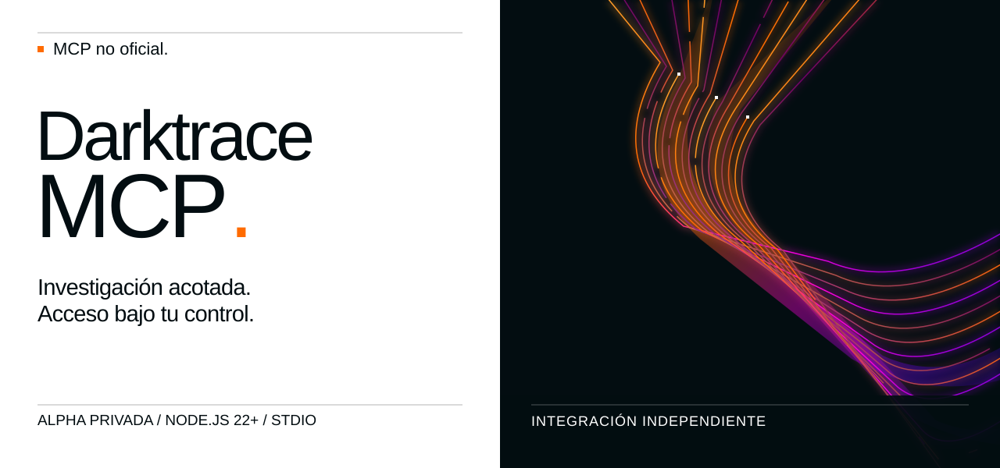
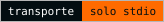
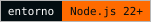
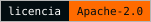
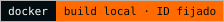
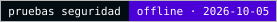

[English](README.md) · **Español**

<picture>
  <source media="(max-width: 600px)" srcset="docs/assets/readme-banner-es-mobile.svg">
  
</picture>

# Darktrace MCP

**MCP no oficial. Desarrollado por un tercero ajeno a Darktrace, sin afiliación ni autorización de Darktrace.**

Usa la API de Darktrace Threat Visualizer desde Claude, Codex, Cursor, VS Code y otros clientes MCP: investiga dispositivos, model breaches e incidentes de AI Analyst y, si lo permites, ejecuta acciones.

<p>
  <a href="docs/architecture.md#91-baseline-stdio"></a>
  <a href="package.json"></a>
  <a href="LICENSE"></a>
  <a href="docs/docker.md"></a>
  <a href="docs/security.md"></a>
  <!-- Insignias OpenSSF: marcadores, comentados hasta que el proyecto tenga un resultado publicado de
       Scorecard y una ficha en bestpractices.dev. Sustituye <BESTPRACTICES_ID> por el id numérico del proyecto.
       Consulta docs/security/supply-chain-checks.md antes de activarlas (se cargan desde servicios externos).
  <a href="https://scorecard.dev/viewer/?uri=github.com/nuoframework/darktrace-mcp"></a>
  <a href="https://www.bestpractices.dev/projects/<BESTPRACTICES_ID>">/badge" alt="OpenSSF Best Practices"></a>
  -->
</p>

[Primeros pasos](docs/es/getting-started.md) · [Clientes](docs/es/clients.md) · [Herramientas](docs/tools.md) (inglés) · [Configuración](docs/es/configuration.md) · [Solución de problemas](docs/es/troubleshooting.md)

## Inicio rápido

Necesitas: la dirección HTTPS de tu appliance Darktrace, un token de API **público** y uno **privado**, y Node.js 22 o posterior.

### 1. Asistente de configuración (macOS, Linux, Windows)

```sh
npx -y @nuoframework/darktrace-mcp@1.1.1 setup
```

El asistente pide la URL y los tokens (sin mostrarlos), guarda los tokens en archivos que solo tú puedes leer, copia el paquete a `~/.local/share/darktrace-mcp/1.1.1/` y configura los clientes que encuentra con rutas absolutas, de modo que los clientes nunca arrancan el servidor a través de `npx`. Windows no puede proteger los archivos de token: prefiere la extensión `.mcpb`, Docker o WSL ([detalles](docs/es/getting-started.md#windows)).

### 2. Extensión de Claude Desktop (.mcpb)

Descarga `darktrace-mcp-1.1.1.mcpb` de la [release v1.1.1](https://github.com/nuoframework/darktrace-mcp/releases/tag/v1.1.1) y haz doble clic. Claude Desktop pide la URL y los tokens y guarda los tokens en el llavero del sistema.

### 3. Docker (ghcr.io)

```sh
docker pull ghcr.io/nuoframework/darktrace-mcp:1.1.1
docker image inspect --format '{{index .RepoDigests 0}}' ghcr.io/nuoframework/darktrace-mcp:1.1.1
npx -y @nuoframework/darktrace-mcp@1.1.1 setup --runtime docker --image ghcr.io/nuoframework/darktrace-mcp@sha256:<digest>
```

La imagen se publica para linux/amd64 y linux/arm64. Fija el digest, nunca la etiqueta. En 1.1.0, la imagen arm64 superó las comprobaciones Docker locales; la amd64 se verifica en CI sobre el commit de la release ([estado](docs/docker.md#110-image-verification-status), inglés).

### Alternativa: compilar desde el código fuente

```sh
curl -fsSLO https://raw.githubusercontent.com/nuoframework/darktrace-mcp/main/scripts/install.sh
less install.sh && sh install.sh
```

`install.sh` clona este repositorio, lo compila y lanza el mismo asistente. Windows: `scripts/install.ps1`.

### Comprobar que funciona

```sh
darktrace-mcp --check-config
darktrace-mcp test
```

`--check-config` revisa la configuración sin conexión. `test` hace una llamada real (`GET /status`) a tu appliance. Sin instalación global, ejecútalos como `npx -y @nuoframework/darktrace-mcp@1.1.1 test`.

## Clientes compatibles

`darktrace-mcp setup` configura estos clientes automáticamente. Cada enlace incluye también la configuración manual.

| Cliente | Automático | Guía manual |
|---|---|---|
| Claude Desktop | `setup` o `.mcpb` | [Claude Desktop](docs/es/clients.md#claude-desktop) |
| Claude Code | `setup` | [Claude Code](docs/es/clients.md#claude-code) |
| Codex (CLI e IDE) | `setup` | [Codex](docs/es/clients.md#codex) |
| Cursor | `setup` o enlace de un clic | [Cursor](docs/es/clients.md#cursor) |
| VS Code (Copilot) | `setup` o enlace de un clic | [VS Code](docs/es/clients.md#vs-code) |
| Windsurf | `setup` | [Windsurf](docs/es/clients.md#windsurf) |
| OpenCode | `setup` | [OpenCode](docs/es/clients.md#opencode) |
| Gemini CLI | `setup` | [Gemini CLI](docs/es/clients.md#gemini-cli) |
| Cualquier cliente, con Docker | `setup --runtime docker` | [Docker](docs/es/clients.md#docker) |
| Una línea por cliente | `claude mcp add`, `codex mcp add`, `code --add-mcp`, `gemini mcp add`, enlace de Cursor | [Una línea por cliente](docs/es/clients.md#una-línea-por-cliente) |

## Qué puede hacer

Se pueden ejecutar 77 de las 79 operaciones de la API, agrupadas en 50 herramientas. La acción de Darktrace/Email (retener, liberar y similares) queda excluida de esta versión, y el endpoint obsoleto `GET /aianalyst/incidents` no está disponible. Lista completa: [referencia de herramientas](docs/tools.md) (inglés).

| Área | Ejemplos | Perfil necesario |
|---|---|---|
| Dispositivos | listar, buscar, dispositivos similares, conexiones, métricas | `read` |
| Model breaches | listar, comentarios | `read` |
| | reconocer (acknowledge), comentar | `write` |
| AI Analyst | incidentes, eventos, investigaciones, estadísticas | `read` |
| | reconocer, fijar, comentar, iniciar una investigación | `write` |
| Respuesta autónoma (Antigena) | listar acciones, resumen | `read` |
| | activar, ampliar, anular, acciones manuales | `critical` |
| Etiquetas (tags) | listar etiquetas y dispositivos etiquetados | `read` |
| | crear, asignar, quitar | `write` |
| | borrar una etiqueta | `critical` |
| Intel feed y subredes | leer | `read` |
| | modificar | `critical` |
| Capturas de paquetes (PCAP) | listar | `read` |
| | solicitar una captura | `write` |
| | descargar una captura | `sensitive` |
| Advanced Search | consultas, análisis, gráficos | `sensitive` |
| Darktrace/Email | paneles, datos de referencia, metadatos de correos, búsqueda, eventos de auditoría | `sensitive` |
| Modelos, métricas, estado | modelos, componentes, métricas, estado, estadísticas | `read` |

59 operaciones tienen evidencia de un laboratorio Darktrace 7.1.0; en 6 de ellas es parcial (por ejemplo, en Antigena manual solo bloqueos `connection`). Las lecturas de correo **no están validadas en laboratorio** (not lab-validated: el token del laboratorio recibió 403). La [referencia de herramientas](docs/tools.md) muestra el estado de cada operación.

## Permisos y seguridad

Tú decides qué puede hacer el modelo con `DARKTRACE_PROFILES` (el asistente te lo pregunta). Por defecto es `read`.

| Perfil | Permite | Protección adicional |
|---|---|---|
| `read` (por defecto) | Lecturas normales | — |
| `sensitive` | Advanced Search, metadatos y búsqueda de correos, descarga de PCAP, eventos de auditoría | — |
| `write` | Reconocer, comentar, fijar, etiquetas, etiquetas de dispositivo, solicitar PCAP, investigaciones | `dryRun:true` muestra una vista previa sin cambiar nada. Sin él, la escritura se ejecuta y depende del aviso de permisos de tu cliente |
| `critical` | Acciones de Antigena, intel feed, subredes, borrar una etiqueta | `dryRun:true` devuelve una vista previa con un `previewId`. Solo se ejecuta al repetir la llamada con `confirm:true` y ese `previewId` y (por defecto) tras aceptar el diálogo del servidor. Sin `confirm:true` la llamada se rechaza |
| `all` | Todo lo anterior | Las mismas reglas de cada perfil. Solo arranca con `DARKTRACE_ACKNOWLEDGE_SENSITIVE_WRITE=true` |

Combina perfiles con comas, por ejemplo `DARKTRACE_PROFILES=read,write`. Cualquier lista con `sensitive` y `write` necesita la misma confirmación que `all`. `DARKTRACE_CRITICAL_APPROVAL=host` (sin diálogo del servidor) necesita `DARKTRACE_ACKNOWLEDGE_HOST_APPROVAL=true` ([detalles](docs/es/configuration.md#aprobación-humana)). Cada escritura y acción crítica queda auditada. Los permisos de tu token de Darktrace siguen aplicando: el servidor no puede hacer más de lo que el token permite.

> **Los datos salen de tu red.** Los resultados llegan a tu cliente MCP y a su proveedor del modelo. Comprueba la idoneidad del proveedor, la retención y la residencia de datos (provider eligibility, retention, residency) en tu organización antes de conectar un appliance de producción. Las descargas de PCAP se devuelven en línea como Base64 y llegan al host y a su proveedor del modelo como cualquier otro resultado.

Más: [resumen de seguridad](docs/security.md) (inglés) · [política de seguridad](SECURITY.md).

## Documentación

| Guía | Qué encontrarás |
|---|---|
| [Primeros pasos](docs/es/getting-started.md) | Instalación paso a paso, tokens, primera prueba |
| [Clientes](docs/es/clients.md) | Configuración automática y manual de cada cliente |
| [Configuración](docs/es/configuration.md) | Variables de entorno, archivo de configuración, perfiles, límites |
| [Herramientas](docs/tools.md) (inglés) | Cada herramienta y operación de la API, con su perfil |
| [Solución de problemas](docs/es/troubleshooting.md) | Autenticación, reloj, TLS, permisos, proxies |
| [Docker](docs/docker.md) (inglés) | Imagen y opciones de ejecución endurecidas |
| [Seguridad](docs/security.md) (inglés) | Modelo de seguridad y enlaces a revisiones detalladas |
| [Arquitectura](docs/architecture.md) (inglés) | Flujo de una petición y decisiones de diseño |
| [Releases](docs/releases.md) · [Changelog](CHANGELOG.md) | Versiones y cambios |
| [Historial](docs/history/README.md) | Registros de revisiones y releases anteriores |

## Estado del proyecto

Repositorio público. Desde v1.1.0, el flujo de release publica [`@nuoframework/darktrace-mcp`](https://www.npmjs.com/package/@nuoframework/darktrace-mcp) en npm (publicación de confianza con procedencia) y `ghcr.io/nuoframework/darktrace-mcp` en GitHub Container Registry; el servidor se describe para el MCP Registry como `io.github.nuoframework/darktrace-mcp`. Cada canal solo está disponible cuando se publica la release v1.1.0 ([releases](docs/releases.md), inglés). Limitaciones conocidas: [changelog](CHANGELOG.md#known-limitations-in-111) (inglés). Licencia [Apache-2.0](LICENSE). Contribuciones: [CONTRIBUTING.md](CONTRIBUTING.md).

## Marcas, logotipo y contacto

**MCP no oficial. Desarrollado por un tercero ajeno a Darktrace, sin afiliación ni autorización de Darktrace.** El nombre y el logotipo de Darktrace pertenecen a Darktrace. La portada muestra el [logotipo oficial sin modificar](docs/assets/brand/darktrace/Darktrace-white.svg) del [paquete público de logotipos del Brand Hub](https://brandhub.darktrace.com/visual-identity/logo) ([procedencia](docs/assets/brand/darktrace/README.md), [identidad visual](docs/visual-identity.md), en inglés). Identifica el producto con el que se integra este proyecto. **El uso del logotipo no implica autorización ni carácter oficial.**

Reclamaciones y reivindicaciones sobre marcas o imagen corporativa, incluidas solicitudes para retirar el logotipo: [contacto@pabloarrabal.com](mailto:contacto@pabloarrabal.com). Esta dirección no es para vulnerabilidades; consulta la [política de seguridad](SECURITY.md). Este proyecto nunca envía correo por sí mismo.
