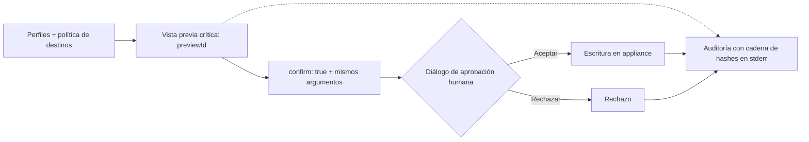

[English](README.md) · **Español**

<picture>
  <source media="(max-width: 600px)" srcset="docs/assets/readme-banner-es-mobile.svg">
  
</picture>

# Darktrace MCP

**MCP no oficial. Desarrollado por un tercero ajeno a Darktrace, sin afiliación ni autorización de Darktrace.**

Investiga tu appliance Darktrace desde tu cliente MCP. Empieza en modo lectura y decide cuándo permitir cambios.

<!-- npm badge will 404 until the package is published. No publication claim is made here. -->

[Primeros pasos](docs/es/getting-started.md) · [Herramientas](docs/tools.md) · [Configuración](docs/es/configuration.md) · [Seguridad](docs/security.md) · [Solución de problemas](docs/es/troubleshooting.md)

## Mira cómo funciona

Tres grabaciones con un **mock HTTPS sintético**, tokens de prueba y ningún dato de producción. Demuestran el flujo, no la compatibilidad con un appliance real. [Fuentes, transcripciones y guía para volver a grabar](scripts/demo/README.md).

**1 · Conecta una vez.** Introduce la URL y los tokens ocultos, elige `read` y un cliente. El asistente comprueba TLS y autenticación y muestra qué ha escrito.

**2 · Haz una pregunta de analista.** Claude Code consulta dispositivos y model breaches y propone qué investigar después. La grabación presenta la salida real del cliente sin interfaz interactiva.

**3 · Controla las acciones críticas.** Vista previa → confirmación → diálogo del servidor → rechazo. Este host mínimo de demostración muestra el diálogo MCP real; no es una captura de Claude Code. No se ejecuta ninguna acción.

## Instala en 60 segundos

Ten a mano el origen HTTPS del appliance y el par de tokens API. El asistente necesita **Node.js 22+**. Estas vías de distribución de 1.1.0 estarán disponibles cuando se publique la versión; consulta el [estado y la instalación desde el código](docs/es/getting-started.md).

<table>
<tr><th>npm → asistente</th><th>Claude Desktop → .mcpb</th><th>Docker → imagen fijada</th></tr>
<tr><td valign="top">
<pre>npx -y \
  @nuoframework/darktrace-mcp@1.1.0 \
  setup</pre>
Elige <code>read</code> y tus clientes.
</td><td valign="top">
Abre <a href="https://github.com/nuoframework/darktrace-mcp/releases">Releases</a>. 
Descarga <code>darktrace-mcp-1.1.0.mcpb</code>. 
Haz doble clic; introduce URL y tokens. 
Claude Desktop guarda los tokens en el llavero del sistema.
</td><td valign="top">
<pre>docker pull \
  ghcr.io/nuoframework/darktrace-mcp:1.1.0</pre>
<a href="docs/clients.md#docker">Obtén el digest y ejecuta el asistente Docker</a>. 
Fija el digest, nunca la etiqueta variable.
</td></tr>
</table>

`npx` solo se usa para instalar. El asistente copia una versión fija y configura los clientes con rutas absolutas a Node y `dist/src/index.js`. Windows nativo no puede proteger los archivos de tokens: usa [.mcpb, Docker o WSL](docs/es/getting-started.md#windows). [Guía completa](docs/es/getting-started.md).

## Clientes compatibles

El asistente configura estos clientes; cada insignia enlaza a su guía (en inglés; [guía en español](docs/es/clients.md)). Los diálogos dependen del cliente y del protocolo. [Aprobación de acciones críticas](docs/es/clients.md#claude-code).

Los nombres y logotipos identifican compatibilidad, pertenecen a sus respectivos titulares y no implican respaldo.

## Qué puedes hacer

**50 herramientas · 77 operaciones ejecutables.** Empieza con `read` (38 operaciones). Añade `sensitive` (18), `write` (16) o `write,critical` (5 operaciones críticas) según necesites. Los permisos del token del appliance siguen siendo el límite.

| Área | Herram. / ops | Ejemplos | Perfiles | Lab: ✓ / ◐ / — |
|---|---:|---|---|---:|
| [Sistema y referencias](docs/tools.md#system-and-reference-data) | 5 / 6 | Estado, estadísticas de red, enumeraciones | `read` | 3 / 1 / 2 |
| [Dispositivos](docs/tools.md#devices) | 9 / 9 | Búsquedas, conexiones, métricas, etiquetas | `read`, `write` | 8 / 0 / 1 |
| [Model breaches](docs/tools.md#model-breaches) | 4 / 7 | Consultar, reconocer, comentar | `read`, `write` | 7 / 0 / 0 |
| [Modelos y métricas](docs/tools.md#models-and-metrics) | 3 / 6 | Definiciones de modelos, componentes y métricas | `read` | 4 / 2 / 0 |
| [AI Analyst](docs/tools.md#ai-analyst) | 8 / 11 | Incidentes, fijación, investigaciones | `read`, `write` | 10 / 0 / 1 |
| [Respuesta autónoma (Antigena)](docs/tools.md#autonomous-response-antigena) | 3 / 4 | Listar, activar, ampliar, anular | `read`, `critical` | 2 / 2 / 0 |
| [Etiquetas](docs/tools.md#tags) | 3 / 10 | Listar, crear, asignar, quitar, borrar | `read`, `write`, `critical` | 7 / 0 / 3 |
| [Intel feed y subredes](docs/tools.md#intel-feed-and-subnets) | 4 / 4 | Watched Domains, ajustes de subred | `read`, `critical` | 2 / 2 / 0 |
| [Capturas de paquetes](docs/tools.md#packet-captures) | 3 / 3 | Listar, solicitar, descargar | `read`, `sensitive`, `write` | 1 / 1 / 1 |
| [Advanced Search](docs/tools.md#advanced-search) | 1 / 4 | Consultas, análisis de campos, gráficos | `sensitive` | 1 / 3 / 0 |
| [Darktrace/Email](docs/tools.md#darktraceemail) | 7 / 13 | Paneles, metadatos, búsquedas, auditoría | `sensitive` | 0 / 0 / 13 |

Cifras de [docs/tools.md](docs/tools.md) (inglés). **✓** = evidencia de laboratorio; **◐** = evidencia parcial; **—** = sin validar en laboratorio. 56 operaciones tienen evidencia del primer laboratorio 7.1.0, 11 de ellas parcial. La mayoría de pruebas de escritura son anteriores a los controles finales; consulta allí los límites por operación y las pruebas posteriores. Las 13 lecturas de Email siguen sin validar (403); la descarga de correo solo devuelve tamaño y SHA-256. La acción de Email está excluida y `GET /aianalyst/incidents` no está disponible.

Prueba estas preguntas:

- «Busca dispositivos llamados finance y muestra sus conexiones recientes». (`read`)
- «Resume los model breaches con mayor puntuación de las últimas 24 horas». (`read`)
- «Muestra los incidentes de AI Analyst de este dispositivo y los comentarios existentes». (`read`)
- «Previsualiza una etiqueta de triaje para el dispositivo 42 antes de cambiar nada». (`write`)
- «Busca tráfico de este dominio y resume las conexiones encontradas». (`sensitive`)
- «Previsualiza la anulación de la acción Antigena 123. Espera mi aprobación». (`write,critical`)

## Seguridad desde el diseño

- **Perfiles:** `read` por defecto; los datos sensibles y los cambios requieren activación. Las escrituras ordinarias se ejecutan sin vista previa salvo que indiques `dryRun:true`; por defecto dependen del aviso de permisos del cliente.
- **Aprobación crítica:** `previewId` de un solo uso (5 minutos), después `confirm:true` con los mismos argumentos y el diálogo del servidor por defecto. Rechazar o cancelar impide la acción. El servidor no puede probar que respondió una persona; las reglas de aprobación automática debilitan este control.
- **Límites de escritura:** hasta 10 por minuto, 3 críticas; tres fallos o resultados desconocidos consecutivos bloquean las escrituras hasta reiniciar. Los límites y el estado son por proceso. Las escrituras nunca se reintentan automáticamente.
- **Destinos protegidos:** configuración opcional, coincidencia literal exacta y límites de destinos por operación. Para acciones Antigena se comprueba `codeid`, no el dispositivo.
- **Auditoría:** escrituras, vistas previas y rechazos generan registros con cadena de hashes en stderr. Las lecturas sensibles no se auditan; las cadenas no tienen anclaje externo ni identidad de arranque.
- **Salida acotada:** selección de campos, límites de tamaño y neutralización de instrucciones reducen la exposición. No garantizan eliminar todo campo sensible ni impedir toda inyección de instrucciones. Los PCAP de más de unos 45 KB se rechazan y solo devuelven tamaño y hash.
- **Transporte:** stdio local; TLS verificado, peticiones firmadas con HMAC, destino fijado y sin proxies ni redirecciones.
- **Aceptación explícita:** `all` o `sensitive` + `write` necesita `DARKTRACE_ACKNOWLEDGE_SENSITIVE_WRITE=true` (sin control de propagación de datos sensibles). La aprobación crítica `host` necesita `DARKTRACE_ACKNOWLEDGE_HOST_APPROVAL=true`.

> **Los datos salen de tu red.** Los resultados llegan al cliente MCP y al proveedor del modelo, incluidos PCAP en Base64 y metadatos de correo. Evalúa la idoneidad del proveedor, la retención y la residencia (**provider eligibility, retention, residency**) antes de conectar un appliance de producción.

[Resumen de seguridad](docs/security.md) · [Configuración y aprobación](docs/es/configuration.md#aprobación-humana) · [Notificar una vulnerabilidad](SECURITY.md)

## Cómo se ha validado

- Modelo de amenazas [TM-18…31](docs/security/threat-model-writes.md), [revisión independiente del diseño](docs/security/design-review-writes.md) y [pruebas adversariales](docs/security/adversarial-results-writes.md).
- Cifras registradas para la versión: **230 pruebas funcionales / 1.150 subcasos de seguridad**. Los registros Linux recogen 1.150 aprobados; macOS omite tres por la plataforma. Es evidencia fechada, no una certificación. [Cifras y registros](docs/security/release-pins-1.1.0.md).
- [Dos laboratorios Darktrace 7.1.0](docs/security/final-lab-campaign-1.1.0.md), con menor cobertura que las pruebas offline; [comprobaciones Docker en arm64 y amd64](docs/security/release-pins-1.1.0.md#ci-closure-for-b1--b7-2026-10-06) en el commit documentado. El cambio posterior del instalador tiene sus propios registros.
- La [revisión final](docs/security/final-gate-review-1.1.0.md) recoge bloqueos y [riesgos residuales](docs/security/final-gate-review-1.1.0.md#4-residual-risks-to-disclose-in-the-release-notes); las [decisiones fechadas del propietario](docs/security/owner-decisions-1.1.0.md) aceptan riesgos concretos, sin eliminarlos. No se afirma cero CVE ni existe un escaneo documentado del entorno 1.1.0.

## Documentación y contribuciones

[Primeros pasos](docs/es/getting-started.md) · [Clientes](docs/es/clients.md) · [Herramientas](docs/tools.md) · [Configuración](docs/es/configuration.md) · [Docker](docs/docker.md) · [Arquitectura](docs/architecture.md) · [Solución de problemas](docs/es/troubleshooting.md) · [Versiones](docs/releases.md) · [Cambios](CHANGELOG.md)

Código abierto bajo [Apache-2.0](LICENSE). Consulta cómo [contribuir](CONTRIBUTING.md). Los canales de distribución se detallan en [Releases](docs/releases.md); cada versión estará disponible tras su publicación.

## Marcas y contacto

El nombre y el logotipo Darktrace pertenecen a Darktrace. La cabecera usa el [logotipo oficial sin modificar](docs/assets/brand/darktrace/Darktrace-white.svg) para identificar el producto integrado ([procedencia](docs/assets/brand/darktrace/README.md)). **Su uso no implica autorización ni carácter oficial.**

Consultas sobre marcas o retirada: [contacto@pabloarrabal.com](mailto:contacto@pabloarrabal.com). Avisos de seguridad: [SECURITY.md](SECURITY.md). Este proyecto nunca envía correo por su cuenta.
