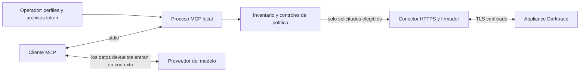

<div align="center">

[English](README.md) · **Español**


# Darktrace MCP

**MCP no oficial. Desarrollado por un tercero ajeno a Darktrace, sin afiliación ni autorización de Darktrace.**

**Herramientas de investigación acotadas para Darktrace en tu entorno MCP.**

Prereleases privadas de GitHub · Node.js 22+ · stdio · Apache-2.0

[Empieza en cinco minutos](docs/es/getting-started.md) · [Configuración de clientes](docs/clients.md) · [Configuración](docs/configuration.md) · [Inicio rápido en inglés](docs/getting-started.md)

</div>

---

Investiga dispositivos, infracciones de modelos e incidentes de analistas desde un cliente MCP, con un inventario fijo de operaciones, perfiles controlados por el operador y salida acotada. Esta es una **alpha privada con validación offline** para `nuoframework/darktrace-mcp`. No hay publicación npm, imagen pública ni despliegue de producción verificado.

| Capacidad | Comportamiento de la base | Evidencia/estado |
|---|---|---|
| Investigación | Perfil de lectura habilitado; Advanced Search necesita opt-in separado de lectura sensible | Contrato fuente **6.1** |
| Cambios | Las escrituras de riesgo medio/alto requieren el perfil de escritura del operador; usan vista previa sin firma por defecto | Se exige `dryRun:false` explícito para ejecutar |
| Operaciones críticas | Cinco operaciones opcionales solo de vista previa; ejecución bloqueada permanentemente | Sin campo `confirm` ni mecanismo para eludir la aprobación |
| Email, exportación PCAP, HTTP | No disponibles; se rechaza su habilitación en configuración | Requieren una revisión de diseño futura y separada |
| Cobertura | **79 operaciones de inventario: 54 ejecutables según perfil + 5 vistas previas críticas + 19 bloqueadas + 1 excluida** | Recuento de operaciones, no de herramientas registradas |
| Compatibilidad | Objetivo de laboratorio Darktrace **7.1: NO VALIDADO** | Firma, ACL y comportamiento real pendientes |
| Seguridad | Revisión independiente del código fuente completada; [evidencia de ejecución offline](docs/release-preparation.md) registrada | Siguen abiertas las condiciones de appliance/proveedor/despliegue y las decisiones sobre riesgo residual |

El [inventario de cobertura](src/coverage/report.generated.json) generado registra 59 operaciones implementadas, incluidas las cinco vistas previas críticas. Las herramientas disponibles dependen de los perfiles; «ejecutable según perfil» no significa habilitada por defecto ni validada contra un appliance.



**Antes de cualquier despliegue:** los resultados del appliance pueden entrar en el contexto del cliente y del proveedor del modelo. Evalúa elegibilidad organizativa, procesamiento del proveedor, retención, residencia y reenvío del cliente para cada despliegue, incluso de solo lectura. Advanced Search exige una evaluación adicional de datos sensibles antes de establecer `DARKTRACE_SENSITIVE_READ=true`. Ese indicador registra la intención del operador; no certifica la elegibilidad del proveedor.

## Instalar una prerelease privada versionada

Descarga la [prerelease privada publicada v0.1.0-alpha.0](https://github.com/nuoframework/darktrace-mcp/releases/tag/v0.1.0-alpha.0). Sigue la guía de [GitHub Releases versionadas](docs/releases.md) para descargar el `.tgz` revisado y `SHA256SUMS`, verificar los checksums e instalar con `npm install --ignore-scripts --omit=dev`. La release incluye un SBOM de runtime verificable; appliance 7.1, elegibilidad del proveedor y Docker siguen sujetos a validaciones separadas pendientes.

## Instalar desde el código fuente en cinco minutos

Usa una cuenta autenticada de GitHub CLI con acceso al repositorio privado, Node.js 22+ y npm. Revisa el checkout y las versiones fijadas de dependencias antes de compilar.

```sh
gh auth status
gh repo clone nuoframework/darktrace-mcp
cd darktrace-mcp
npm ci --ignore-scripts
npm run build
node dist/src/index.js --help
node dist/src/index.js --version
```

Provisiona **dos archivos token separados fuera del checkout** mediante el proceso aprobado de gestión de secretos: uno para el token público de API y otro para el privado. Usa rutas absolutas, propietario igual al usuario de ejecución actual, archivos regulares, un máximo de 4.096 bytes y permisos `0600` o más restrictivos. Sin enlaces simbólicos. No pegues tokens en comandos, JSON del cliente, control de versiones ni chat.

```sh
export DARKTRACE_URL='https://darktrace.example.internal'
export DARKTRACE_PUBLIC_TOKEN_FILE='/absolute/private/darktrace/public-token'
export DARKTRACE_PRIVATE_TOKEN_FILE='/absolute/private/darktrace/private-token'
export DARKTRACE_PROFILES='read'
export DARKTRACE_SENSITIVE_READ='false'
node dist/src/index.js --check-config
```

`--check-config` valida localmente sin contactar con el appliance. No valida autenticación, conectividad ni compatibilidad 7.1. Configura tu [cliente MCP](docs/clients.md) con las **rutas absolutas del ejecutable Node y del punto de entrada compilado**. El arranque normal (`node /absolute/checkout/dist/src/index.js`) habla MCP por stdin/stdout; el cliente lo lanza.

## Operar con decisiones explícitas

Lectura es el perfil predeterminado. Activar `write` expone herramientas elegibles de riesgo medio/alto, que siguen usando `dryRun:true` por defecto. Una vista previa aceptada devuelve únicamente `{dryRun:true, operationId, method, parameterNames}` antes de construir o firmar la solicitud, sin valores de parámetros ni llamada de red. Registrar vistas previas críticas también exige `DARKTRACE_WRITE_CRITICAL=true`, pero ninguna configuración permite la ejecución crítica. La aprobación del modelo/cliente **no es autorización**; las ACL del token en el appliance y la política del operador siguen siendo la autoridad.

Tras un timeout de mutación o una conexión perdida, el resultado puede ser **desconocido**. No reintentes automáticamente: inspecciona primero el estado del appliance y los registros de auditoría. El servidor no reproduce solicitudes POST/DELETE. La firma usa un modo configurado explícitamente, sin probar otro tras errores de autenticación. La verificación TLS es obligatoria; usa `NODE_EXTRA_CA_CERTS` para una CA privada aprobada.

## Documentación

Salvo el inicio rápido en español, las guías enlazadas están en inglés.

| Guía | Propósito |
|---|---|
| [Inicio rápido en español](docs/es/getting-started.md) · [Getting started](docs/getting-started.md) | Credenciales, comprobaciones locales y artefactos privados verificados |
| [Configuración](docs/configuration.md) | Entorno, perfiles y límites máximos |
| [Clientes](docs/clients.md) | Claude Code/Desktop, VS Code y Codex |
| [Resolución de problemas](docs/troubleshooting.md) | Arranque, TLS, herramientas ocultas y resultados desconocidos |
| [Arquitectura](docs/architecture.md) · [Contrato API](docs/api-contract.md) | Diseño y evidencia fuente de 6.1 |
| [Modelo de amenazas](docs/security/threat-model.md) · [Decisiones de diseño](docs/security/design-decisions.md) | Supuestos de seguridad y condiciones pendientes |
| [Política de seguridad](SECURITY.md) · [Contribuir](CONTRIBUTING.md) | Comunicación privada de problemas y desarrollo |
| [Changelog](CHANGELOG.md) | Cambios de la alpha versionada |
| [Releases](docs/releases.md) · [Preparación de release](docs/release-preparation.md) | Artefactos privados versionados, SBOM y evidencia actual de verificación |

## Empaquetado privado

`private:true` impide la publicación npm. Las GitHub Releases privadas versionadas distribuyen el tarball verificado; sigue disponible la instalación desde el código fuente. El artefacto empaquetado incluye runtime compilado, npm shrinkwrap, README, licencia y política de seguridad. Excluye código fuente TypeScript, tests, scripts de desarrollo, fuentes de documentación y secretos. Consulta el [procedimiento de artefactos](docs/getting-started.md#optional-verified-local-artifact). La integridad de dependencias y las comprobaciones de empaquetado son evidencia sobre el artefacto, no prueba de que el código de las dependencias sea benigno.

CI configura comprobaciones Node 22/24, el harness de seguridad aislado existente y empaquetado verificado. Un workflow manual de solo lectura prepara artefactos candidatos; el propietario publica una prerelease privada de GitHub después de revisarla. No se realiza publicación npm/contenedor ni attestation de artefactos. Consulta [releases](docs/releases.md) para requisitos de protección y límites de la evidencia.

Licencia [Apache-2.0](LICENSE). Este proyecto no está afiliado a Darktrace ni cuenta con su respaldo.

## Límites de salida y destino

La salida de runtime usa vistas conservadoras definidas en código, con hasta ocho campos principales seleccionados. `minimized:true` y `unmodeledFieldsOmitted:true` describen la proyección, sin demostrar que se hayan eliminado todos los datos sensibles arbitrarios anidados. Los objetos desconocidos y mapas se resumen. Advanced Search omite el contenido de `@message` y `@fields`. Se ocultan los valores secretos conocidos y las codificaciones soportadas de un paso; las codificaciones transformadas arbitrariamente quedan fuera de esa garantía. El cliente MCP/proveedor del modelo todavía puede recibir información sensible en los campos retenidos.

El conector HTTPS fija una instantánea DNS de arranque aprobada. Las direcciones de los rangos NAT64 estándar (`64:ff9b::/96`, `64:ff9b:1::/48`), 6to4 (`2002::/16`) y Teredo (`2001::/32`) siempre se bloquean, incluidas traducciones que aparentan apuntar a IPv4 pública. Una respuesta DNS prohibida provoca un fallo terminal del conector hasta que se reinicie el proceso del servidor; corregir DNS no reactiva el conector en ejecución. Los prefijos NAT64 propios del operador no pueden detectarse genéricamente; siguen siendo necesarias allowlists exactas de destino y revisión de la red de despliegue. Este comportamiento de cierre ante fallo puede exigir cambiar el diseño DNS/red del despliegue. El pinning en una red privada real y el comportamiento del appliance siguen sin validar.

Referencia visual: [Darktrace Brand Hub](https://brandhub.darktrace.com/visual-identity/colors) ([trazos lineales](https://brandhub.darktrace.com/visual-identity/trace), [Arial como alternativa del sistema](https://brandhub.darktrace.com/visual-identity/typography)). Los banners son composiciones originales independientes, no recursos oficiales de marca ni una declaración de aprobación de marca.
