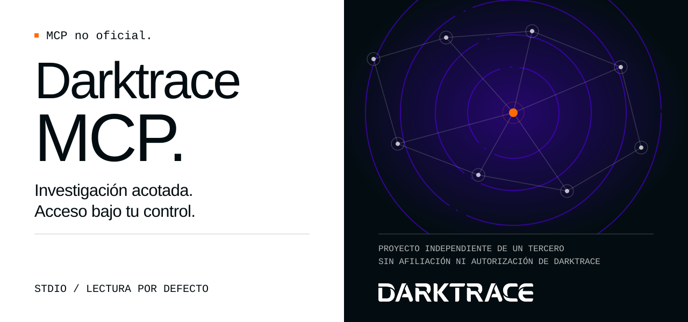
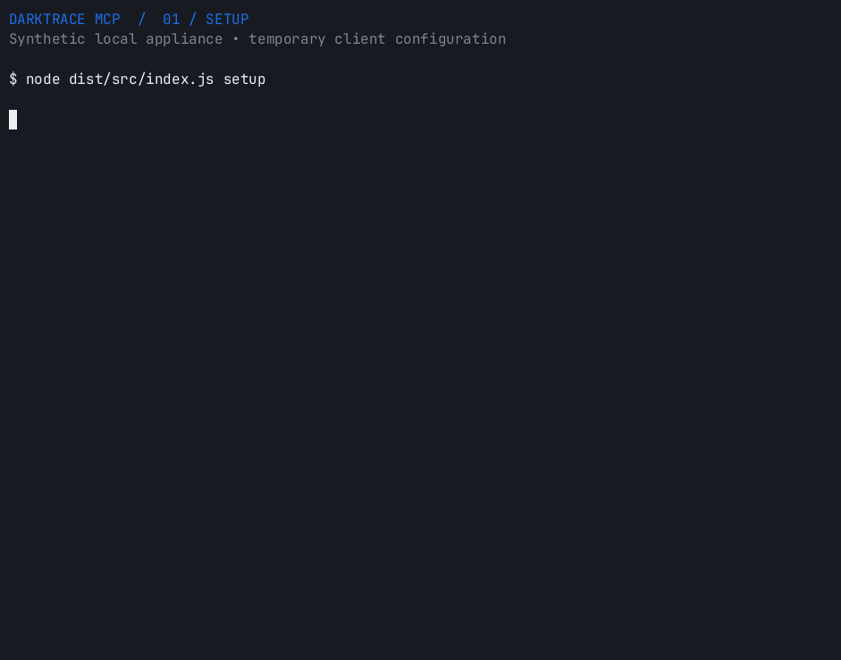
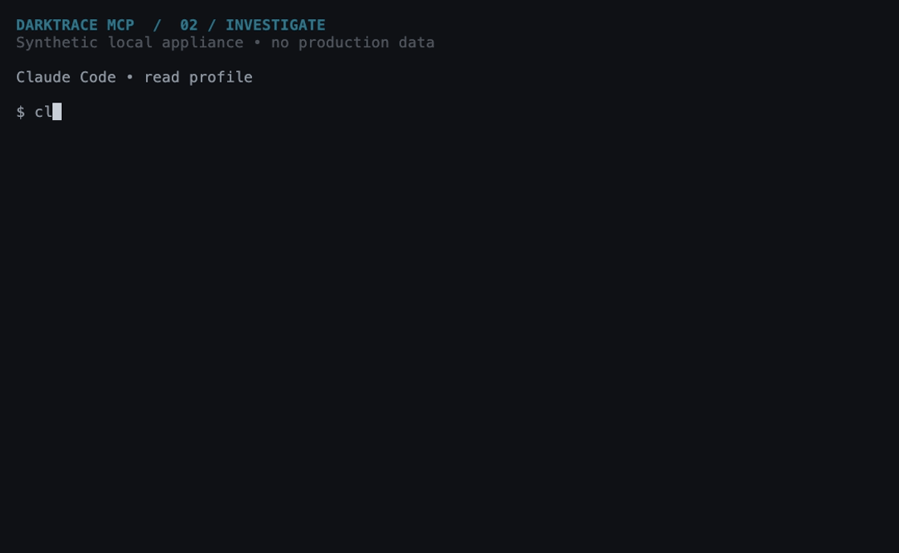
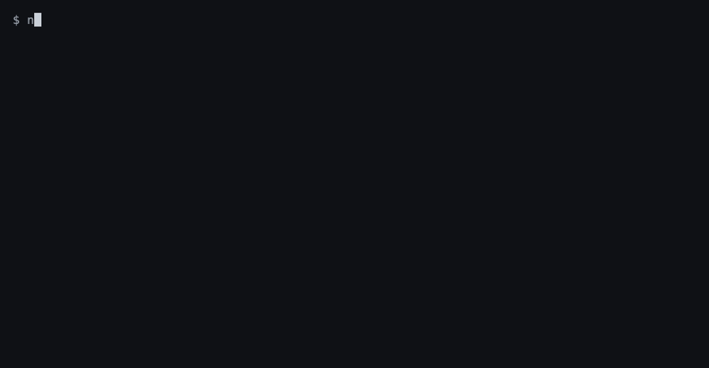
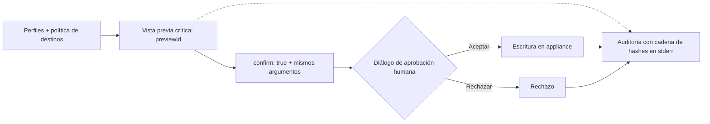

[English](README.md) · **Español**

<picture>
  <source media="(max-width: 600px)" srcset="docs/assets/banner-variants/b/readme-banner-es-mobile.svg">
  
</picture>

# Darktrace MCP

**MCP no oficial. Desarrollado por un tercero ajeno a Darktrace, sin afiliación ni autorización de Darktrace.**

Investiga tu appliance Darktrace desde tu cliente MCP. Empieza en modo lectura y decide cuándo permitir cambios.

[](LICENSE)
[](docs/es/getting-started.md)
[](docs/es/configuration.md#aprobación-humana)
[](https://github.com/nuoframework/darktrace-mcp/actions/workflows/ci.yml)
[](https://www.bestpractices.dev/projects/15261)
[](https://scorecard.dev/viewer/?uri=github.com/nuoframework/darktrace-mcp)
[](docs/releases.md#distribution-channels-110-and-later)
[](https://github.com/nuoframework/darktrace-mcp/releases)

[Primeros pasos](docs/es/getting-started.md) · [Herramientas (EN)](docs/tools.md) · [Configuración](docs/es/configuration.md) · [Seguridad (EN)](docs/security.md) · [Solución de problemas](docs/es/troubleshooting.md)

## Instalación

1. **Requisitos.** Node.js 22+, la URL del appliance (`https://…`) y el par de tokens API público/privado (Darktrace: **System Config → Settings → API Token**).
2. **Ejecuta el asistente.** Un solo comando para todos los clientes. Pide la URL, los tokens (entrada oculta, guardados en archivos de solo propietario), los permisos (`read` por defecto) y los clientes que detecta, comprueba la conexión con una petición firmada y solo entonces escribe las entradas (con copia de seguridad de los archivos existentes).

    ```sh
    npx -y @nuoframework/darktrace-mcp@1.1.2 setup
    ```

    Con un clic: el botón de Cursor solo añade la entrada; después ejecuta `npx -y @nuoframework/darktrace-mcp@1.1.2 setup --client cursor` para completarla. Los botones de VS Code piden la URL y los tokens por sí mismos.

    [](cursor://anysphere.cursor-deeplink/mcp/install?name=darktrace&config=eyJjb21tYW5kIjoibnB4IiwiYXJncyI6WyIteSIsIkBudW9mcmFtZXdvcmsvZGFya3RyYWNlLW1jcEAxLjEuMiJdLCJlbnYiOnsiREFSS1RSQUNFX1BST0ZJTEVTIjoicmVhZCJ9fQ%3D%3D)
    [](vscode:mcp/install?%7B%22name%22%3A%22darktrace%22%2C%22type%22%3A%22stdio%22%2C%22command%22%3A%22npx%22%2C%22args%22%3A%5B%22-y%22%2C%22%40nuoframework%2Fdarktrace-mcp%401.1.2%22%5D%2C%22env%22%3A%7B%22DARKTRACE_URL%22%3A%22%24%7Binput%3Adarktrace-url%7D%22%2C%22DARKTRACE_PUBLIC_TOKEN%22%3A%22%24%7Binput%3Adarktrace-public-token%7D%22%2C%22DARKTRACE_PRIVATE_TOKEN%22%3A%22%24%7Binput%3Adarktrace-private-token%7D%22%2C%22DARKTRACE_PROFILES%22%3A%22read%22%7D%2C%22inputs%22%3A%5B%7B%22type%22%3A%22promptString%22%2C%22id%22%3A%22darktrace-url%22%2C%22description%22%3A%22Darktrace%20appliance%20URL%20(https%3A%2F%2F...)%22%2C%22password%22%3Afalse%7D%2C%7B%22type%22%3A%22promptString%22%2C%22id%22%3A%22darktrace-public-token%22%2C%22description%22%3A%22Darktrace%20API%20public%20token%22%2C%22password%22%3Atrue%7D%2C%7B%22type%22%3A%22promptString%22%2C%22id%22%3A%22darktrace-private-token%22%2C%22description%22%3A%22Darktrace%20API%20private%20token%22%2C%22password%22%3Atrue%7D%5D%7D)
    [](vscode-insiders:mcp/install?%7B%22name%22%3A%22darktrace%22%2C%22type%22%3A%22stdio%22%2C%22command%22%3A%22npx%22%2C%22args%22%3A%5B%22-y%22%2C%22%40nuoframework%2Fdarktrace-mcp%401.1.2%22%5D%2C%22env%22%3A%7B%22DARKTRACE_URL%22%3A%22%24%7Binput%3Adarktrace-url%7D%22%2C%22DARKTRACE_PUBLIC_TOKEN%22%3A%22%24%7Binput%3Adarktrace-public-token%7D%22%2C%22DARKTRACE_PRIVATE_TOKEN%22%3A%22%24%7Binput%3Adarktrace-private-token%7D%22%2C%22DARKTRACE_PROFILES%22%3A%22read%22%7D%2C%22inputs%22%3A%5B%7B%22type%22%3A%22promptString%22%2C%22id%22%3A%22darktrace-url%22%2C%22description%22%3A%22Darktrace%20appliance%20URL%20(https%3A%2F%2F...)%22%2C%22password%22%3Afalse%7D%2C%7B%22type%22%3A%22promptString%22%2C%22id%22%3A%22darktrace-public-token%22%2C%22description%22%3A%22Darktrace%20API%20public%20token%22%2C%22password%22%3Atrue%7D%2C%7B%22type%22%3A%22promptString%22%2C%22id%22%3A%22darktrace-private-token%22%2C%22description%22%3A%22Darktrace%20API%20private%20token%22%2C%22password%22%3Atrue%7D%5D%7D)

3. **Reinicia el cliente y pregúntale:** "list my Darktrace devices".

<details>
<summary>Por cliente (21 clientes), plugin, Docker, extensión de Claude Desktop, desinstalar</summary>

`setup --client <id>` configura un cliente; `config <id>` imprime su fragmento con tus rutas reales y sin secretos. Detalles y ubicación de cada archivo: [página de instalación (EN)](docs/install.md).

| Cliente | Camino más corto |
|---|---|
| Claude Desktop | `setup --client claude-desktop`, o abre el `.mcpb` de la [release](https://github.com/nuoframework/darktrace-mcp/releases) (los tokens van al llavero del sistema) |
| Claude Code | `setup --client claude-code`, o el plugin: `claude plugin marketplace add nuoframework/darktrace-mcp` y `claude plugin install darktrace-mcp@darktrace-mcp` ([guía](docs/plugin-distribution.md)) |
| Codex CLI / app | `setup --client codex`, o `codex plugin marketplace add nuoframework/darktrace-mcp`, `codex plugin add darktrace-mcp@darktrace-mcp` y después `setup` una vez |
| Cursor | botón de Cursor arriba y después `setup --client cursor` |
| VS Code / Insiders | botón de VS Code arriba (pide URL y tokens), o `setup --client vscode` |
| Windsurf, OpenCode, Gemini CLI | `setup --client windsurf` / `opencode` / `gemini` |
| Zed, Cline, Roo Code, Continue | `setup --client zed` / `cline` / `roo` / `continue` |
| Kiro, Amp, Copilot CLI, Warp | `setup --client kiro` / `amp` / `copilot-cli` / `warp` |
| Goose, LM Studio, Antigravity | `setup --client goose` / `lmstudio` / `antigravity` |
| JetBrains Junie / AI Assistant | `setup --client junie`; AI Assistant: `config jetbrains` y pega en Settings \| Tools \| AI Assistant \| MCP |
| Docker | `setup --runtime docker` descarga `ghcr.io/nuoframework/darktrace-mcp:1.1.2` (digest del índice publicado `sha256:fa261c2f7423fa79c66b0b5ddf74d6d8bb53b59a64608dda869959b43900d9ee`) y fija el ID de imagen local ([guía Docker (EN)](docs/docker.md)) |
| Actualizar | `npx -y @nuoframework/darktrace-mcp@1.1.2 update` verifica la última versión y mueve todas las entradas; `update --rollback` vuelve atrás ([guía, EN](docs/update.md)) |
| Desinstalar | `npx -y @nuoframework/darktrace-mcp@1.1.2 uninstall` quita todas las entradas (con copias de seguridad), los tokens y las copias fijas |

Windows, fragmentos manuales, `test`, cuándo fijar la versión y qué hacen los botones: [página de instalación (EN)](docs/install.md) · [matriz (EN)](docs/install-matrix.md).

</details>

## Actualizar

```sh
npx -y @nuoframework/darktrace-mcp@1.1.2 update
```

Mueve todas las entradas de cliente a la última versión publicada solo después de verificarla: registro npm fijo, firmas del registro y atestación de procedencia (`npm audit signatures`), el `--check-config` de la copia nueva con tu configuración guardada y una petición firmada al appliance. La versión anterior se conserva para `update --rollback`; `update --check` muestra instalada frente a última con las notas de la versión, y `test` avisa cuando existe una más nueva. El servidor nunca comprueba actualizaciones por sí mismo. La [guía de actualización (EN)](docs/update.md) cubre los plugins (`claude plugin update darktrace-mcp@darktrace-mcp`, `codex plugin marketplace upgrade darktrace-mcp`), el `.mcpb`, Docker y `uninstall`.

## Mira cómo funciona

Tres grabaciones con un **mock HTTPS sintético**, tokens de prueba y ningún dato de producción. Demuestran el flujo, no la compatibilidad con un appliance real. [Fuentes, transcripciones y guía para volver a grabar](scripts/demo/README.md).

**1 · Conecta una vez.** Escribe la URL del appliance y los dos tokens (no se muestran al teclear), elige `read` y un cliente. El asistente verifica TLS y los tokens con una petición firmada y lista lo que ha escrito. Grabado desde el código fuente; `npx` añade la instalación de una copia fija.



**2 · Haz una pregunta de analista.** Claude Code llama a las herramientas de dispositivos y model breaches y propone qué revisar después. Salida real de una ejecución no interactiva (`claude -p`), con un ritmo ajustado para leerla; la respuesta no está preparada de antemano.



**3 · Mantén el control de las acciones críticas.** Vista previa, confirmación y el diálogo nativo de aprobación de Claude Code, donde una pulsación programada elige **Decline** (rechazar). El servidor deniega la acción; no se envía ninguna escritura al appliance. Se recortan el arranque y las esperas.



## Clientes compatibles

El asistente configura estos clientes; cada insignia enlaza a su guía. Los diálogos de aprobación dependen del cliente y del protocolo. [Aprobación de acciones críticas](docs/es/clients.md#claude-code).

[](docs/es/clients.md#claude-desktop)
[](docs/es/clients.md#claude-code)
[](docs/es/clients.md#codex)
[](docs/es/clients.md#cursor)
[](docs/es/clients.md#vs-code)
[](docs/es/clients.md#windsurf)
[](docs/es/clients.md#opencode)
[](docs/es/clients.md#gemini-cli)
[](docs/es/clients.md#docker)

Los nombres y logotipos identifican compatibilidad, pertenecen a sus respectivos titulares y no implican respaldo.

## Qué puedes hacer

**50 herramientas · 77 operaciones ejecutables.** Empieza con `read` (38 operaciones). Añade `sensitive` (18), `write` (16) o `write,critical` (5 operaciones críticas) según necesites. Los permisos del token del appliance siguen siendo el límite.

| Área | Herram. / ops | Ejemplos | Perfiles | Evidencia de laboratorio |
|---|---:|---|---|---:|
| [Sistema y referencias](docs/tools.md#system-and-reference-data) | 5 / 6 | Estado, estadísticas de red, enumeraciones | `read` | 3 / 1 / 2 |
| [Dispositivos](docs/tools.md#devices) | 9 / 9 | Búsquedas, conexiones, métricas, etiquetas | `read`, `write` | 9 / 0 / 0 |
| [Model breaches](docs/tools.md#model-breaches) | 4 / 7 | Consultar, reconocer, comentar | `read`, `write` | 7 / 0 / 0 |
| [Modelos y métricas](docs/tools.md#models-and-metrics) | 3 / 6 | Definiciones de modelos, componentes y métricas | `read` | 4 / 2 / 0 |
| [AI Analyst](docs/tools.md#ai-analyst) | 8 / 11 | Incidentes, fijación, investigaciones | `read`, `write` | 11 / 0 / 0 |
| [Respuesta autónoma (Antigena)](docs/tools.md#autonomous-response-antigena) | 3 / 4 | Listar, activar, ampliar, anular | `read`, `critical` | 3 / 1 / 0 |
| [Etiquetas](docs/tools.md#tags) | 3 / 10 | Listar, crear, asignar, quitar, borrar | `read`, `write`, `critical` | 7 / 0 / 3 |
| [Intel feed y subredes](docs/tools.md#intel-feed-and-subnets) | 4 / 4 | Watched Domains, ajustes de subred | `read`, `critical` | 2 / 2 / 0 |
| [Capturas de paquetes](docs/tools.md#packet-captures) | 3 / 3 | Listar, solicitar, descargar | `read`, `sensitive`, `write` | 3 / 0 / 0 |
| [Advanced Search](docs/tools.md#advanced-search) | 1 / 4 | Consultas, análisis de campos, gráficos | `sensitive` | 4 / 0 / 0 |
| [Darktrace/Email](docs/tools.md#darktraceemail) | 7 / 13 | Paneles, metadatos, búsquedas, auditoría | `sensitive` | 0 / 0 / 13 |

**✓** evidencia en un laboratorio Darktrace 7.1.0 · **◐** evidencia parcial (la [referencia de herramientas (EN)](docs/tools.md) indica qué se cubrió) · **—** sin validar en laboratorio, incluidas las pruebas bloqueadas o fallidas.

- 59 de 77 operaciones tienen evidencia de dos laboratorios Darktrace 7.1.0, 6 de ellas parcial. Las rutas de escritura y críticas se volvieron a comprobar después.
- Las 13 lecturas de Darktrace/Email están sin validar (el token del laboratorio recibió HTTP 403). La descarga de correo solo devuelve tamaño y SHA-256.
- No disponibles: la acción de Darktrace/Email (excluida) y el obsoleto `GET /aianalyst/incidents`.

Prueba estas preguntas:

- «Busca dispositivos llamados finance y muestra sus conexiones recientes». (`read`)
- «Resume los model breaches con mayor puntuación de las últimas 24 horas». (`read`)
- «Muestra los incidentes de AI Analyst de este dispositivo y los comentarios existentes». (`read`)
- «Previsualiza una etiqueta de triaje para el dispositivo 42 antes de cambiar nada». (`write`)
- «Busca tráfico de este dominio y resume las conexiones encontradas». (`sensitive`)
- «Previsualiza la anulación de la acción Antigena 123. Espera mi aprobación». (`write,critical`)

## Seguridad desde el diseño

Las acciones críticas (Antigena, intel feed, subredes, borrado de etiquetas) siguen este camino. Las escrituras ordinarias omiten la vista previa salvo que la pidas.



- **Perfiles:** `read` por defecto; los datos sensibles y los cambios requieren activación. Las escrituras ordinarias se ejecutan sin vista previa salvo que indiques `dryRun:true`; por defecto dependen del aviso de permisos del cliente.
- **Aprobación crítica:** `previewId` de un solo uso (5 minutos), después `confirm:true` con los mismos argumentos y el diálogo del servidor por defecto. Rechazar o cancelar impide la acción. El servidor no puede probar que respondió una persona; las reglas de aprobación automática debilitan este control.
- **Límites de escritura:** hasta 10 por minuto, 3 críticas; tres fallos o resultados desconocidos consecutivos bloquean las escrituras hasta reiniciar. Los límites y el estado son por proceso. Las escrituras nunca se reintentan automáticamente.
- **Destinos protegidos:** configuración opcional, coincidencia literal exacta y límites de destinos por operación. Para acciones Antigena se comprueba `codeid`, no el dispositivo.
- **Auditoría:** escrituras, vistas previas y rechazos generan registros con cadena de hashes en stderr. Las lecturas sensibles no se auditan; las cadenas no tienen anclaje externo ni identidad de arranque.
- **Salida acotada:** selección de campos, límites de tamaño y neutralización de instrucciones reducen la exposición. No garantizan eliminar todo campo sensible ni impedir toda inyección de instrucciones. Los PCAP de más de unos 45 KB se rechazan y solo devuelven tamaño y hash.
- **Transporte:** stdio local; TLS verificado, peticiones firmadas con HMAC, destino fijado y sin proxies ni redirecciones.
- **Aceptación explícita:** `all` o `sensitive` + `write` necesita `DARKTRACE_ACKNOWLEDGE_SENSITIVE_WRITE=true` (sin control de propagación de datos sensibles). La aprobación crítica `host` necesita `DARKTRACE_ACKNOWLEDGE_HOST_APPROVAL=true`.

> **Los datos salen de tu red.** Los resultados llegan al cliente MCP y al proveedor del modelo, incluidos PCAP en Base64 y metadatos de correo. Evalúa la **idoneidad del proveedor, la retención y la residencia de los datos** antes de conectar un appliance de producción.

[Resumen de seguridad (EN)](docs/security.md) · [Configuración y aprobación](docs/es/configuration.md#aprobación-humana) · [Notificar una vulnerabilidad](SECURITY.md)

## Cómo se ha validado

- Modelo de amenazas [TM-18…31](docs/security/threat-model-writes.md), [revisión independiente del diseño](docs/security/design-review-writes.md) y [pruebas adversariales](docs/security/adversarial-results-writes.md).
- Cifras registradas para la versión: **230 pruebas funcionales / 1.150 subcasos de seguridad**. Los registros Linux recogen 1.150 aprobados; macOS omite tres por la plataforma. Es evidencia fechada, no una certificación. [Cifras y registros](docs/security/release-pins-1.1.0.md).
- [Dos laboratorios Darktrace 7.1.0](docs/security/final-lab-campaign-1.1.0.md), con menor cobertura que las pruebas offline; [comprobaciones Docker en arm64 y amd64](https://github.com/nuoframework/darktrace-mcp/actions/runs/37497433186) en el commit de la versión `f95e798`. La validación del instalador también tiene [sus propios registros (EN)](docs/security/release-pins-1.1.0.md#update-after-the-installer-date-format-probe-2026-10-06-later).
- La [revisión final](docs/security/final-gate-review-1.1.0.md) recoge bloqueos y [riesgos residuales](docs/security/final-gate-review-1.1.0.md#4-residual-risks-to-disclose-in-the-release-notes); las [decisiones fechadas del propietario](docs/security/owner-decisions-1.1.0.md) aceptan riesgos concretos, sin eliminarlos. No se afirma cero CVE ni existe un escaneo documentado del entorno 1.1.0.

## Documentación y contribuciones

[Primeros pasos](docs/es/getting-started.md) · [Clientes](docs/es/clients.md) · [Herramientas (EN)](docs/tools.md) · [Configuración](docs/es/configuration.md) · [Docker (EN)](docs/docker.md) · [Arquitectura (EN)](docs/architecture.md) · [Solución de problemas](docs/es/troubleshooting.md) · [Versiones (EN)](docs/releases.md) · [Cambios](CHANGELOG.md)

Código abierto bajo [Apache-2.0](LICENSE). Consulta cómo [contribuir](CONTRIBUTING.md). Dónde se publica cada versión y cómo verificarla: [Versiones (EN)](docs/releases.md).

## Marcas y contacto

El nombre y el logotipo Darktrace pertenecen a Darktrace. La cabecera usa el [logotipo oficial sin modificar](docs/assets/brand/darktrace/Darktrace-white.svg) para identificar el producto integrado ([procedencia](docs/assets/brand/darktrace/README.md)). **Su uso no implica autorización ni carácter oficial.**

Consultas sobre marcas o retirada: [contacto@pabloarrabal.com](mailto:contacto@pabloarrabal.com). Avisos de seguridad: [SECURITY.md](SECURITY.md). Este proyecto nunca envía correo por su cuenta.
