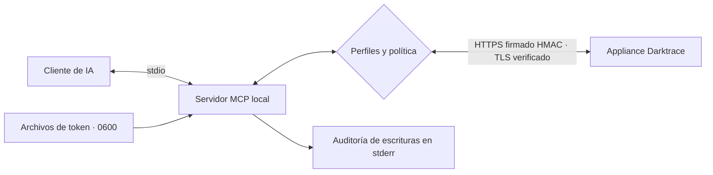
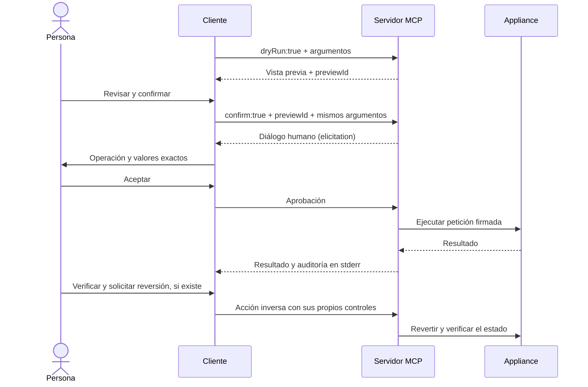
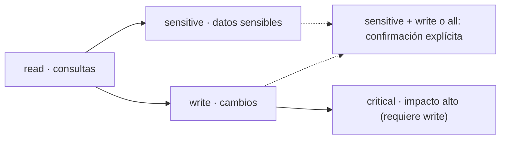

# Darktrace MCP

**Español** · [English](README.en.md)

<picture><source media="(max-width: 600px)" srcset="docs/assets/banner-variants/b/readme-banner-es-mobile.svg">
  </picture>

Darktrace MCP server no oficial que conecta la **Darktrace Threat Visualizer API** con Claude, Cursor, Codex y VS Code mediante **Model Context Protocol**. Ayuda a tu SOC en la respuesta a incidentes: investigación, Antigena / RESPOND y consultas de Darktrace/Email aún sin validar. No es un producto oficial ni está afiliado a Darktrace.

**Investiga en lenguaje natural, con permisos explícitos y aprobación humana de acciones críticas.**

[](LICENSE)
[](docs/getting-started.md)
[](docs/configuration.md#aprobación-humana)
[](https://github.com/nuoframework/darktrace-mcp/actions/workflows/ci.yml)
[](https://www.bestpractices.dev/projects/15261)
[](https://scorecard.dev/viewer/?uri=github.com/nuoframework/darktrace-mcp)
[](docs/releases.md)
[](https://github.com/nuoframework/darktrace-mcp/releases)

[Primeros pasos](docs/getting-started.md) · [Herramientas](docs/tools.md) · [Configuración](docs/configuration.md) · [Seguridad](docs/security.md) · [Solución de problemas](docs/troubleshooting.md)

## Instalación en 1 minuto

1. **Prepara la conexión.** Node.js 22+, `https://<tu-appliance>` y dos tokens API (público y privado, desde **System Config → Settings → API Token**).
2. **Ejecuta el asistente** y elige `read` para empezar:

   ```sh
   npx -y @nuoframework/darktrace-mcp@1.1.2 setup
   ```

3. **Reinicia tu cliente** y pide: «Resume los model breaches de la última hora».

[Guía de instalación](docs/install.md) · [Primeros pasos](docs/getting-started.md) · [Problemas frecuentes](docs/troubleshooting.md). Windows: consulta las [opciones para proteger tokens](docs/getting-started.md#windows).

<details><summary>Elige tu cliente: comandos y botones de instalación</summary>

| Tu cliente | Instalación directa |
|---|---|
| Claude Desktop | Abre el `.mcpb` de la [release v1.1.2](https://github.com/nuoframework/darktrace-mcp/releases/tag/v1.1.2); tokens en el llavero |
| Claude Code | `npx -y @nuoframework/darktrace-mcp@1.1.2 setup --client claude-code` |
| Codex (CLI e IDE) | `npx -y @nuoframework/darktrace-mcp@1.1.2 setup --client codex` |
| Cursor | `npx -y @nuoframework/darktrace-mcp@1.1.2 setup --client cursor` |
| VS Code | `npx -y @nuoframework/darktrace-mcp@1.1.2 setup --client vscode` |
| Windsurf | `npx -y @nuoframework/darktrace-mcp@1.1.2 setup --client windsurf` |
| OpenCode | `npx -y @nuoframework/darktrace-mcp@1.1.2 setup --client opencode` |
| Gemini CLI | `npx -y @nuoframework/darktrace-mcp@1.1.2 setup --client gemini` |
| Docker (cualquier cliente) | `npx -y @nuoframework/darktrace-mcp@1.1.2 setup --runtime docker` |

[](docs/clients.md#claude-desktop) [](docs/clients.md#claude-code) [](docs/clients.md#codex) [](docs/clients.md#cursor) [](docs/clients.md#vs-code) [](docs/clients.md#windsurf) [](docs/clients.md#opencode) [](docs/clients.md#gemini-cli) [](docs/clients.md#docker)
<p align="left"><a href="cursor://anysphere.cursor-deeplink/mcp/install?name=darktrace&amp;config=eyJjb21tYW5kIjoibnB4IiwiYXJncyI6WyIteSIsIkBudW9mcmFtZXdvcmsvZGFya3RyYWNlLW1jcEAxLjEuMiJdLCJlbnYiOnsiREFSS1RSQUNFX1BST0ZJTEVTIjoicmVhZCJ9fQ%3D%3D"></a>
<a href="vscode:mcp/install?%7B%22name%22%3A%22darktrace%22%2C%22type%22%3A%22stdio%22%2C%22command%22%3A%22npx%22%2C%22args%22%3A%5B%22-y%22%2C%22%40nuoframework%2Fdarktrace-mcp%401.1.2%22%5D%2C%22env%22%3A%7B%22DARKTRACE_URL%22%3A%22%24%7Binput%3Adarktrace-url%7D%22%2C%22DARKTRACE_PUBLIC_TOKEN%22%3A%22%24%7Binput%3Adarktrace-public-token%7D%22%2C%22DARKTRACE_PRIVATE_TOKEN%22%3A%22%24%7Binput%3Adarktrace-private-token%7D%22%2C%22DARKTRACE_PROFILES%22%3A%22read%22%7D%2C%22inputs%22%3A%5B%7B%22type%22%3A%22promptString%22%2C%22id%22%3A%22darktrace-url%22%2C%22description%22%3A%22Darktrace%20appliance%20URL%20(https%3A%2F%2F...)%22%2C%22password%22%3Afalse%7D%2C%7B%22type%22%3A%22promptString%22%2C%22id%22%3A%22darktrace-public-token%22%2C%22description%22%3A%22Darktrace%20API%20public%20token%22%2C%22password%22%3Atrue%7D%2C%7B%22type%22%3A%22promptString%22%2C%22id%22%3A%22darktrace-private-token%22%2C%22description%22%3A%22Darktrace%20API%20private%20token%22%2C%22password%22%3Atrue%7D%5D%7D"></a>
<a href="vscode-insiders:mcp/install?%7B%22name%22%3A%22darktrace%22%2C%22type%22%3A%22stdio%22%2C%22command%22%3A%22npx%22%2C%22args%22%3A%5B%22-y%22%2C%22%40nuoframework%2Fdarktrace-mcp%401.1.2%22%5D%2C%22env%22%3A%7B%22DARKTRACE_URL%22%3A%22%24%7Binput%3Adarktrace-url%7D%22%2C%22DARKTRACE_PUBLIC_TOKEN%22%3A%22%24%7Binput%3Adarktrace-public-token%7D%22%2C%22DARKTRACE_PRIVATE_TOKEN%22%3A%22%24%7Binput%3Adarktrace-private-token%7D%22%2C%22DARKTRACE_PROFILES%22%3A%22read%22%7D%2C%22inputs%22%3A%5B%7B%22type%22%3A%22promptString%22%2C%22id%22%3A%22darktrace-url%22%2C%22description%22%3A%22Darktrace%20appliance%20URL%20(https%3A%2F%2F...)%22%2C%22password%22%3Afalse%7D%2C%7B%22type%22%3A%22promptString%22%2C%22id%22%3A%22darktrace-public-token%22%2C%22description%22%3A%22Darktrace%20API%20public%20token%22%2C%22password%22%3Atrue%7D%2C%7B%22type%22%3A%22promptString%22%2C%22id%22%3A%22darktrace-private-token%22%2C%22description%22%3A%22Darktrace%20API%20private%20token%22%2C%22password%22%3Atrue%7D%5D%7D"></a></p>

**Cursor:** añade la entrada ([completar](docs/install.md#qué-hace-el-botón)). **VS Code / Insiders:** piden los datos.

</details>

Para desinstalar: `npx -y @nuoframework/darktrace-mcp@1.1.2 uninstall`. Muestra el plan y pide confirmación; `--dry-run` solo lo muestra y `--docker` incluye la imagen fijada.

## Cómo funciona



El servidor no abre puertos. Fija un destino HTTPS, rechaza proxies y redirecciones y nunca supera los permisos del token. Los resultados llegan al cliente y a su proveedor: revisa la idoneidad del proveedor, el tratamiento, la retención y la residencia de datos antes de usar producción.



La vista previa dura **5 minutos** y sirve una sola vez. Rechazar, cancelar o no poder mostrar el diálogo impide la ejecución. La reversión depende de la operación: **no hay rollback automático**, los comentarios no se borran y un resultado desconocido exige comprobar el appliance antes de repetir.



Es una escala de riesgo, no una herencia automática: selecciona perfiles separados por comas. `critical` necesita `write`; `all` o `sensitive` + `write` requiere `DARKTRACE_ACKNOWLEDGE_SENSITIVE_WRITE=true`. No hay aislamiento de datos entre lectura sensible y escritura. [Perfiles y aprobación](docs/configuration.md#perfiles).

<details><summary>Tres demostraciones: conectar, investigar y rechazar una acción</summary>

Grabaciones con un mock HTTPS y datos sintéticos; muestran el flujo, no validan un appliance. [Fuentes y transcripciones](scripts/demo/README.md).

<p><br><strong>Conecta una vez.</strong> El asistente verifica la conexión y configura el cliente.</p>

<p><br><strong>Investiga.</strong> Consulta dispositivos y model breaches y decide qué revisar después.</p>

<p><br><strong>Conserva el control.</strong> La demostración rechaza el diálogo crítico; no se envía la escritura.</p>

</details>

## Qué puedes hacer

**50 herramientas · 77 operaciones ejecutables**. Por perfil mínimo: `read` 38, `sensitive` 18, `write` 16, `critical` 5. La [referencia generada](docs/tools.md) detalla cada operación, sus límites y la evidencia.

| Área | Herramientas | Operaciones | Ejemplos | Perfiles | ✓ / ◐ / — |
|---|---:|---:|---|---|---:|
| [Sistema y referencias](docs/tools.md#sistema-y-referencias) | 5 | 6 | Estado, estadísticas de red, enumeraciones | `read` | 3 / 1 / 2 |
| [Dispositivos](docs/tools.md#dispositivos) | 9 | 9 | Búsquedas, conexiones, métricas, etiquetas | `read`, `write` | 9 / 0 / 0 |
| [Model breaches](docs/tools.md#model-breaches) | 4 | 7 | Consultar, reconocer, comentar | `read`, `write` | 7 / 0 / 0 |
| [Modelos y métricas](docs/tools.md#modelos-y-métricas) | 3 | 6 | Definiciones de modelos, componentes y métricas | `read` | 4 / 2 / 0 |
| [AI Analyst](docs/tools.md#ai-analyst) | 8 | 11 | Incidentes, fijación, investigaciones | `read`, `write` | 11 / 0 / 0 |
| [Respuesta autónoma (Antigena)](docs/tools.md#respuesta-autónoma-antigena) | 3 | 4 | Listar, activar, ampliar, anular | `read`, `critical` | 3 / 1 / 0 |
| [Etiquetas](docs/tools.md#etiquetas) | 3 | 10 | Listar, crear, asignar, quitar, borrar | `read`, `write`, `critical` | 7 / 0 / 3 |
| [Intel feed y subredes](docs/tools.md#intel-feed-y-subredes) | 4 | 4 | Watched Domains, ajustes de subred | `read`, `critical` | 2 / 2 / 0 |
| [Capturas de paquetes](docs/tools.md#capturas-de-paquetes) | 3 | 3 | Listar, solicitar, descargar | `read`, `sensitive`, `write` | 3 / 0 / 0 |
| [Advanced Search](docs/tools.md#advanced-search) | 1 | 4 | Consultas, análisis de campos, gráficos | `sensitive` | 4 / 0 / 0 |
| [Darktrace/Email](docs/tools.md#darktraceemail) | 7 | 13 | Paneles, metadatos, búsquedas, auditoría | `sensitive` | 0 / 0 / 13 |

**✓** evidencia completa · **◐** evidencia parcial · **—** sin validar; las cifras cuentan operaciones. Cada herramienta agrupa variantes de la misma API (por ejemplo, lista y detalle por ID), de ahí que haya menos herramientas que operaciones.

## Estado de validación por área

**53 operaciones tienen evidencia completa, 6 parcial y 18 están sin validar**. Son **59 con evidencia**, no 59 totalmente validadas. Las campañas se hicieron con Darktrace **7.1.0**; no garantizan todas las combinaciones de argumentos ni otras versiones.

- **Dispositivos, model breaches, AI Analyst, PCAP y Advanced Search:** evidencia para las operaciones listadas. PCAP devuelve Base64 completo solo dentro del límite (unos 45 KB); por encima devuelve tamaño y SHA-256.
- **Sistema, modelos y métricas:** `models`, `components` y `enums` solo con `responsedata`; CVEs devolvió 500 en el laboratorio no OT y `filtertypes`, una redirección 302 rechazada.
- **Respuesta, intel feed y subredes:** cobertura parcial por parámetros; consulta la [campaña 1.1.1](docs/security/lab-gap-campaign-1.1.1.md).
- **Etiquetas:** las tres eliminaciones se aplicaron, pero devolvieron 502: se informa `write_outcome_unknown`, no éxito.
- **Darktrace/Email en 1.1.1:** **14 operaciones inventariadas: 13 lecturas disponibles detrás de `sensitive` y una acción excluida de todos los perfiles**. Ninguna está validada contra un appliance real. Las 13 rutas API `/agemail` probadas con tokens devolvieron 403; más tarde, el servicio devolvió 503 con HTML «Darktrace Labs», sin validación posible. La consola usa otro host y autenticación de sesión; abrirla no demuestra acceso por API. La descarga de correo devuelve solo tamaño y SHA-256, nunca contenido.

Para validar Email hacen falta un despliegue habilitado, un token con permisos **Email Logs**, el esquema OpenAPI de la instancia revisado y fijado, y pruebas de las 13 lecturas por MCP con datos de laboratorio. La acción requiere además un esquema restrictivo, prueba de firma y efectos/reversión, y una nueva revisión de diseño; liberar un correo implica exposición irreversible. [Prueba bloqueada por 403](docs/security/lab-email-validation.md) · [API observada en consola y trabajo pendiente](docs/security/email-api-observed.md).

## Compatibilidad

Matriz de rutas documentadas; no certifica cada versión de cliente o sistema. **N**: Node con tokens en archivos privados; **D**: Docker; **W**: WSL. En Windows nativo, el asistente no garantiza permisos POSIX `0600`. WSL ejecuta servidor y cliente en Linux; los clientes Windows necesitan un lanzador WSL explícito. La [matriz completa](docs/install-matrix.md) documenta 21 clientes y separa los 13 adaptadores previstos para 1.1.3. [Configuración manual](docs/clients.md).

| Cliente | macOS | Linux | Windows | Ruta |
|---|---|---|---|---|
| Claude Desktop | N / D | No documentado | `.mcpb` / D | Extensión o `setup` |
| Claude Code / Codex | N / D | N / D | W / D | `setup` o plugin; Codex necesita conexión aparte |
| Cursor / VS Code | N / D | N / D | W / D | `setup` o enlace de instalación |
| Windsurf / OpenCode | N / D | N / D | W / D | `setup` o JSON |
| Gemini CLI | N / D | N / D | W / D | `setup` o CLI |

| Componente | Compatibilidad y evidencia |
|---|---|
| Node.js | Mínimo 22; CI documentada con 22 y 24. Revisa también la versión de OpenSSL, no solo la de Node |
| Docker | Linux `amd64` y `arm64`; ejecución local por stdio, sin puertos. Docker Desktop en macOS/Windows |
| Windows nativo | Tokens en archivos POSIX no garantizados; `.mcpb` usa el llavero. Alternativas: Docker o WSL |
| WSL | Ruta Linux; usa Node y archivos privados dentro de WSL |
| Darktrace | Laboratorios 7.1.0; inventario basado en API Threat Visualizer 6.1 y SDK. Otras versiones sin validar |
| Firma | `compact` y `spaced` observados en 7.1.0. El asistente prueba la alternativa ante 400; el servidor no cambia silenciosamente |

| Cliente / capacidad | Diálogo del servidor | Alternativa y límites |
|---|---|---|
| Claude Code 2.1.289 | Verificado: protocolo 2026-07-28, `input_required`, formulario por llamada | No interactivo: cancela; reglas automáticas debilitan la intervención humana |
| Cliente con MCP 2025 y capacidad de formulario | `elicitation/create` si declara soporte al iniciar | Hay que verificar la versión concreta del cliente |
| Desktop, Codex, Cursor, VS Code, Windsurf, OpenCode, Gemini CLI | Sin prueba individual de aprobación registrada aquí | Si falta soporte, `approval_unavailable`; `host` depende del permiso por herramienta |

El modo crítico `host` requiere `DARKTRACE_ACKNOWLEDGE_HOST_APPROVAL=true` y mantiene vista previa y confirmación. No prueba intervención humana. [Configuración](docs/configuration.md#aprobación-humana) · [Clientes](docs/clients.md#claude-code) · [Notas de corrección del cliente HTTP](docs/security/client-remediation-notes.md).

## Seguridad

TLS obligatorio, tokens privados, perfiles al arrancar, límites de entrada/salida, escrituras sin reintento y auditoría con cadena de hashes en stderr. Tres escrituras fallidas o desconocidas consecutivas bloquean nuevas escrituras hasta reiniciar. La auditoría no cubre lecturas sensibles ni tiene anclaje externo. Ningún filtro garantiza eliminar todos los datos sensibles o toda inyección de instrucciones.

Evidencia fechada: [modelo de amenazas](docs/security/threat-model-writes.md), [revisión independiente](docs/security/design-review-writes.md), [rondas adversariales](docs/security/adversarial-results-writes.md), [campañas de laboratorio](docs/security/final-lab-campaign-1.1.0.md) y [revisión final](docs/security/final-gate-review-1.1.0.md). Los [valores fijados 1.1.0](docs/security/release-pins-1.1.0.md) recogen 230 pruebas funcionales y 1.150 subcasos de seguridad; macOS omite tres por plataforma. Las insignias OpenSSF enlazan a sus resultados, no son una certificación. [Resumen y límites](docs/security.md) · [Índice de auditorías](docs/security/README.md).

## Versiones y releases

Paquete npm: **`@nuoframework/darktrace-mcp`**; el nombre sin ámbito no es este proyecto. Etiquetas `vX.Y.Z`, títulos `Darktrace MCP vX.Y.Z`. [GitHub Releases](https://github.com/nuoframework/darktrace-mcp/releases) distribuye `.tgz`, `.mcpb`, `SHA256SUMS`, SBOM y evidencia; ghcr ofrece las dos arquitecturas. Fija la versión npm y el digest de imagen, y verifica las sumas y la procedencia. [Estado por canal y procedimiento](docs/releases.md) · [Cambios](CHANGELOG.md).

## Casos de uso

### Investigar model breaches de Darktrace con IA

Consulta alertas, comentarios y contexto de dispositivos para priorizar una investigación SOC.
Empieza con `read` y la [referencia de herramientas](docs/tools.md#model-breaches).

### Aislar un dispositivo con Antigena desde Claude con aprobación humana

En Claude Code, previsualiza un bloqueo de conexión con Antigena / RESPOND; el aislamiento total no está validado.
Usa `write,critical` y revisa la [aprobación humana](docs/configuration.md#aprobación-humana).

### Consultar Advanced Search de Darktrace en lenguaje natural

Pide a tu cliente que traduzca una pregunta de investigación a una consulta acotada de tráfico.
Activa `sensitive` y consulta los [límites de Advanced Search](docs/tools.md#advanced-search).

### Automatizar triage de AI Analyst

Resume incidentes y eventos para priorizar el triaje; añadir comentarios requiere `write`.
Consulta las [operaciones de AI Analyst](docs/tools.md#ai-analyst) y previsualiza los cambios.

### Integrar Darktrace en Cursor, VS Code y Codex

Conecta tu cliente con el asistente o una configuración manual de rutas y tokens privados.
Sigue la [guía por cliente](docs/clients.md) y distingue 1.1.2 de las novedades de 1.1.3.

### Servidor MCP local y seguro para SOC

Ejecuta por stdio, limita los perfiles y revisa qué datos llegan al proveedor de tu cliente.
Consulta el [modelo de seguridad y sus límites](docs/security.md) antes de usar producción.

## Contribuir, soporte y licencia

Lee [CONTRIBUTING.md](CONTRIBUTING.md). Para dudas o errores, abre una [incidencia (issue)](https://github.com/nuoframework/darktrace-mcp/issues) con datos sintéticos. Para vulnerabilidades, usa el [canal privado](SECURITY.md). Licencia [Apache-2.0](LICENSE).

Darktrace y su logotipo pertenecen a Darktrace; su uso identifica el producto integrado y no implica respaldo ni autorización. [Procedencia del logotipo](docs/assets/brand/darktrace/README.md). Reclamaciones de marca o retirada: [contacto@pabloarrabal.com](mailto:contacto@pabloarrabal.com).

**Relacionado:** [npm](https://www.npmjs.com/package/@nuoframework/darktrace-mcp) · [Imagen GHCR](https://github.com/nuoframework/darktrace-mcp/pkgs/container/darktrace-mcp) · [MCP Registry](https://registry.modelcontextprotocol.io/) · [Darktrace API: documentación oficial (requiere acceso al portal)](https://customerportal.darktrace.com/guides/api-tokens).
