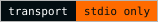
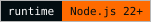
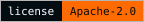
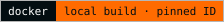
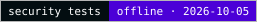

**English** · [Español](README.es.md)

<picture>
  <source media="(max-width: 600px)" srcset="docs/assets/readme-banner-en-mobile.svg">
  
</picture>

# Darktrace MCP

**Unofficial MCP. Developed by an independent third party, unaffiliated with Darktrace and without authorization from Darktrace.**

Use the Darktrace Threat Visualizer API from Claude, Codex, Cursor, VS Code and other MCP clients: investigate devices, model breaches and AI Analyst incidents, and, if you allow it, take action.

<p>
  <a href="docs/architecture.md#91-baseline-stdio"></a>
  <a href="package.json"></a>
  <a href="LICENSE"></a>
  <a href="docs/docker.md"></a>
  <a href="docs/security.md"></a>
</p>

[Getting started](docs/getting-started.md) · [Clients](docs/clients.md) · [Tools](docs/tools.md) · [Configuration](docs/configuration.md) · [Troubleshooting](docs/troubleshooting.md)

## Quick start

You need: the HTTPS address of your Darktrace appliance, a **public** and a **private** API token, and access to this private GitHub repository.

### 1. Installer and setup wizard (macOS, Linux)

```sh
gh auth login
gh api -H 'Accept: application/vnd.github.raw' \
  repos/nuoframework/darktrace-mcp/contents/scripts/install.sh > install.sh
less install.sh
bash install.sh
```

The installer clones the repository, builds it and starts `darktrace-mcp setup`. The wizard asks for the URL and tokens (typed hidden), saves the tokens to files only you can read, and configures the clients it finds. Windows: use `scripts/install.ps1` ([details](docs/getting-started.md#windows)).

### 2. Claude Desktop extension (.mcpb)

```sh
gh repo clone nuoframework/darktrace-mcp && cd darktrace-mcp
npm ci --ignore-scripts && npm run build
npm run pack:mcpb
```

Double-click the `.mcpb` file. Claude Desktop asks for the URL and tokens and keeps the tokens in your OS keychain.

### 3. Docker

```sh
docker load --input darktrace-mcp-<version>-linux-arm64.tar.gz
docker image inspect --format '{{.Id}}' darktrace-mcp:<version>-arm64
```

Get the archive from a private release or build it yourself, then add the hardened client snippet. See the [Docker guide](docs/docker.md).

### Check it works

```sh
darktrace-mcp --check-config
darktrace-mcp test
```

`--check-config` checks your settings offline. `test` makes one real call (`GET /status`) to your appliance.

## Supported clients

`darktrace-mcp setup` configures these automatically. Each link shows the manual snippet too.

| Client | Automatic | Manual guide |
|---|---|---|
| Claude Desktop | `setup` or `.mcpb` | [Claude Desktop](docs/clients.md#claude-desktop) |
| Claude Code | `setup` | [Claude Code](docs/clients.md#claude-code) |
| Codex (CLI and IDE) | `setup` | [Codex](docs/clients.md#codex) |
| Cursor | `setup` or one-click link | [Cursor](docs/clients.md#cursor) |
| VS Code (Copilot) | `setup` or one-click link | [VS Code](docs/clients.md#vs-code) |
| Windsurf | `setup` | [Windsurf](docs/clients.md#windsurf) |
| OpenCode | `setup` | [OpenCode](docs/clients.md#opencode) |
| Gemini CLI | `setup` | [Gemini CLI](docs/clients.md#gemini-cli) |
| Any client, via Docker | manual | [Docker](docs/clients.md#docker) |

## What it can do

78 of the 79 API operations are available, grouped into 51 tools. Full list: [tool reference](docs/tools.md).

| Area | Examples | Profile needed |
|---|---|---|
| Devices | list, search, similar devices, connection details, metrics | `read` |
| Model breaches | list, comments | `read` |
| | acknowledge, comment | `write` |
| AI Analyst | incidents, events, investigations, stats | `read` |
| | acknowledge, pin, comment, start an investigation | `write` |
| Autonomous Response (Antigena) | list actions, summary | `read` |
| | activate, extend, clear, manual actions | `critical` |
| Tags | list tags and tagged devices | `read` |
| | create, assign, remove | `write` |
| | delete a tag | `critical` |
| Intel feed and subnets | read | `read` |
| | change | `critical` |
| Packet captures | list | `read` |
| | request a capture | `write` |
| | download a capture | `sensitive` |
| Advanced Search | queries, analysis, graphs | `sensitive` |
| Darktrace/Email | dashboards, reference data | `read` |
| | email content, search, audit events | `sensitive` |
| | hold, release and other email actions | `critical` |
| Models, metrics, status | models, components, metrics, status, statistics | `read` |

19 operations passed real queries on a Darktrace 7.1.0 lab. The others are marked **not lab-validated** in the [tool reference](docs/tools.md).

## Permissions and safety

You choose what the model may do with `DARKTRACE_PROFILES` (the wizard asks you). The default is `read`.

| Profile | Allows | Extra safety |
|---|---|---|
| `read` (default) | Normal reads | — |
| `sensitive` | Advanced Search, email content, PCAP download, audit events | — |
| `write` | Acknowledge, comment, pin, tags, device labels, PCAP requests, investigations | `dryRun:true` shows a preview without changing anything |
| `critical` | Antigena actions, intel feed, subnets, email actions, deleting a tag | Runs only with `confirm:true`. Without it you get a preview |
| `all` | Everything above | Same rules as each profile |

Combine profiles with commas, for example `DARKTRACE_PROFILES=read,write`. Every write and critical call is audited. Your Darktrace token permissions still apply: the server cannot do more than the token allows.

> **Data leaves your network.** Results go to your MCP client and its model provider. Check provider eligibility, retention and residency for your organization before you connect a production appliance.

More: [security overview](docs/security.md) · [security policy](SECURITY.md).

## Documentation

| Guide | What you find there |
|---|---|
| [Getting started](docs/getting-started.md) | Step-by-step install, tokens, first test |
| [Clients](docs/clients.md) | Automatic and manual setup for each client |
| [Configuration](docs/configuration.md) | Environment variables, config file, profiles, limits |
| [Tools](docs/tools.md) | Every tool and API operation, with its profile |
| [Troubleshooting](docs/troubleshooting.md) | Authentication, clock, TLS, permissions, proxies |
| [Docker](docs/docker.md) | Image, hardened run options |
| [Security](docs/security.md) | Safety model and links to detailed reviews |
| [Architecture](docs/architecture.md) | How a request flows, design decisions |
| [Releases](docs/releases.md) · [Changelog](CHANGELOG.md) | Versions and changes |
| [History](docs/history/README.md) | Past review and release records |

## Project status

Private repository. Nothing is published to npm or a public registry. Licensed under [Apache-2.0](LICENSE). Contributions: [CONTRIBUTING.md](CONTRIBUTING.md).

## Trademarks, logo and contact

**Unofficial MCP. Developed by an independent third party, unaffiliated with Darktrace and without authorization from Darktrace.** The Darktrace name and logo belong to Darktrace. The cover shows the [unmodified official wordmark](docs/assets/brand/darktrace/Darktrace-white.svg) from the public [Brand Hub logo pack](https://brandhub.darktrace.com/visual-identity/logo) ([provenance](docs/assets/brand/darktrace/README.md), [visual identity](docs/visual-identity.md)). It identifies the product this project integrates with. **Logo use does not imply authorization or official status.**

Complaints, trademark or branding claims, including requests to remove the logo: [contacto@pabloarrabal.com](mailto:contacto@pabloarrabal.com). This address is not for security reports; see the [security policy](SECURITY.md). This project never sends mail on its own.
