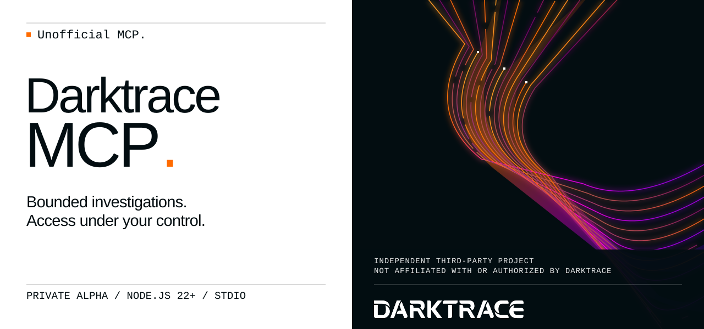
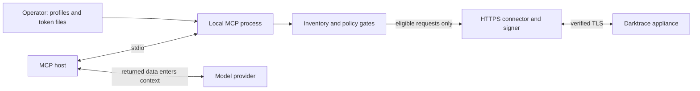

**English** · [Español](README.es.md)

<picture>
  <source media="(max-width: 600px)" srcset="docs/assets/readme-banner-en-mobile.svg">
  
</picture>

# Darktrace MCP

**Unofficial MCP. Developed by an independent third party, unaffiliated with Darktrace and without authorization from Darktrace.**

**Bring bounded Darktrace investigation tools into your MCP workspace.**

Private GitHub prereleases · Node.js 22+ · stdio · Apache-2.0

[Start in five minutes](docs/getting-started.md) · [Client setup](docs/clients.md) · [Configuration](docs/configuration.md) · [Inicio rápido en español](docs/es/getting-started.md)

## Investigation, with boundaries

Investigate devices, model breaches and analyst incidents from an MCP host, with a fixed operation inventory, operator-controlled profiles and bounded output. This is a **private offline alpha** for `nuoframework/darktrace-mcp`. There is no npm publication, public image or verified production deployment.

| Capability | Baseline behavior | Evidence/status |
|---|---|---|
| Investigation | Read profile enabled; Advanced Search needs separate sensitive-read opt-in | Source contract **6.1** |
| Changes | Medium/high writes require operator write profile; default to unsigned preview | Explicit `dryRun:false` needed for execution |
| Critical operations | Five optional preview-only operations; execution permanently blocked | No `confirm` field or approval bypass |
| Email, PCAP export, HTTP | Unavailable; enabling configuration rejected | Separate future design review required |
| Coverage | **79 inventory operations: 54 executable by profile + 5 critical previews + 19 blocked + 1 excluded** | Operation counts, not registered tool counts |
| Compatibility | Darktrace **7.1 lab target: NOT VALIDATED** | Signing, ACLs and live behavior remain pending |
| Security | Independent source review completed; [offline execution evidence](docs/release-preparation.md) recorded | Appliance/provider/deployment gates and residual-risk decisions remain open |

The generated [coverage inventory](src/coverage/report.generated.json) records 59 implemented operations, including the five critical previews. Available tools depend on profiles; “executable by profile” does not mean enabled by default or validated against an appliance.



**Before any deployment:** appliance results can enter the host and model provider context. Assess organizational eligibility, provider processing, retention, residency and host forwarding for every deployment, including read-only use. Advanced Search requires an additional sensitive-data assessment before setting `DARKTRACE_SENSITIVE_READ=true`. That flag records operator intent; it does not certify provider eligibility.

## Install a versioned private prerelease

Download the published [v0.1.0-alpha.0 private prerelease](https://github.com/nuoframework/darktrace-mcp/releases/tag/v0.1.0-alpha.0). Use [versioned GitHub Releases](docs/releases.md) to download the reviewed `.tgz` and `SHA256SUMS`, verify checksums, and install with `npm install --ignore-scripts --omit=dev`. The release includes a verifiable runtime SBOM; appliance 7.1, provider eligibility and Docker remain separate pending gates.

## Five-minute source install

Use an authenticated GitHub CLI account with access to the private repository, Node.js 22+ and npm. Review the checkout and dependency pins before building.

```sh
gh auth status
gh repo clone nuoframework/darktrace-mcp
cd darktrace-mcp
npm ci --ignore-scripts
npm run build
node dist/src/index.js --help
node dist/src/index.js --version
```

Provision **two separate token files outside the checkout** through your approved secret-management flow: one public API token and one private API token. Use absolute paths, current runtime-user ownership, regular files, at most 4,096 bytes and mode `0600` or stricter. No symlinks. Do not paste tokens into commands, client JSON, source control or chat.

```sh
export DARKTRACE_URL='https://darktrace.example.internal'
export DARKTRACE_PUBLIC_TOKEN_FILE='/absolute/private/darktrace/public-token'
export DARKTRACE_PRIVATE_TOKEN_FILE='/absolute/private/darktrace/private-token'
export DARKTRACE_PROFILES='read'
export DARKTRACE_SENSITIVE_READ='false'
node dist/src/index.js --check-config
```

`--check-config` validates locally without contacting the appliance. It does not validate authentication, connectivity or 7.1 compatibility. Configure your [MCP client](docs/clients.md) with the **absolute Node executable and compiled entrypoint paths**. Normal startup (`node /absolute/checkout/dist/src/index.js`) speaks MCP on stdin/stdout; the client launches it.

## Operate deliberately

Read is the default. Enabling `write` exposes eligible medium/high tools, which still default to `dryRun:true`. An accepted preview returns only `{dryRun:true, operationId, method, parameterNames}` before request construction/signing, with no parameter values or network call. Critical preview registration also requires `DARKTRACE_WRITE_CRITICAL=true`, but no setting enables critical execution. Model/client approval is **not authorization**; appliance token ACLs and operator policy remain authoritative.

After a mutation timeout or lost connection, the result can be **unknown**. Do not retry automatically: inspect appliance state and audit records first. The server does not replay POST/DELETE requests. Signing uses one explicitly configured mode, with no fallback on authentication errors. TLS verification is mandatory; use `NODE_EXTRA_CA_CERTS` for an approved private CA.

## Documentation

| Guide | Purpose |
|---|---|
| [Getting started](docs/getting-started.md) | Credentials, local checks and verified private artifacts |
| [Configuration](docs/configuration.md) | Environment, profiles and ceilings |
| [Clients](docs/clients.md) | Claude Code/Desktop, VS Code and Codex |
| [Troubleshooting](docs/troubleshooting.md) | Startup, TLS, hidden tools and unknown outcomes |
| [Architecture](docs/architecture.md) · [API contract](docs/api-contract.md) | Design and 6.1 source evidence |
| [Threat model](docs/security/threat-model.md) · [Design decisions](docs/security/design-decisions.md) | Security assumptions and outstanding gates |
| [Security policy](SECURITY.md) · [Contributing](CONTRIBUTING.md) | Private reporting and development |
| [Changelog](CHANGELOG.md) | Versioned alpha changes |
| [Releases](docs/releases.md) · [Release preparation](docs/release-preparation.md) | Versioned private artifacts, SBOM and current verification evidence |

## Private packaging

`private:true` prevents npm publication. Versioned private GitHub Releases distribute the verified tarball; source installation remains available. The packed artifact includes compiled runtime files, an npm shrinkwrap, README, license and security policy. It excludes source TypeScript, tests, development scripts, documentation sources and secrets. See the [artifact procedure](docs/getting-started.md#optional-verified-local-artifact). Dependency integrity and packaging checks are evidence about the artifact, not proof that dependency code is benign.

CI configures Node 22/24 checks, the existing isolated security harness and verified packaging. A manual read-only workflow prepares candidate assets; the owner publishes a private GitHub prerelease after review. No npm/container publication or artifact attestation is performed. See [releases](docs/releases.md) for protection prerequisites and evidence limits.

Licensed under [Apache-2.0](LICENSE). This project is not affiliated with or endorsed by Darktrace.

## Output and destination boundaries

Runtime output uses code-owned conservative views, with up to eight selected principal fields. `minimized:true` and `unmodeledFieldsOmitted:true` describe projection, not proof that all arbitrary nested sensitive data was removed. Unknown objects and maps are summarized. Advanced Search omits `@message` and `@fields` content. Known secret values and supported one-step encodings are redacted; arbitrary transformed encodings are outside that guarantee. The MCP host/model provider can still receive sensitive information in retained fields.

The HTTPS connector pins an approved startup DNS snapshot. The standard NAT64 ranges (`64:ff9b::/96`, `64:ff9b:1::/48`), 6to4 (`2002::/16`) and Teredo (`2001::/32`) addresses are always blocked, including translations that appear to target public IPv4. A prohibited DNS answer causes a terminal connector failure until the server process restarts; fixing DNS does not reopen that running connector. Operator-specific NAT64 prefixes cannot be detected generically; exact destination allowlists and deployment network review remain necessary. This fail-closed behavior may require changing the deployment's DNS/network design. Actual private-network pinning and appliance behavior remain unvalidated.

Visual design: [references and independent artwork](docs/visual-identity.md).
