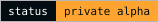
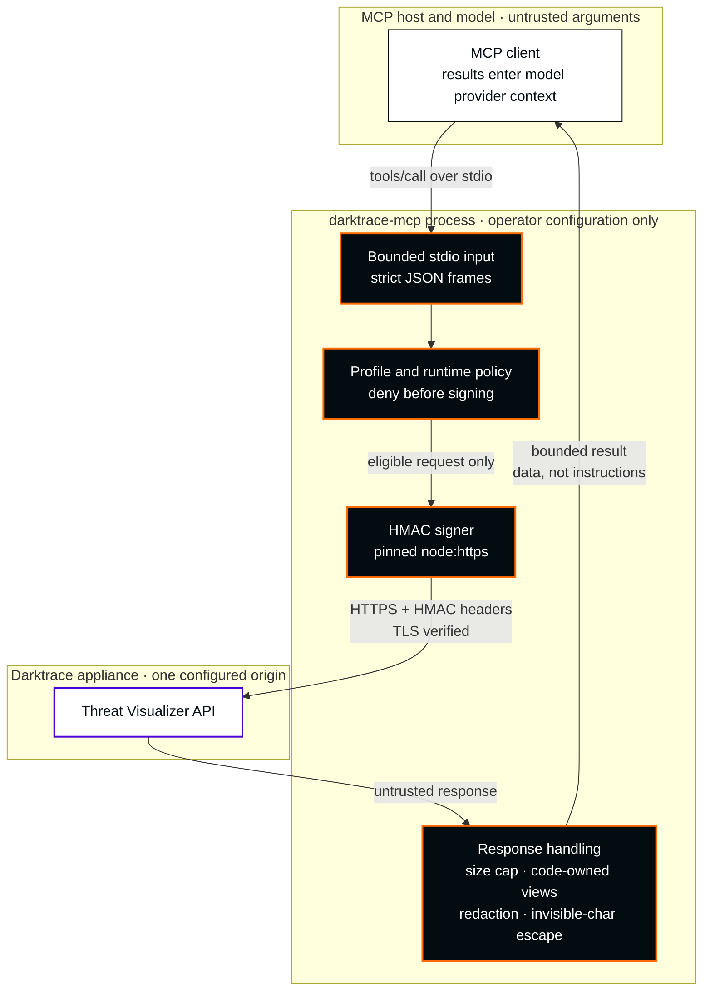

**English** · [Español](README.es.md)

<picture>
  <source media="(max-width: 600px)" srcset="docs/assets/readme-banner-en-mobile.svg">
  
</picture>

# Darktrace MCP

**Unofficial MCP. Developed by an independent third party, unaffiliated with Darktrace and without authorization from Darktrace.**

**Bring bounded Darktrace investigation tools into your MCP workspace.**

<p>
  <a href="docs/architecture.md#91-baseline-stdio"></a>
  <a href="package.json"></a>
  <a href="LICENSE"></a>
  <a href="docs/docker.md"></a>
  <a href="docs/security/mcp-corrections-acceptance.md"></a>
  <a href="docs/stable-readiness.md"></a>
</p>

[Start in five minutes](docs/getting-started.md) · [Client setup](docs/clients.md) · [Configuration](docs/configuration.md) · [Inicio rápido en español](docs/es/getting-started.md)

## Investigation, with boundaries

Investigate devices, model breaches and analyst incidents from an MCP host, with a fixed operation inventory, operator-controlled profiles and bounded output. This is a **private alpha with bounded 19-selector lab evidence** for `nuoframework/darktrace-mcp`. There is no npm publication, public image or verified production deployment.

| Capability | Baseline behavior | Evidence/status |
|---|---|---|
| Investigation | Enforced 19 validated GET selectors / 15 MCP tools in both profiles | Independently accepted source and full pinned contract; Advanced Search deferred |
| Changes | All non-read capabilities are denied by the immutable first-stable policy | No write execution or dry-run preview; writes are deferred to a later release |
| Critical operations | Unavailable in this release | No `confirm` field or approval bypass |
| Email, PCAP export, HTTP | Unavailable; enabling configuration rejected | Separate future design review required |
| Coverage | **79-operation** design catalogue; **19 GET / 15 tools** enabled | Catalogue counts do not describe enabled tools |
| Compatibility | Darktrace **7.1.0: 19/19 native and Docker selectors PASS** | Bounded recipes only; not full API compatibility. [Lab evidence](docs/security/validated-consultations-lab-checkpoint.md) |
| Security | Independent source acceptance; migration review and final candidate suites/package gates remain | **OpenSSL 3.5.8 hold; Grype reports 11 High** in unchanged scanned OS components; no stable publication |

The generated [coverage inventory](src/coverage/report.generated.json) preserves the 79-operation design catalogue; it does not define release eligibility. The independently accepted candidate enforces **19 validated GET selectors across 15 MCP tools**. Both `read` and `read` + `sensitiveRead` expose the same complete contract; sensitive read cannot expand this ceiling. Advanced Search and every other excluded selector, including writes, are refused before preview, audit or network access. [Current tools](docs/architecture.md#11-current-implementation-snapshot).

**Current checkpoint (2026-10-06 Europe/Madrid; evidence dated October 5 UTC):** accepted source `9e7c7070…` passed all **19 distinct permitted GET selectors in native MCP and hardened Docker** against lab 7.1.0. These are bounded recipes and expected response-shape checks, not every parameter combination, nonempty resource variant or full API compatibility. The exact campaign secret volume was removed and its absence independently verified. Earlier missing-identifier refusals and permission failures remain historical evidence. [Bound lab receipts](docs/security/validated-consultations-lab-checkpoint.md).

Source and full tool contract have independent acceptance; helper acceptance is scoped and final test-migration review remains a separate gate. **Final candidate test-suite completion is not yet established**; reproducible package preparation must consume the final documentation bytes. **Stable publication remains blocked by OpenSSL 3.5.8 / CVE-2026-35189** and outstanding final release gates. No stable version or tag has been created. [Readiness](docs/stable-readiness.md).



More detail: [profiles and trust boundaries](docs/architecture.md#32-profiles-and-trust-boundaries) · [Docker runtime](docs/architecture.md#33-docker-runtime).

**Before any deployment:** appliance results can enter the host and model provider context. Assess organizational eligibility, provider processing, retention, residency and host forwarding for every deployment, including read-only use. Sensitive read cannot expand the validated ceiling or certify provider eligibility.

## Install a versioned private prerelease

Download the published [v0.1.0-alpha.0 private prerelease](https://github.com/nuoframework/darktrace-mcp/releases/tag/v0.1.0-alpha.0). Use [versioned GitHub Releases](docs/releases.md) to download the reviewed `.tgz` and `SHA256SUMS`, verify checksums, and install with `npm install --ignore-scripts --omit=dev`. That published alpha predates the current working-tree Docker changes. The release includes a verifiable runtime SBOM; that historical alpha does not establish current 7.1 compatibility, and provider eligibility plus stable-release gates remain separate.

## Five-minute source install

Use an authenticated GitHub CLI account with access to the private repository, Node.js 22+ and npm. Review the checkout and dependency pins before building.

```sh
gh auth status
gh repo clone nuoframework/darktrace-mcp
cd darktrace-mcp
npm ci --ignore-scripts
npm run build
node dist/src/index.js --help
node dist/src/index.js --version
```

Provision **two separate token files outside the checkout** through your approved secret-management flow: one public API token and one private API token. Use absolute paths, current runtime-user ownership, regular files, at most 4,096 bytes and mode `0600` or stricter. No symlinks. Do not paste tokens into commands, client JSON, source control or chat.

```sh
export DARKTRACE_URL='https://darktrace.example.internal'
export DARKTRACE_PUBLIC_TOKEN_FILE='/absolute/private/darktrace/public-token'
export DARKTRACE_PRIVATE_TOKEN_FILE='/absolute/private/darktrace/private-token'
export DARKTRACE_PROFILES='read'
export DARKTRACE_SENSITIVE_READ='false'
node dist/src/index.js --check-config
```

`--check-config` validates locally without contacting the appliance. It does not validate authentication, connectivity or 7.1 compatibility. Configure your [MCP client](docs/clients.md) with the **absolute Node executable and compiled entrypoint paths**. Normal startup (`node /absolute/checkout/dist/src/index.js`) speaks MCP on stdin/stdout; the client launches it.

## Run the private local Docker image

Docker is an optional alternative to the [source install](#five-minute-source-install). Build from the reviewed checkout; `darktrace-mcp:local` is a private local inspection tag. Use the exact inspected image ID with `--pull=never`. Accepted source `9e7c7070…` produced image `sha256:eb3a7681…`: both 15-tool SDK profiles match the pinned complete contract, and all 19 permitted GET selectors passed bounded initialized-MCP lab checks. [Docker guide](docs/docker.md) · [Exact image/runtime binding](docs/security/validated-consultations-docker-checkpoint.md).

Historical fresh scans of predecessor `dc9b8f14…` found the same 31 Debian-package matches: Trivy 0.74.0 rated 23 MEDIUM and 8 LOW; Grype 0.118.0 rated 11 HIGH, 10 MEDIUM, 3 LOW and 7 NEGLIGIBLE, with no fix indicated by either scanner. The accepted final image has independently checked component equality to those scanned bytes; this is not a fresh database scan. Their SBOM omits Node and its bundled libraries, which were separately inventoried. Bundled OpenSSL 3.5.8 is affected by **CVE-2026-35189 (official severity Low)** during TLS certificate processing; 3.5.9 fixes it. On October 5, no official supported Node 22/24/26 release examined supplied that fix. This applicable issue blocks stable publication despite the successful functional checks; it is not a zero-CVE image. [Primary OpenSSL advisory](https://openssl-library.org/news/secadv/20260929.txt). The stdio image has no listener; do not publish ports. [Runtime boundaries](docs/architecture.md#33-docker-runtime).

```sh
docker build --pull -t darktrace-mcp:local .
docker image inspect --format '{{.Id}}' darktrace-mcp:local
```

For an MCP client, set `command` to the **absolute path of the host's Docker executable** (resolve it with `command -v docker`, then use that full path; do not rely on `PATH` or a shell). Pass Docker arguments as `args`. Keep `-i` and omit `-t` so stdio remains available to the MCP host. This example uses the image's nonroot UID `1000`; both mounted token files must be owned by that UID inside the container and have mode `0600` or stricter. Alternatively, set `--user` to a matching nonzero UID:GID and make both mounted files owned by that UID. Mount both tokens read-only; never put token values in client configuration or an env file.

```json
{
  "command": "/absolute/path/to/docker",
  "args": [
    "run", "--rm", "-i", "--init", "--pull=never", "--log-driver=none",
    "--read-only", "--cap-drop=ALL", "--security-opt=no-new-privileges",
    "--pids-limit=64", "--memory=256m", "--user", "1000:1000",
    "--mount", "type=bind,src=/absolute/private/darktrace/public-token,dst=/run/secrets/public-token,readonly",
    "--mount", "type=bind,src=/absolute/private/darktrace/private-token,dst=/run/secrets/private-token,readonly",
    "-e", "DARKTRACE_URL=https://darktrace.example.internal",
    "-e", "DARKTRACE_PUBLIC_TOKEN_FILE=/run/secrets/public-token",
    "-e", "DARKTRACE_PRIVATE_TOKEN_FILE=/run/secrets/private-token",
    "-e", "DARKTRACE_PROFILES=read",
    "-e", "DARKTRACE_SENSITIVE_READ=false",
    "REPLACE_WITH_IMAGE_ID_FROM_DOCKER_INSPECT"
  ]
}
```

Replace the image placeholder with the exact `sha256:...` ID returned above. Use absolute host paths for the token mounts. Do not add `-p`/`--publish`; this stdio image has no listener. The read-only root filesystem, dropped capabilities, `no-new-privileges`, and `--log-driver=none` setting are part of the example's runtime restrictions. Docker daemon logging does not control forwarding by the MCP host/provider. Docker Desktop UID and file-permission translation must be checked on the host; do not loosen token-file permissions to work around a mismatch. Prefer user-scoped MCP configuration; review every command, argument, environment value and host preload before enabling project-shared configuration. Use a dedicated MCP host profile or OS account for this server when available. Before sharing a host process, review the commands, environment, and mounts of every other configured MCP server; each runs with the host's privileges. The runtime image includes the project `LICENSE`, the Node.js license, the license files shipped with its production dependencies and the Debian package copyright files; review them before use. See the [Docker guide](docs/docker.md) for local image and private transfer verification steps.

## Operate deliberately

The independently accepted candidate enforces **19 validated GET selectors across 15 MCP tools**. Both `read` and `read` + `sensitiveRead` expose the same complete contract; sensitive read cannot expand this ceiling. Advanced Search and every other excluded selector, including writes, are refused before preview, audit or network access. Model/client approval is **not authorization**; appliance token ACLs remain authoritative.

This release has no mutation operations. If a later reviewed release enables a write, treat a timeout or lost connection as an **unknown** result and inspect appliance state and audit records before any action; the client must never replay POST/DELETE requests. Signing uses one explicitly configured mode, with no fallback on authentication errors. TLS verification is mandatory; use `NODE_EXTRA_CA_CERTS` for an approved private CA.

## Documentation

| Guide | Purpose |
|---|---|
| [Getting started](docs/getting-started.md) | Credentials, local checks and verified private artifacts |
| [Configuration](docs/configuration.md) | Environment, profiles and ceilings |
| [Clients](docs/clients.md) | Claude Code/Desktop, VS Code and Codex |
| [Troubleshooting](docs/troubleshooting.md) | Startup, TLS, hidden tools and unknown outcomes |
| [Architecture](docs/architecture.md) · [API contract](docs/api-contract.md) | Diagrams, tools per profile, design and 6.1 source evidence |
| [Threat model](docs/security/threat-model.md) · [Design decisions](docs/security/design-decisions.md) | Security assumptions and outstanding gates |
| [Docker](docs/docker.md) | Local build, hardened stdio runtime and private artifact verification |
| [Security policy](SECURITY.md) · [Contributing](CONTRIBUTING.md) | Private reporting and development |
| [Changelog](CHANGELOG.md) | Versioned alpha changes |
| [Releases](docs/releases.md) · [Release preparation](docs/release-preparation.md) | Versioned private artifacts, SBOM and current verification evidence |

## Private packaging

`private:true` prevents npm publication. Versioned private GitHub Releases distribute the verified tarball; source installation remains available. The packed artifact includes compiled runtime files, an npm shrinkwrap, README, license and security policy. It excludes source TypeScript, tests, development scripts, documentation sources and secrets. See the [artifact procedure](docs/getting-started.md#optional-verified-local-artifact). Dependency integrity and packaging checks are evidence about the artifact, not proof that dependency code is benign.

CI configures Node 22/24 checks, the existing isolated security harness and verified packaging. A manual read-only workflow prepares candidate assets; the owner publishes a private GitHub prerelease after review. No npm/container publication or artifact attestation is performed. See [releases](docs/releases.md) for protection prerequisites and evidence limits.

Licensed under [Apache-2.0](LICENSE). This project is not affiliated with or endorsed by Darktrace.

## Output and destination boundaries

Runtime output uses code-owned conservative views, with up to eight selected principal fields. `minimized:true` and `unmodeledFieldsOmitted:true` describe projection, not proof that all arbitrary nested sensitive data was removed. Unknown objects and maps are summarized. Known secret values and supported one-step encodings are redacted; arbitrary transformed encodings are outside that guarantee. The MCP host/model provider can still receive sensitive information in retained fields.

The HTTPS connector pins an approved startup DNS snapshot. The standard NAT64 ranges (`64:ff9b::/96`, `64:ff9b:1::/48`), 6to4 (`2002::/16`) and Teredo (`2001::/32`) addresses are always blocked, including translations that appear to target public IPv4. A prohibited DNS answer causes a terminal connector failure until the server process restarts; fixing DNS does not reopen that running connector. Operator-specific NAT64 prefixes cannot be detected generically; exact destination allowlists and deployment network review remain necessary. This fail-closed behavior may require changing the deployment's DNS/network design. The coordinator’s bounded native/Docker checks validate only their recorded selectors and snapshots; broader private-network and appliance behavior remain unvalidated.

## Trademarks, logo and contact

**Unofficial MCP. Developed by an independent third party, unaffiliated with Darktrace and without authorization from Darktrace.** The Darktrace name and logo belong to Darktrace. The cover shows the [unmodified official wordmark](docs/assets/brand/darktrace/Darktrace-white.svg) from the public [Brand Hub logo pack](https://brandhub.darktrace.com/visual-identity/logo), stored locally with [recorded provenance](docs/assets/brand/darktrace/README.md) and placed following the published single-color, clear-space and minimum-size rules. It identifies the product this independent project integrates with. **Logo use does not imply authorization or official status.** Visual design references and comparison: [visual identity](docs/visual-identity.md).

Complaints, trademark or branding claims, including requests from the trademark owner to remove the logo: [contacto@pabloarrabal.com](mailto:contacto@pabloarrabal.com). This address is for such claims only; it is not the vulnerability-reporting channel described in the [security policy](SECURITY.md). This project never sends mail on its own.
