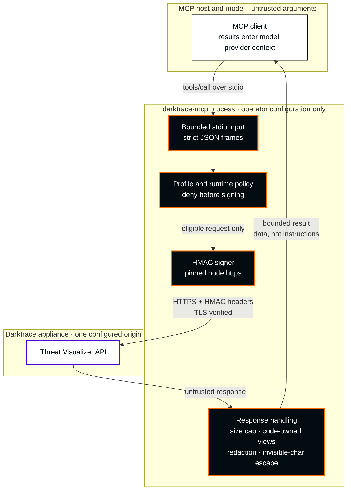

**English** · [Español](README.es.md)

<picture>
  <source media="(max-width: 600px)" srcset="docs/assets/readme-banner-en-mobile.svg">
  
</picture>

# Darktrace MCP

**Unofficial MCP. Developed by an independent third party, unaffiliated with Darktrace and without authorization from Darktrace.**

**Bring bounded Darktrace investigation tools into your MCP workspace.**

<p>
  <a href="docs/architecture.md#91-baseline-stdio"></a>
  <a href="package.json"></a>
  <a href="LICENSE"></a>
  <a href="docs/docker.md"></a>
  <a href="docs/security/mcp-corrections-acceptance.md"></a>
</p>

[Start in five minutes](docs/getting-started.md) · [Client setup](docs/clients.md) · [Configuration](docs/configuration.md) · [Inicio rápido en español](docs/es/getting-started.md)

## Investigation, with boundaries

Investigate devices, model breaches and analyst incidents from an MCP host, with a fixed operation inventory, operator-controlled profiles and bounded output. This is a **private release candidate** for `nuoframework/darktrace-mcp`. Nothing is published to npm or a public registry, and no production deployment has been verified.

| Area | Current candidate | Status |
|---|---|---|
| Tools | **15 MCP tools / 19 validated GET selectors**, identical in `read` and `read` + `sensitiveRead` | [Full mapping](#tools-in-this-release) |
| Changes | Writes, critical operations, email, PCAP export and HTTP transport are unavailable | Writes are planned for a later, separately reviewed release |
| Docker runtime | Alpine 3.24, Alpine-maintained **Node.js 24.18.1** with shared **OpenSSL 3.5.9**, on arm64 and amd64 | Nonroot, shell-free, `scratch`-based. [Docker guide](docs/docker.md) |
| Tests | arm64: 130 functional + 325 security tests pass, 0 skipped. amd64: 130 functional pass | The amd64 325-test security gate runs on native CI; its result is recorded in the release notes |
| Image scan | Trivy: 0 matches. Grype: 1 High (zlib, CVE-2026-85091) + 1 Medium (`ada`, CVE-2024-9410) | Raw matches kept. Independent arm64 review: the zlib library is affected, but its vulnerable `gz*` code is not in the application's execution path; the `ada` match is a product-name collision. zlib is **not fixed** (no Alpine package yet). Not a zero-CVE claim |
| Lab (Darktrace 7.1.0) | arm64 image `sha256:8cd85604…`: **19/19 real queries PASS** on 2026-10-06, no writes, cleanup verified | The lab is closed. Released images use the same query/policy implementation and dependencies; the only production source difference is the version literal. They were not retested live. Bounded recipes, not full API compatibility. [Lab record](docs/security/patched-runtime-lab-checkpoint.md) |
| Release | `1.0.0`, private | Published as private GitHub Release assets only after native CI and artifact acceptance pass. Hashes and CI evidence are in the release notes. [Readiness](docs/stable-readiness.md) |

Sensitive read cannot widen the ceiling. Advanced Search and every other excluded selector, including writes, are refused before preview, audit or network access. The [79-operation coverage inventory](src/coverage/report.generated.json) is design accounting, not the enabled surface. Lab results are bounded recipes and response-shape checks, not full API compatibility.



More detail: [profiles and trust boundaries](docs/architecture.md#32-profiles-and-trust-boundaries) · [Docker runtime](docs/architecture.md#33-docker-runtime).

**Before any deployment:** appliance results can enter the host and model provider context. Assess organizational eligibility, provider processing, retention, residency and host forwarding for every deployment, including read-only use. Sensitive read cannot expand the validated ceiling or certify provider eligibility.

## Run with Docker (recommended)

The image runs the server over stdio as UID `1000`, with no shell, package manager, listener or published port. Its root filesystem is root-owned and run read-only, with all capabilities dropped and `no-new-privileges`. Tokens arrive only as read-only mounted files. Docker is recommended because it ships a patched OpenSSL 3.5.9; official upstream Node.js releases examined on 2026-10-05 still bundle 3.5.8.

**Runtime support, honestly stated.** Node.js here is Alpine's musl build, maintained by the Alpine distribution, not an upstream Node.js Tier 1 binary. Node.js 24 lists x64 musl as Experimental and does not list arm64 musl. Security updates for this runtime depend on Alpine's package maintenance. [Details](docs/docker.md#runtime-support).

**Install options**

1. **Private GitHub Release image archive (easiest).** Download your architecture's archive (`linux-arm64` or `linux-amd64`) and `SHA256SUMS`, verify, then load. There is no public registry image; nothing is pulled from Docker Hub.

```sh
gh release download v1.0.0 --repo nuoframework/darktrace-mcp \
  --pattern 'darktrace-mcp-1.0.0-linux-arm64.tar.gz' --pattern SHA256SUMS
shasum -a 256 --ignore-missing -c SHA256SUMS
docker load --input darktrace-mcp-1.0.0-linux-arm64.tar.gz
docker image inspect --format '{{.Id}}' darktrace-mcp:1.0.0-arm64
```

   On amd64, replace `arm64` with `amd64` in the file name and the `darktrace-mcp:1.0.0-amd64` tag. Compare the image ID with the one in the release notes before configuring a client.
2. **Build from the reviewed checkout.** Fetch and verify the pinned Alpine packages, then build for your architecture (`arm64` or `amd64`):

```sh
node scripts/prepare-docker-runtime.mjs /absolute/private/darktrace-runtime arm64
docker buildx build --platform linux/arm64 \
  --build-context runtime-apks=/absolute/private/darktrace-runtime/arm64 \
  --load --tag darktrace-mcp:local .
docker image inspect --format '{{.Id}}' darktrace-mcp:local
```

The helper needs Docker and public HTTPS. It authenticates Alpine's signed package index with the pinned Alpine keys, checks the SHA-256 of all 22 packages, the upstream source SHA-512s and the license hashes, and writes nothing into the checkout.

For an MCP client, set `command` to the **absolute path of the host's Docker executable** (resolve it with `command -v docker`, then use that full path; do not rely on `PATH` or a shell). Pass Docker arguments as `args`. Keep `-i` and omit `-t` so stdio remains available to the MCP host. This example uses the image's nonroot UID `1000`; both mounted token files must be owned by that UID inside the container and have mode `0600` or stricter. Alternatively, set `--user` to a matching nonzero UID:GID and make both mounted files owned by that UID. Mount both tokens read-only; never put token values in client configuration or an env file.

```json
{
  "command": "/absolute/path/to/docker",
  "args": [
    "run", "--rm", "-i", "--init", "--pull=never", "--log-driver=none",
    "--read-only", "--cap-drop=ALL", "--security-opt=no-new-privileges",
    "--pids-limit=64", "--memory=256m", "--user", "1000:1000",
    "--mount", "type=bind,src=/absolute/private/darktrace/public-token,dst=/run/secrets/public-token,readonly",
    "--mount", "type=bind,src=/absolute/private/darktrace/private-token,dst=/run/secrets/private-token,readonly",
    "-e", "DARKTRACE_URL=https://darktrace.example.internal",
    "-e", "DARKTRACE_PUBLIC_TOKEN_FILE=/run/secrets/public-token",
    "-e", "DARKTRACE_PRIVATE_TOKEN_FILE=/run/secrets/private-token",
    "-e", "DARKTRACE_PROFILES=read",
    "-e", "DARKTRACE_SENSITIVE_READ=false",
    "REPLACE_WITH_IMAGE_ID_FROM_DOCKER_INSPECT"
  ]
}
```


## Five-minute source install

Use an authenticated GitHub CLI account with access to the private repository, Node.js 22+ and npm. Review the checkout and dependency pins before building.

> **Runtime OpenSSL.** Docker is the recommended route. Official upstream Node.js releases examined on 2026-10-05 bundle OpenSSL 3.5.8, affected by CVE-2026-35189. Being on Node 22 or 24 does **not** by itself make a native install patched. For a native install, use a maintained Node.js runtime whose OpenSSL you have independently verified as **3.5.9 or later**, for example with `node -p 'process.versions.openssl'` and your distribution's package records.

```sh
gh auth status
gh repo clone nuoframework/darktrace-mcp
cd darktrace-mcp
npm ci --ignore-scripts
npm run build
node dist/src/index.js --help
node dist/src/index.js --version
```

Provision **two separate token files outside the checkout** through your approved secret-management flow: one public API token and one private API token. Use absolute paths, current runtime-user ownership, regular files, at most 4,096 bytes and mode `0600` or stricter. No symlinks. Do not paste tokens into commands, client JSON, source control or chat.

```sh
export DARKTRACE_URL='https://darktrace.example.internal'
export DARKTRACE_PUBLIC_TOKEN_FILE='/absolute/private/darktrace/public-token'
export DARKTRACE_PRIVATE_TOKEN_FILE='/absolute/private/darktrace/private-token'
export DARKTRACE_PROFILES='read'
export DARKTRACE_SENSITIVE_READ='false'
node dist/src/index.js --check-config
```

`--check-config` validates locally without contacting the appliance. It does not validate authentication, connectivity or 7.1 compatibility. Configure your [MCP client](docs/clients.md) with the **absolute Node executable and compiled entrypoint paths**. Normal startup (`node /absolute/checkout/dist/src/index.js`) speaks MCP on stdin/stdout; the client launches it.

## Earlier private prerelease

The published [v0.1.0-alpha.0 private prerelease](https://github.com/nuoframework/darktrace-mcp/releases/tag/v0.1.0-alpha.0) is historical: it predates the 15-tool contract and the patched runtime. [Releases](docs/releases.md) explains download, `SHA256SUMS` verification and `npm install --ignore-scripts --omit=dev`.

## Tools in this release

All 15 tools are read-only, idempotent and non-destructive, and appear identically in both profiles.

| MCP tool | Validated GET selectors |
|---|---|
| `darktrace_get_status` | `get_status` |
| `darktrace_get_devices` | `get_devices` |
| `darktrace_list_subnets` | `get_subnets` |
| `darktrace_get_ai_analyst_stats` | `get_aianalyst_stats` |
| `darktrace_get_intel_feed` | `get_intelfeed` |
| `darktrace_list_model_breaches` | `get_modelbreaches` |
| `darktrace_search_devices` | `get_devicesearch` |
| `darktrace_get_similar_devices` | `get_similardevices` |
| `darktrace_list_ai_analyst_incidents` | `get_aianalyst_groups`, `get_aianalyst_incidentevents` |
| `darktrace_list_ai_analyst_investigations` | `get_aianalyst_investigations` |
| `darktrace_get_model_breach_comments` | `get_mbcomments` |
| `darktrace_get_connection_details` | `get_details` |
| `darktrace_list_tags` | `get_tags_entities`, `get_tags_tid`, `get_tags_tid_entities` |
| `darktrace_get_endpoint_details` | `get_endpointdetails` |
| `darktrace_list_antigena_actions` | `get_antigena`, `get_antigena_summary` |

## Operate deliberately

Model or client approval is **not authorization**; appliance token ACLs remain authoritative. Signing uses one explicitly configured mode, with no fallback on authentication errors. TLS verification is mandatory; use `NODE_EXTRA_CA_CERTS` for an approved private CA. If a later reviewed release enables writes, treat a timeout or lost connection as an **unknown** result and check appliance state before acting; never replay POST/DELETE requests.

## Documentation

| Guide | Purpose |
|---|---|
| [Getting started](docs/getting-started.md) | Credentials, local checks and verified private artifacts |
| [Configuration](docs/configuration.md) | Environment, profiles and ceilings |
| [Clients](docs/clients.md) | Claude Code/Desktop, VS Code and Codex |
| [Troubleshooting](docs/troubleshooting.md) | Startup, TLS, hidden tools and unknown outcomes |
| [Architecture](docs/architecture.md) · [API contract](docs/api-contract.md) | Diagrams, tools per profile, design and 6.1 source evidence |
| [Threat model](docs/security/threat-model.md) · [Design decisions](docs/security/design-decisions.md) | Security assumptions and outstanding gates |
| [Docker](docs/docker.md) | Local build, hardened stdio runtime and private artifact verification |
| [Security policy](SECURITY.md) · [Contributing](CONTRIBUTING.md) | Private reporting and development |
| [Changelog](CHANGELOG.md) | Versioned changes |
| [Releases](docs/releases.md) · [Release preparation](docs/release-preparation.md) | Versioned private artifacts, SBOM and current verification evidence |

## Private packaging

`private:true` prevents npm publication. Versioned private GitHub Releases distribute the verified tarball; source installation remains available. The packed artifact includes compiled runtime files, an npm shrinkwrap, README, license and security policy. It excludes source TypeScript, tests, development scripts, documentation sources and secrets. See the [artifact procedure](docs/getting-started.md#optional-verified-local-artifact). Dependency integrity and packaging checks are evidence about the artifact, not proof that dependency code is benign.

CI configures Node 22/24 checks, the existing isolated security harness and verified packaging. A manual read-only workflow prepares candidate assets; the owner publishes a private GitHub prerelease after review. No npm/container publication or artifact attestation is performed. See [releases](docs/releases.md) for protection prerequisites and evidence limits.

Licensed under [Apache-2.0](LICENSE). This project is not affiliated with or endorsed by Darktrace.

## Output and destination boundaries

Runtime output uses code-owned conservative views, with up to eight selected principal fields. `minimized:true` and `unmodeledFieldsOmitted:true` describe projection, not proof that all arbitrary nested sensitive data was removed. Unknown objects and maps are summarized. Known secret values and supported one-step encodings are redacted; arbitrary transformed encodings are outside that guarantee. The MCP host/model provider can still receive sensitive information in retained fields.

The HTTPS connector pins an approved startup DNS snapshot. The standard NAT64 ranges (`64:ff9b::/96`, `64:ff9b:1::/48`), 6to4 (`2002::/16`) and Teredo (`2001::/32`) addresses are always blocked, including translations that appear to target public IPv4. A prohibited DNS answer causes a terminal connector failure until the server process restarts; fixing DNS does not reopen that running connector. Operator-specific NAT64 prefixes cannot be detected generically; exact destination allowlists and deployment network review remain necessary. This fail-closed behavior may require changing the deployment's DNS/network design. The coordinator’s bounded native/Docker checks validate only their recorded selectors and snapshots; broader private-network and appliance behavior remain unvalidated.

## Trademarks, logo and contact

**Unofficial MCP. Developed by an independent third party, unaffiliated with Darktrace and without authorization from Darktrace.** The Darktrace name and logo belong to Darktrace. The cover shows the [unmodified official wordmark](docs/assets/brand/darktrace/Darktrace-white.svg) from the public [Brand Hub logo pack](https://brandhub.darktrace.com/visual-identity/logo), stored locally with [recorded provenance](docs/assets/brand/darktrace/README.md) and placed following the published single-color, clear-space and minimum-size rules. It identifies the product this independent project integrates with. **Logo use does not imply authorization or official status.** Visual design references and comparison: [visual identity](docs/visual-identity.md).

Complaints, trademark or branding claims, including requests from the trademark owner to remove the logo: [contacto@pabloarrabal.com](mailto:contacto@pabloarrabal.com). This address is for such claims only; it is not the vulnerability-reporting channel described in the [security policy](SECURITY.md). This project never sends mail on its own.
