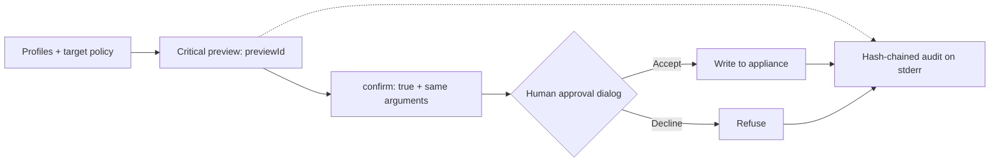

**English** · [Español](README.es.md)

<picture>
  <source media="(max-width: 600px)" srcset="docs/assets/readme-banner-en-mobile.svg">
  
</picture>

# Darktrace MCP

**Unofficial MCP. Developed by an independent third party, unaffiliated with Darktrace and without authorization from Darktrace.**

Investigate your Darktrace appliance from your MCP client. Start read-only; choose when to allow changes.

<!-- npm badge will 404 until the package is published. No publication claim is made here. -->

[Get started](docs/getting-started.md) · [Tools](docs/tools.md) · [Configuration](docs/configuration.md) · [Security](docs/security.md) · [Troubleshooting](docs/troubleshooting.md)

## See it work

Three recordings against a **synthetic HTTPS mock**, with dummy tokens and no production data. These demonstrate the workflow, not appliance compatibility. [Sources, transcripts and re-recording guide](scripts/demo/README.md).

**1 · Connect once.** Enter the URL and hidden tokens, pick `read`, then choose a client. The wizard checks TLS/authentication and shows what it wrote.

**2 · Ask an analyst question.** Claude Code calls the device and model-breach tools, then suggests what to inspect next. The recording formats actual headless client output.

**3 · Keep control of critical actions.** Preview → confirm → server confirmation dialog → decline. This minimal demo host renders the real MCP dialog; it is not a Claude Code screenshot. No action executes.

## Install in 60 seconds

Have your appliance's HTTPS origin and API token pair ready. The wizard needs **Node.js 22+**. These 1.1.0 distribution paths become available when the release is published; see [release status and source-install fallback](docs/getting-started.md).

<table>
<tr><th>npm → setup wizard</th><th>Claude Desktop → .mcpb</th><th>Docker → pinned image</th></tr>
<tr><td valign="top">
<pre>npx -y \
  @nuoframework/darktrace-mcp@1.1.0 \
  setup</pre>
Choose <code>read</code> and your clients.
</td><td valign="top">
Open <a href="https://github.com/nuoframework/darktrace-mcp/releases">Releases</a>. 
Download <code>darktrace-mcp-1.1.0.mcpb</code>. 
Double-click; enter URL and tokens. 
Claude Desktop keeps tokens in the OS keychain.
</td><td valign="top">
<pre>docker pull \
  ghcr.io/nuoframework/darktrace-mcp:1.1.0</pre>
<a href="docs/clients.md#docker">Resolve the digest and run the Docker wizard</a>. 
Pin the digest, never the moving tag.
</td></tr>
</table>

`npx` is a one-time bootstrap. The wizard installs a fixed copy and gives clients absolute Node + `dist/src/index.js` paths. Native Windows cannot protect token files: use [.mcpb, Docker or WSL](docs/getting-started.md#windows). [Full installation guide](docs/getting-started.md).

## Compatible clients

The wizard configures these clients; each badge links to its setup guide. Dialog support depends on the client and protocol. [Critical-action approval](docs/clients.md#claude-code).

Product names and logos identify compatibility only; they belong to their respective owners and imply no endorsement.

## What you can do

**50 tools · 77 executable operations.** Start with `read` (38 operations). Add `sensitive` (18), `write` (16), or `write,critical` (5 critical operations) as needed. Your appliance token permissions still set the ceiling.

| Area | Tools / ops | Examples | Profiles | Lab: ✓ / ◐ / — |
|---|---:|---|---|---:|
| [System and reference data](docs/tools.md#system-and-reference-data) | 5 / 6 | Health, network statistics, enums | `read` | 3 / 1 / 2 |
| [Devices](docs/tools.md#devices) | 9 / 9 | Search, connections, metrics, labels | `read`, `write` | 8 / 0 / 1 |
| [Model breaches](docs/tools.md#model-breaches) | 4 / 7 | Read, acknowledge, comment | `read`, `write` | 7 / 0 / 0 |
| [Models and metrics](docs/tools.md#models-and-metrics) | 3 / 6 | Model, component and metric definitions | `read` | 4 / 2 / 0 |
| [AI Analyst](docs/tools.md#ai-analyst) | 8 / 11 | Incidents, pinning, investigations | `read`, `write` | 10 / 0 / 1 |
| [Autonomous Response (Antigena)](docs/tools.md#autonomous-response-antigena) | 3 / 4 | List, activate, extend, clear | `read`, `critical` | 2 / 2 / 0 |
| [Tags](docs/tools.md#tags) | 3 / 10 | List, create, assign, remove, delete | `read`, `write`, `critical` | 7 / 0 / 3 |
| [Intel feed and subnets](docs/tools.md#intel-feed-and-subnets) | 4 / 4 | Watched Domains, subnet settings | `read`, `critical` | 2 / 2 / 0 |
| [Packet captures](docs/tools.md#packet-captures) | 3 / 3 | List, request, download | `read`, `sensitive`, `write` | 1 / 1 / 1 |
| [Advanced Search](docs/tools.md#advanced-search) | 1 / 4 | Queries, field analysis, graphs | `sensitive` | 1 / 3 / 0 |
| [Darktrace/Email](docs/tools.md#darktraceemail) | 7 / 13 | Dashboards, metadata, search, audit | `sensitive` | 0 / 0 / 13 |

Counts come from [docs/tools.md](docs/tools.md). **✓** = lab evidence; **◐** = partial evidence; **—** = not lab-validated. 56 operations have evidence from the first 7.1.0 lab, including 11 partial. Most write evidence predates the final controls; see the per-operation limits and later lab checks there. All 13 Email reads remain unvalidated (403); email download returns size and SHA-256 only. The Email action is excluded and `GET /aianalyst/incidents` is unavailable.

Try asking:

- “Find devices named finance and show their recent connections.” (`read`)
- “Summarize the highest-scoring model breaches from the last 24 hours.” (`read`)
- “Show AI Analyst incidents for this device and the existing analyst comments.” (`read`)
- “Preview a triage tag for device 42 before changing anything.” (`write`)
- “Search traffic for this domain and summarize the matching connections.” (`sensitive`)
- “Preview clearing Antigena action 123. Wait for my approval.” (`write,critical`)

## Safety by design

- **Profiles:** `read` by default; opt into sensitive data and changes. Ordinary writes run without a preview unless you set `dryRun:true`; their approval defaults to the host's tool prompt.
- **Critical approval:** a single-use `previewId` (5 minutes), then `confirm:true` with the same arguments, then the default server dialog. Decline/cancel refuses the action. The server cannot prove that a human answered; auto-allow rules weaken this control.
- **Write limits:** up to 10 writes/minute, 3 critical; three consecutive failed/unknown writes open the circuit breaker until restart. Limits and state are per process. Writes are never retried automatically.
- **Protected targets:** opt-in, exact literal matching plus per-operation target caps. Antigena action protection matches `codeid`, not the device.
- **Audit:** writes, previews and refusals have hash-chained records on stderr. Sensitive reads are not audited; chains have no external anchor or boot identity.
- **Bounded output:** field selection, size limits and instruction neutralization reduce exposure. They do not guarantee removal of every sensitive field or defeat every prompt injection. PCAPs over about 45 KB are refused with size/digest only.
- **Transport:** local stdio; verified TLS, HMAC-signed requests, a pinned destination and no proxies or redirects.
- **Explicit acknowledgements:** `all` or `sensitive` + `write` needs `DARKTRACE_ACKNOWLEDGE_SENSITIVE_WRITE=true` (no taint control). Critical `host` approval needs `DARKTRACE_ACKNOWLEDGE_HOST_APPROVAL=true`.

> **Data leaves your network.** Results reach your MCP client and its model provider, including inline Base64 PCAP data and email metadata. Assess provider **eligibility, retention and residency** before connecting a production appliance.

[Security overview](docs/security.md) · [Configuration and approval modes](docs/configuration.md#human-approval) · [Report a vulnerability](SECURITY.md)

## How it was validated

- Threat model [TM-18…31](docs/security/threat-model-writes.md), [independent design review](docs/security/design-review-writes.md) and [adversarial suites](docs/security/adversarial-results-writes.md).
- Recorded release pins: **230 functional tests / 1,150 security subcases**. Linux receipts report 1,150 passes; macOS has three platform skips. These are dated evidence, not a certification. [Pins and receipts](docs/security/release-pins-1.1.0.md).
- [Two Darktrace 7.1.0 labs](docs/security/final-lab-campaign-1.1.0.md), with narrower coverage than the offline suites; [Docker gates on arm64 and amd64](docs/security/release-pins-1.1.0.md#ci-closure-for-b1--b7-2026-10-06) at the recorded commit. The later installer change has separate pins.
- The [final gate review](docs/security/final-gate-review-1.1.0.md) records blockers and [residual risks](docs/security/final-gate-review-1.1.0.md#4-residual-risks-to-disclose-in-the-release-notes); [dated owner decisions](docs/security/owner-decisions-1.1.0.md) accept specific residuals. Neither removes them. There is no zero-CVE claim or recorded 1.1.0 runtime scan.

## Documentation and contributing

[Getting started](docs/getting-started.md) · [Clients](docs/clients.md) · [Tools](docs/tools.md) · [Configuration](docs/configuration.md) · [Docker](docs/docker.md) · [Architecture](docs/architecture.md) · [Troubleshooting](docs/troubleshooting.md) · [Releases](docs/releases.md) · [Changelog](CHANGELOG.md)

Open source under [Apache-2.0](LICENSE). [Contributions](CONTRIBUTING.md) are welcome. Distribution channels are described in [Releases](docs/releases.md); availability follows publication of each version.

## Trademarks and contact

The Darktrace name and logo belong to Darktrace. The banner uses the [unmodified official wordmark](docs/assets/brand/darktrace/Darktrace-white.svg) to identify the integrated product ([provenance](docs/assets/brand/darktrace/README.md)). **Logo use does not imply authorization or official status.**

Branding or removal requests: [contacto@pabloarrabal.com](mailto:contacto@pabloarrabal.com). Security reports: [SECURITY.md](SECURITY.md). This project never sends mail on its own.
