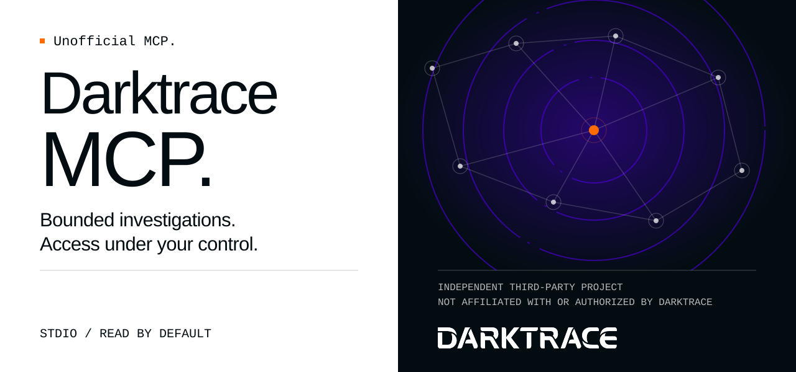
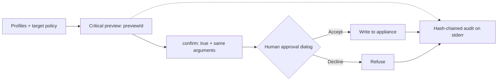

**English** · [Español](README.es.md)

<picture>
  <source media="(max-width: 600px)" srcset="docs/assets/banner-variants/b/readme-banner-en-mobile.svg">
  
</picture>

# Darktrace MCP

**Unofficial MCP. Developed by an independent third party, unaffiliated with Darktrace and without authorization from Darktrace.**

Investigate your Darktrace appliance from your MCP client. Start read-only; choose when to allow changes.

[](LICENSE)
[](docs/getting-started.md)
[](docs/configuration.md#human-approval)
[](https://github.com/nuoframework/darktrace-mcp/actions/workflows/ci.yml)
[](https://www.bestpractices.dev/projects/15261)
[](https://scorecard.dev/viewer/?uri=github.com/nuoframework/darktrace-mcp)
[](docs/releases.md#distribution-channels-110-and-later)
[](https://github.com/nuoframework/darktrace-mcp/releases)

[Get started](docs/getting-started.md) · [Tools](docs/tools.md) · [Configuration](docs/configuration.md) · [Security](docs/security.md) · [Troubleshooting](docs/troubleshooting.md)

## Install

You need **Node.js 22+**, your appliance URL (`https://…`) and a public/private API token pair (Darktrace: **System Config → Settings → API Token**).

```sh
npx -y @nuoframework/darktrace-mcp@1.1.1 setup
```

Choose `read`, then pick your clients. The wizard verifies TLS and the tokens with a signed request, stores the tokens in owner-only files on macOS/Linux, and backs up existing client configs before updating them. [Full guide](docs/getting-started.md).

`npx` is a one-time bootstrap. The wizard installs a fixed copy and gives clients absolute Node + `dist/src/index.js` paths. Native Windows cannot protect token files: use [.mcpb, Docker or WSL](docs/getting-started.md#windows).

All three paths ship 1.1.0: npm (with provenance), the `.mcpb` on the [v1.1.0 release](https://github.com/nuoframework/darktrace-mcp/releases/tag/v1.1.0) and the ghcr image. Prefer to build from source? See the [fallback](docs/getting-started.md#fallback-build-from-source).

Release 1.1.1 is in progress on **2026-10-06**. [Release status](docs/releases.md#release-status-2026-10-06).

### Claude Desktop

Download `darktrace-mcp-1.1.1.mcpb` from the [v1.1.0 release](https://github.com/nuoframework/darktrace-mcp/releases/tag/v1.1.0) and open it; tokens go to the OS keychain.

### Docker

With Docker installed, pull the pinned image first, then run the wizard. Client launchers use `--pull=never`.

```sh
docker pull ghcr.io/nuoframework/darktrace-mcp@sha256:a1e3944426eddae0e1fa13db0f58a380ae601562dcd4dd93f1767fa42a98a1e1
npx -y @nuoframework/darktrace-mcp@1.1.1 setup --runtime docker \
  --image ghcr.io/nuoframework/darktrace-mcp@sha256:a1e3944426eddae0e1fa13db0f58a380ae601562dcd4dd93f1767fa42a98a1e1
```

Multi-arch image (linux/amd64, linux/arm64), pinned by its index digest. Use the digest, not the mutable `1.1.1` tag, in client configuration. [Docker guide](docs/docker.md).

### Uninstall

```sh
npx -y @nuoframework/darktrace-mcp@1.1.1 uninstall
```

Shows a plan and asks once, then removes the `darktrace` entry from every client (backups kept), the stored tokens and settings, and the fixed copies. `--dry-run` only prints the plan; `--docker` also removes the image ID that setup pinned. [Details](docs/clients.md#uninstall).

## See it work

Three recordings against a **synthetic HTTPS mock**, with dummy tokens and no production data. These demonstrate the workflow, not appliance compatibility. [Sources, transcripts and re-recording guide](scripts/demo/README.md).

**1 · Connect once.** Type the appliance URL and both tokens (input is not echoed), pick `read`, then choose a client. The wizard verifies TLS and the tokens with a signed request and lists what it wrote. Recorded from a source checkout; `npx` adds a fixed-copy installation step.


**2 · Ask an analyst question.** Claude Code calls the device and model-breach tools, then suggests what to inspect next. Real output from a non-interactive `claude -p` run, paced for reading; the answer is not canned.


**3 · Keep control of critical actions.** Preview, then confirm, then Claude Code's native approval dialog, where a scripted keypress selects **Decline**. The server refuses the action; no write reaches the appliance. Startup and waits are cut.


## Compatible clients

The wizard configures these clients; each badge links to its setup guide. Dialog support depends on the client and protocol. [Critical-action approval](docs/clients.md#claude-code).

[](docs/clients.md#claude-desktop)
[](docs/clients.md#claude-code)
[](docs/clients.md#codex)
[](docs/clients.md#cursor)
[](docs/clients.md#vs-code)
[](docs/clients.md#windsurf)
[](docs/clients.md#opencode)
[](docs/clients.md#gemini-cli)
[](docs/clients.md#docker)

Product names and logos identify compatibility only; they belong to their respective owners and imply no endorsement.

## What you can do

**50 tools · 77 executable operations.** Start with `read` (38 operations). Add `sensitive` (18), `write` (16), or `write,critical` (5 critical operations) as needed. Your appliance token permissions still set the ceiling.

| Area | Tools / ops | Examples | Profiles | Lab evidence |
|---|---:|---|---|---:|
| [System and reference data](docs/tools.md#system-and-reference-data) | 5 / 6 | Health, network statistics, enums | `read` | 3 / 1 / 2 |
| [Devices](docs/tools.md#devices) | 9 / 9 | Search, connections, metrics, labels | `read`, `write` | 9 / 0 / 0 |
| [Model breaches](docs/tools.md#model-breaches) | 4 / 7 | Read, acknowledge, comment | `read`, `write` | 7 / 0 / 0 |
| [Models and metrics](docs/tools.md#models-and-metrics) | 3 / 6 | Model, component and metric definitions | `read` | 4 / 2 / 0 |
| [AI Analyst](docs/tools.md#ai-analyst) | 8 / 11 | Incidents, pinning, investigations | `read`, `write` | 11 / 0 / 0 |
| [Autonomous Response (Antigena)](docs/tools.md#autonomous-response-antigena) | 3 / 4 | List, activate, extend, clear | `read`, `critical` | 3 / 1 / 0 |
| [Tags](docs/tools.md#tags) | 3 / 10 | List, create, assign, remove, delete | `read`, `write`, `critical` | 7 / 0 / 3 |
| [Intel feed and subnets](docs/tools.md#intel-feed-and-subnets) | 4 / 4 | Watched Domains, subnet settings | `read`, `critical` | 2 / 2 / 0 |
| [Packet captures](docs/tools.md#packet-captures) | 3 / 3 | List, request, download | `read`, `sensitive`, `write` | 3 / 0 / 0 |
| [Advanced Search](docs/tools.md#advanced-search) | 1 / 4 | Queries, field analysis, graphs | `sensitive` | 4 / 0 / 0 |
| [Darktrace/Email](docs/tools.md#darktraceemail) | 7 / 13 | Dashboards, metadata, search, audit | `sensitive` | 0 / 0 / 13 |

**✓** lab evidence on Darktrace 7.1.0 · **◐** partial evidence (the [tool reference](docs/tools.md) states what was covered) · **—** not lab-validated, including blocked or failed checks.

- 59 of 77 operations have lab evidence from two Darktrace 7.1.0 lab appliances, 6 of them partial. The write and critical paths were re-checked on the second lab after the final write controls.
- All 13 Darktrace/Email reads are unvalidated (the lab token got HTTP 403). The email download returns size and SHA-256 only.
- Not available: the Darktrace/Email action (excluded) and the deprecated `GET /aianalyst/incidents`.

Try asking:

- “Find devices named finance and show their recent connections.” (`read`)
- “Summarize the highest-scoring model breaches from the last 24 hours.” (`read`)
- “Show AI Analyst incidents for this device and the existing analyst comments.” (`read`)
- “Preview a triage tag for device 42 before changing anything.” (`write`)
- “Search traffic for this domain and summarize the matching connections.” (`sensitive`)
- “Preview clearing Antigena action 123. Wait for my approval.” (`write,critical`)

## Safety by design

Critical actions (Antigena, intel feed, subnets, tag deletion) follow this path. Ordinary writes skip the preview unless you ask for one.



- **Profiles:** `read` by default; opt into sensitive data and changes. Ordinary writes run without a preview unless you set `dryRun:true`; their approval defaults to the host's tool prompt.
- **Critical approval:** a single-use `previewId` (5 minutes), then `confirm:true` with the same arguments, then the default server dialog. Decline/cancel refuses the action. The server cannot prove that a human answered; auto-allow rules weaken this control.
- **Write limits:** up to 10 writes/minute, 3 critical; three consecutive failed/unknown writes open the circuit breaker until restart. Limits and state are per process. Writes are never retried automatically.
- **Protected targets:** opt-in, exact literal matching plus per-operation target caps. Antigena action protection matches `codeid`, not the device.
- **Audit:** writes, previews and refusals have hash-chained records on stderr. Sensitive reads are not audited; chains have no external anchor or boot identity.
- **Bounded output:** field selection, size limits and instruction neutralization reduce exposure. They do not guarantee removal of every sensitive field or defeat every prompt injection. PCAPs over about 45 KB are refused with size/digest only.
- **Transport:** local stdio; verified TLS, HMAC-signed requests, a pinned destination and no proxies or redirects.
- **Explicit acknowledgements:** `all` or `sensitive` + `write` needs `DARKTRACE_ACKNOWLEDGE_SENSITIVE_WRITE=true` (no taint control). Critical `host` approval needs `DARKTRACE_ACKNOWLEDGE_HOST_APPROVAL=true`.

> **Data leaves your network.** Results reach your MCP client and its model provider, including inline Base64 PCAP data and email metadata. Assess provider **eligibility, retention and residency** before connecting a production appliance.

[Security overview](docs/security.md) · [Configuration and approval modes](docs/configuration.md#human-approval) · [Report a vulnerability](SECURITY.md)

## How it was validated

- Threat model [TM-18…31](docs/security/threat-model-writes.md), [independent design review](docs/security/design-review-writes.md) and [adversarial suites](docs/security/adversarial-results-writes.md).
- Recorded release pins: **230 functional tests / 1,150 security subcases**. Linux receipts report 1,150 passes; macOS has three platform skips. These are dated evidence, not a certification. [Pins and receipts](docs/security/release-pins-1.1.0.md).
- [Two Darktrace 7.1.0 labs](docs/security/final-lab-campaign-1.1.0.md), with narrower coverage than the offline suites; [Docker gates on arm64 and amd64](https://github.com/nuoframework/darktrace-mcp/actions/runs/37497433186) at release commit `f95e798`. Installer validation also has [separate pins](docs/security/release-pins-1.1.0.md#update-after-the-installer-date-format-probe-2026-10-06-later).
- The [final gate review](docs/security/final-gate-review-1.1.0.md) records blockers and [residual risks](docs/security/final-gate-review-1.1.0.md#4-residual-risks-to-disclose-in-the-release-notes); [dated owner decisions](docs/security/owner-decisions-1.1.0.md) accept specific residuals. Neither removes them. There is no zero-CVE claim or recorded 1.1.0 runtime scan.

## Documentation and contributing

[Getting started](docs/getting-started.md) · [Clients](docs/clients.md) · [Tools](docs/tools.md) · [Configuration](docs/configuration.md) · [Docker](docs/docker.md) · [Architecture](docs/architecture.md) · [Troubleshooting](docs/troubleshooting.md) · [Releases](docs/releases.md) · [Changelog](CHANGELOG.md)

Open source under [Apache-2.0](LICENSE). [Contributions](CONTRIBUTING.md) are welcome. Where each version is published, and how to verify it: [Releases](docs/releases.md).

## Trademarks and contact

The Darktrace name and logo belong to Darktrace. The banner uses the [unmodified official wordmark](docs/assets/brand/darktrace/Darktrace-white.svg) to identify the integrated product ([provenance](docs/assets/brand/darktrace/README.md)). **Logo use does not imply authorization or official status.**

Branding or removal requests: [contacto@pabloarrabal.com](mailto:contacto@pabloarrabal.com). Security reports: [SECURITY.md](SECURITY.md). This project never sends mail on its own.
