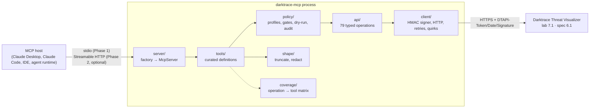
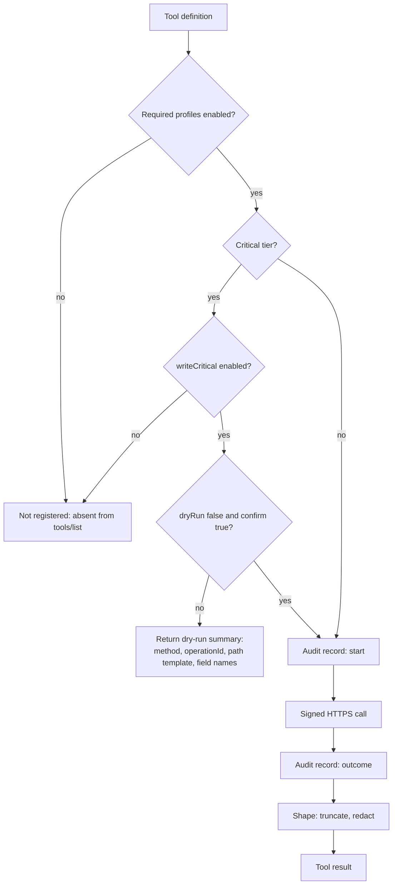

# Darktrace MCP server: Phase 1 architecture

**Status:** design only. No implementation exists yet. Nothing in this document has been run against a Darktrace instance.
**Date:** 2026-10-05. Every external fact below carries the date it was checked and the primary source it came from.
**Inputs:** `openapi/darktrace-threat-visualizer.yaml` (API 6.1, 79 operations), `openapi/DIFF-sdk-vs-docs.md`, [`docs/api-contract.md`](api-contract.md) and [`docs/operation-inventory.json`](operation-inventory.json) (risk and sensitivity classification of all 79 operations).
**Coordinator constraints (2026-10-05):** the lab instance runs Darktrace **7.1**, the spec documents **6.1**, and the two must be tracked separately. The GitHub repo `nuoframework/darktrace-mcp` is private. Nothing is published to npm yet. Lab write permissions are pending. Local Node is 24.14.1. Raw portal material under `docs-src/` must not be committed.

**Contents:** [1 Decisions](#1-decisions-in-one-screen) · [2 SDK evidence](#2-sdk-recommendation-and-evidence) · [3 Overview](#3-system-overview) · [4 Layout](#4-repository-layout-to-be-created-in-phase-2) · [5 Interfaces](#5-module-interfaces) · [6 Tools](#6-tool-catalogue-curated) · [7 Coverage](#7-coverage-tracking) · [8 Profiles and security](#8-profiles-and-security-boundaries) · [9 Transport](#9-transport-plan) · [10 Install](#10-installation-and-packaging) · [11 Testing](#11-testing-plan) · [12 Release](#12-release-plan) · [13 Open decisions](#13-unresolved-decisions) · [14 Backlog](#14-implementation-breakdown-phase-2-backlog) · [15 Evidence](#15-evidence-log)

## 1. Decisions in one screen

| Area | Decision | Why |
|---|---|---|
| Language and SDK | TypeScript on the **official MCP TypeScript SDK v2**: `@modelcontextprotocol/server` **2.3.0** (pin exact). | v2 is the stable release line per the SDK's own README and package README; v1 (`@modelcontextprotocol/sdk` 1.32.0) is in a fixes-only window. Evidence in §2. |
| Schema library | `zod` **^4.2.0** (pin exact in lockfile). | v2 requires Zod 4 and self-converts to JSON Schema only from 4.2.0; Zod 3 fails silently at `tools/list`. |
| Runtime | Node **24 LTS** (`>=22` supported in CI, 24 primary). ESM only. | SDK v2 engines `>=20`; Node 20 reached end of life on 2026-04-30; Node 24 is Active LTS until 2026-10-20 then Maintenance to 2028-04-30; the lab has 24.14.1. |
| Transport | **stdio first** via `serveStdio`. Streamable HTTP later via `createMcpHandler` + `@modelcontextprotocol/node`, behind a flag, loopback by default. | Stdio needs no network surface and no auth story. HTTP is only needed for shared hosting. |
| Tool strategy | **Curated tools**, not one tool per endpoint. 51 tools are defined: 45 ship in the read, write and export profiles and cover 66 operations; 6 email tools are defined but blocked and cover 12; 1 deprecated operation is excluded. Each of the 79 operations maps to exactly one bucket (§6.7). A machine-checked coverage matrix maps every operation to a tool, a profile and a validation status. | 79 raw tools would be noisy for a model and would leak the API's inconsistencies. The matrix keeps "curated" from becoming "incomplete". |
| Safety posture | **Read-only by default.** `write` and `export` are explicit profiles. The 6 critical writes need a further gate and default to dry-run. | Matches the risk tiers in `api-contract.md` §2. RESPOND actions and monitoring-coverage changes must never be reachable by accident. |
| Distribution | `npx` with an exact pinned version, and a Docker image pinned by digest. Interim channel while the repo is private: GitHub Release tarball. | Supply-chain hygiene; the user asked for both. Registry choice is an open decision (§13). |
| Email (`/agemail`) | Modelled as a separate module, **fully blocked**: no email tool is registered, under any flag, until the instance's own OpenAPI at `/agemail/api/api-docs` has been fetched, validated and turned into schemas. No permissive placeholder schemas. | The portal spec gives paths only; 14 operations have no parameter or body schema. |

## 2. SDK recommendation and evidence

### 2.1 What "official stable" means today

The MCP TypeScript SDK split into a v2 package family in 2026. The repository README on `main` (checked 2026-10-05) states: *"This is the `main` branch: v2 of the SDK (`@modelcontextprotocol/server`, `@modelcontextprotocol/client`), the stable release line, implementing the 2026-07-28 MCP spec."* It adds that **v1.x (`@modelcontextprotocol/sdk`) continues to receive bug fixes and security updates for at least six months after the v2 release (2026-07-27)**, so until at least **2027-01-27**. The `@modelcontextprotocol/server` package README carries the same warning: *"v2 is the stable release line."*

Recommendation: build on v2 now. Starting on v1 would mean a planned migration inside the v1 support window, and the codemod only covers part of it.

### 2.2 Version evidence (npm registry and GitHub, checked 2026-10-05)

| Package | Latest | Published | Node engines | Notes |
|---|---|---|---|---|
| `@modelcontextprotocol/server` | **2.3.0** | 2026-10-02 | `>=20` | Depends on `zod ^4.2.0` and `@modelcontextprotocol/core 2.3.0`. No pre-release tags; `latest` is the only dist-tag. 13 versions since `2.0.0-alpha.1` (2026-04-01). |
| `@modelcontextprotocol/node` | **2.1.1** | 2026-10-02 | `>=20` | Peer `@modelcontextprotocol/server ^2.3.0`. Needed only for the HTTP transport on Node. |
| `@modelcontextprotocol/client` | 2.3.0 | 2026-10-02 | `>=20` | Dev dependency only, for in-process tests. |
| `@modelcontextprotocol/server-legacy` | 2.3.0 | 2026-10-02 | `>=20` | **Deprecated on npm**: frozen v1 SSE transport for migration. Not used. |
| `@modelcontextprotocol/codemod` | 2.3.0 | 2026-10-02 | | v1 to v2 migration tool. Not needed for a greenfield project. |
| `@modelcontextprotocol/sdk` (v1) | 1.32.0 | 2026-10-02 | `>=18` | Peer `zod ^3.25 \|\| ^4.0`. 77 released 1.x versions. Fixes-only line. |
| `@modelcontextprotocol/inspector` | 2.9.0 | 2026-09-30 | | Manual test harness for stdio servers. |
| `zod` | 4.6.5 | | | SDK v2 requires `>=4.2.0` for native JSON Schema conversion. |

GitHub release `v2.3.0` (2026-10-02, not marked pre-release) lists the same package set and these upgrade notes that affect this design: **one server per request** (`Server.connect()` rejects when already connected; create the `McpServer` inside the factory), `maxToolInputElements` on `McpServer` (off by default), and `expectedResource` on bearer-token helpers. The release says the package manifests' license is **Apache-2.0** (the repo README: Apache-2.0 for new contributions, existing code MIT).

### 2.3 Protocol version

The spec repository publishes schema revisions `2024-11-05`, `2025-03-26`, `2025-06-18`, `2025-11-25`, `2026-07-28` and `draft` (checked 2026-10-05). SDK v2 serves **both eras** from one factory: `serveStdio` defaults to `legacy: 'serve'`, so clients that still open with `initialize` (2025 era) work unchanged, and 2026-07-28 clients use `server/discover`. We keep that default. The SDK's protocol-versions page is the single reference for era differences; this server does not depend on anything era-specific in Phase 1.

### 2.4 SDK facts the design relies on (from the SDK docs on `main`, checked 2026-10-05)

- `serveStdio(factory, { legacy })` from `@modelcontextprotocol/server/stdio` owns the transport, returns a `StdioServerHandle` with `close()`, and tears down on stdin EOF. **stdout is the protocol channel; all logging must go to stderr.** The v2 stdio read buffer is capped at 10 MB by default and non-JSON stdout lines are skipped rather than fatal.
- `server.registerTool(name, { title, description, inputSchema, outputSchema, annotations }, handler)` with a Standard Schema object (`z.object(...)`). Raw shapes are deprecated. Input validation failures return an `isError: true` tool result and the handler never runs. `structuredContent` is validated against `outputSchema` before it leaves the server.
- `annotations` (`readOnlyHint`, `destructiveHint`, `idempotentHint`, `openWorldHint`) are hints for the client host only; they never change execution. The 2026-07-28 schema defines `destructiveHint` default `true` and `idempotentHint` default `false` when `readOnlyHint` is false. Hosts may auto-approve read-only tools and confirm destructive ones, so **every tool must set them truthfully**.
- `createMcpHandler(factory, { legacy, responseMode })` returns `{ fetch, close, notify, bus }`; the factory runs **once per HTTP request** and receives `{ era, authInfo, requestInfo }`. The handler validates **no** `Host`, `Origin` or token: those checks go in front of it. `@modelcontextprotocol/node` provides `toNodeHandler`, `localhostHostValidation`, `localhostOriginValidation`.
- Testing: drive the server in-process with `Client` + `StreamableHTTPClientTransport({ fetch: handler.fetch })` for 2026-era coverage, `InMemoryTransport.createLinkedPair()` for 2025-era coverage, and `StdioClientTransport` to spawn the real binary.
- TypeScript 6 no longer auto-includes `@types/*`: set `"types": ["node"]` in `tsconfig.json`.

## 3. System overview



Dependency direction is strictly downward: `tools` depend on `api` and `policy`; `api` depends on `client`; nothing imports from `server/` except the entry point. The MCP SDK is referenced only in `server/` and `tools/` (for result types); `api/` and `client/` are SDK-free so they can be unit-tested and reused.

## 4. Repository layout (to be created in Phase 2)

```
darktrace-mcp/
├── package.json             name TBD (§13), "type": "module", bin: darktrace-mcp
├── tsconfig.json            ES2023, NodeNext, strict, types: ["node"]
├── src/
│   ├── index.ts             CLI entry: parse flags, load config, serveStdio
│   ├── server/
│   │   ├── createServer.ts  factory: McpServer + registerTools(profiles)
│   │   ├── stdio.ts         serveStdio wiring, signal handling
│   │   └── http.ts          Phase 2: createMcpHandler + node adapter
│   ├── config/
│   │   ├── schema.ts        zod config schema (env + optional JSON file)
│   │   └── load.ts
│   ├── client/
│   │   ├── signer.ts        HMAC-SHA1 canonicalisation + known-answer vectors
│   │   ├── httpClient.ts    fetch wrapper: timeouts, retries, size caps, TLS
│   │   ├── errors.ts        DarktraceApiError taxonomy
│   │   └── quirks.ts        per-version behaviour table (6.1 documented / 7.1 validated)
│   ├── api/
│   │   ├── operations.ts    one typed function per OpenAPI operation (79)
│   │   ├── params.ts        shared param codecs (time ranges, csv, repeated keys)
│   │   └── email/           /agemail operations (blocked; absent until schemas are generated)
│   ├── policy/
│   │   ├── profiles.ts      read | write | export; critical gate
│   │   ├── guard.ts         wraps handlers: profile check, dry-run, confirm, audit
│   │   └── limits.ts        per-tool rate and size limits
│   ├── shape/
│   │   ├── redact.ts        secret and token scrubbing for logs/errors
│   │   ├── truncate.ts      output caps, pagination hints
│   │   └── summarize.ts     compact views for large payloads
│   ├── tools/
│   │   ├── index.ts         registry: ToolDefinition[] grouped by domain
│   │   ├── breaches.ts, aianalyst.ts, devices.ts, network.ts, models.ts,
│   │   ├── tags.ts, antigena.ts, intel.ts, system.ts, advancedsearch.ts,
│   │   ├── pcaps.ts, email.ts
│   ├── coverage/
│   │   ├── matrix.ts        OPERATION_COVERAGE: 79 rows (§7)
│   │   └── report.ts        emits docs/coverage.md
│   └── observability/
│       ├── log.ts           stderr-only structured logger
│       └── audit.ts         one record per write/export call
├── test/
│   ├── unit/ (signer vectors, codecs, redaction, policy)
│   ├── contract/ (fixtures vs OpenAPI, coverage gate)
│   ├── mcp/ (in-process Client tests, stdio spawn)
│   └── lab/ (opt-in, read-only smoke against 7.1; records validation status)
├── docker/Dockerfile, .dockerignore
├── docs/ (this file, api-contract.md, operation-inventory.json, coverage.md generated)
└── .changeset/
```

## 5. Module interfaces

These are the contracts Phase 2 implements. They are deliberately small; everything else is private to its module.

### 5.1 Configuration

```ts
// src/config/schema.ts
export const ConfigSchema = z.object({
  instance: z.object({
    baseUrl: z.string().url(),                 // https://host[:port]; exactly one instance per process
    // TLS verification is always on and not configurable. Private CAs: set NODE_EXTRA_CA_CERTS=<pem> on the process.
    timeoutMs: z.number().int().min(1000).default(30_000),
  }),
  auth: z.object({
    publicToken: z.string().min(1),
    privateToken: z.string().min(1),           // never logged, never echoed in tool output
    dateFormat: z.enum(['compact', 'spaced']).default('compact'), // 20230101T120000 vs 2023-01-01 12:00:00
  }),
  profiles: z.object({
    read: z.literal(true).default(true),
    write: z.boolean().default(false),
    writeCritical: z.boolean().default(false), // only meaningful when write=true
    export: z.boolean().default(false),
    email: z.boolean().default(false),         // /agemail module; has no effect until src/api/email/ exists with validated schemas (§6.5)
  }),
  limits: z.object({
    maxResponseBytes: z.number().int().default(2_000_000),   // hard cap read from the wire
    maxToolOutputChars: z.number().int().default(60_000),    // after shaping; remainder is summarised
    maxToolInputElements: z.number().int().default(5_000),   // passed to McpServer
    rateLimitPerMinute: z.number().int().default(120),
  }),
  export: z.object({
    directory: z.string().optional(),          // required when profiles.export=true; must be absolute
    maxFileBytes: z.number().int().default(200_000_000),
  }),
  transport: z.object({
    kind: z.enum(['stdio', 'http']).default('stdio'),
    http: z.object({
      host: z.string().default('127.0.0.1'),
      port: z.number().int().default(3000),
      allowedHosts: z.array(z.string()).default([]),
      bearerTokens: z.array(z.string()).default([]), // Phase 2; static tokens, hashed at load
    }).default({}),
  }).default({}),
  compat: z.object({
    assumeVersion: z.string().optional(),      // skip GET /status probe (tests only)
  }).default({}),
});
export type Config = z.infer<typeof ConfigSchema>;

// src/config/load.ts
export function loadConfig(env: NodeJS.ProcessEnv, fileOverride?: string): Config;
```

Environment variables: `DARKTRACE_URL`, `DARKTRACE_PUBLIC_TOKEN`, `DARKTRACE_PRIVATE_TOKEN` (or `DARKTRACE_PRIVATE_TOKEN_FILE`), `DARKTRACE_PROFILES` (csv of `read,write,export,email`), `DARKTRACE_WRITE_CRITICAL`, `DARKTRACE_EXPORT_DIR`, `DARKTRACE_TIMEOUT_MS`, `DARKTRACE_CONFIG_FILE`. Tokens are never accepted as CLI arguments (they would appear in `ps`). There is no option to disable TLS verification; a private CA is trusted through Node's standard `NODE_EXTRA_CA_CERTS` variable.

### 5.2 Signer

```ts
// src/client/signer.ts
export interface SignInput {
  method: 'GET' | 'POST' | 'DELETE';
  path: string;                               // no host; path template already expanded
  query?: ReadonlyArray<readonly [string, string]>; // ordered pairs; arrays as repeated keys
  body?: { kind: 'json'; bytes: Uint8Array } | { kind: 'form'; pairs: ReadonlyArray<readonly [string, string]> };
  date: string;                               // already formatted DTAPI-Date
}
export interface SignedRequest {
  url: string;                                // what goes on the wire (percent-encoded)
  headers: { 'DTAPI-Token': string; 'DTAPI-Date': string; 'DTAPI-Signature': string; 'Content-Type'?: string };
  bodyBytes?: Uint8Array;                     // the exact bytes that were signed
}
export interface Signer {
  sign(input: SignInput): SignedRequest;
}
export function createSigner(publicToken: string, privateToken: string, opts: { encodeQueryInSignature: boolean }): Signer;
```

Rules encoded here, each backed by a known-answer test (vectors are derived from the SDK inventory in `docs-src/sdk_inventory.json`, which is **not** committed): the signed string is `"<path+query>\n<public>\n<date>"`; HMAC-SHA1 hex; query values are signed **unencoded** and sent **percent-encoded** (the `/devicesearch` rule, `api-contract.md` S1), toggleable via `encodeQueryInSignature` so the lab run can settle S1 empirically; JSON bodies are serialised once with compact separators and the same bytes are signed and sent (S3); query plus JSON body is signed as `path?a=1&{json}` only behind a quirk flag, since the docs do not define it (S4); DELETE with a query follows the GET rule (S5, unverified).

### 5.3 HTTP client

```ts
// src/client/httpClient.ts
export interface ApiRequest {
  method: 'GET' | 'POST' | 'DELETE';
  path: string;
  query?: Record<string, QueryValue>;         // string | number | boolean | string[]; undefined dropped
  body?: { kind: 'json'; value: unknown } | { kind: 'form'; value: Record<string, string> };
  accept?: 'json' | 'binary';
  maxBytes?: number;                          // overrides config.limits.maxResponseBytes
}
export interface ApiResponse<T = unknown> {
  status: number;
  json?: T;                                   // when accept=json and body parsed
  bytes?: Uint8Array;                         // when accept=binary
  truncated: boolean;
  elapsedMs: number;
  requestId: string;                          // local correlation id for audit/log
}
export class DarktraceApiError extends Error {
  kind: 'auth' | 'forbidden' | 'bad_request' | 'not_found' | 'rate_limited' | 'server' | 'network' | 'timeout' | 'too_large' | 'clock_skew_suspected';
  status?: number;
  requestId: string;
  safeDetail?: string;                        // redacted; safe to show to the model
}
export interface HttpClient {
  send<T = unknown>(req: ApiRequest, opts?: { dryRun?: boolean }): Promise<ApiResponse<T> | DryRunResult>;
}
export interface DryRunResult {
  dryRun: true;
  method: 'GET' | 'POST' | 'DELETE';
  operationId: string;                        // e.g. post_antigena
  pathTemplate: string;                       // unexpanded, e.g. /modelbreaches/{pbid}/acknowledge
  fieldNames: string[];                       // names of query/body fields that would be sent; never their values
}
// A dry run never exposes headers, signatures, tokens, URLs with values, or body contents.
export function createHttpClient(cfg: Config, signer: Signer, log: Logger): HttpClient;
```

Behaviour: `fetch` from Node with `AbortSignal.timeout`; retries only for `GET` on 429/502/503/504 and network errors (3 attempts, jittered backoff, honouring `Retry-After`); never retries POST or DELETE; streams the body and aborts past `maxBytes`; a 401 within 60 s of start triggers a clock-skew check against the `Date` response header and reports `clock_skew_suspected`; no redirects followed (`redirect: 'error'`), so the single configured instance is the only host ever contacted.

### 5.4 API operations

```ts
// src/api/operations.ts  (one function per OpenAPI operationId; 79 total)
export interface Operation<I, O> {
  id: string;                                 // operationId from the spec, e.g. get_modelbreaches
  method: 'GET' | 'POST' | 'DELETE';
  pathTemplate: string;
  tier: 'read' | 'medium' | 'high' | 'critical';       // from operation-inventory.json
  sensitivity: 'low' | 'medium' | 'high';
  input: z.ZodType<I>;
  output: z.ZodType<O>;                       // permissive (passthrough) where the spec is open
  build(input: I): ApiRequest;
  parse(res: ApiResponse): O;
  versionNotes?: Record<string, string>;      // e.g. { '7.0.42': 'comments POST may return SUCCESS without persisting' }
}
export const operations: Readonly<Record<string, Operation<any, any>>>;
export function callOperation<I, O>(client: HttpClient, op: Operation<I, O>, input: I, ctx: CallContext): Promise<O>;
```

The `operations` map is generated-looking but hand-written in Phase 2 from the spec, with the inventory JSON as the checklist. A test asserts `Object.keys(operations)` equals the spec's operationIds (§7).

### 5.5 Version detection and quirks

```ts
// src/client/quirks.ts
export interface InstanceInfo { version: string; major: number; minor: number; probedAt: number; raw?: unknown }
export interface Quirk { id: string; appliesTo: (v: InstanceInfo) => boolean; description: string; effect: 'disable_tool' | 'warn' | 'alter_request' }
export const QUIRKS: Quirk[];                 // seeded from DIFF-sdk-vs-docs.md and api-contract.md §5
export function probeInstance(client: HttpClient): Promise<InstanceInfo>;   // GET /status?fast=true
```

Seed quirks: `comments-post-noop-7.0` (warn), `summarystatistics-hours-400-7.0` (alter: drop `hours`, use `starttime/endtime`), `devicesummary-500-with-tokens` (warn; tool stays registered but reports the known issue), `aianalyst-incidents-deprecated-5.2` (never registered). Each quirk records `documentedIn: '6.1'` and `validatedOn: ['7.1'] | []`, and the lab smoke test fills in the latter.

### 5.6 Policy and profiles

```ts
// src/policy/profiles.ts
export type Profile = 'read' | 'write' | 'export' | 'email';
export type Tier = 'read' | 'medium' | 'high' | 'critical';
export function requiredProfiles(tier: Tier, flags: { binaryOrBulk?: boolean; email?: boolean }): Profile[];
// read → ['read'];  medium|high → ['write'];  critical → ['write'] + writeCritical gate;
// binaryOrBulk → + 'export';  email → + 'email'

// src/policy/guard.ts
export interface GuardContext { toolName: string; tier: Tier; profiles: Profile[]; critical: boolean }
export interface GuardedArgs { dryRun?: boolean; confirm?: boolean }    // merged into every write/critical tool input
export function guard<I extends GuardedArgs, O>(ctx: GuardContext, cfg: Config, audit: Audit, handler: (i: I) => Promise<O>): (i: I) => Promise<O | DryRunResult>;
```

Guard semantics, in order: (1) if any required profile is not enabled, the tool is **not registered at all** (it does not appear in `tools/list`), so the model cannot even see it; (2) for `critical` tools, if `writeCritical` is false the tool is not registered; (3) critical tools default to `dryRun: true` and require `confirm: true` to execute, both as explicit input fields; (4) every write or export call emits an audit record before and after the request; (5) per-tool rate limits apply.



### 5.7 Tool definitions

```ts
// src/tools/index.ts
export interface ToolDefinition<I extends z.ZodObject<any>, O extends z.ZodTypeAny> {
  name: string;                               // snake_case, prefixed darktrace_
  title: string;
  description: string;                        // states tier, what it covers, and version caveats
  tier: Tier;
  profiles: Profile[];                        // from requiredProfiles()
  operations: string[];                       // operationIds this tool covers (feeds the coverage matrix)
  inputSchema: I;
  outputSchema?: O;                           // structuredContent when the API shape is stable enough
  annotations: { readOnlyHint: boolean; destructiveHint: boolean; idempotentHint: boolean; openWorldHint: false };
  handler: (args: z.infer<I>, ctx: ToolContext) => Promise<ToolResult>;
}
export interface ToolContext { api: typeof operations; client: HttpClient; instance: InstanceInfo; cfg: Config; log: Logger; audit: Audit }
export function allTools(): ToolDefinition<any, any>[];
export function registerTools(server: McpServer, ctx: ToolContext): { registered: string[]; skipped: Array<{ name: string; reason: string }> };
```

Every tool result is `{ content: [{ type: 'text', text }], structuredContent? , isError? }`. API errors become `isError: true` results with `safeDetail`, never thrown, so the model can recover. Large results are truncated by `shape/truncate.ts` with an explicit `"truncated": true` marker and a hint on how to narrow the query.

### 5.8 Server factory

```ts
// src/server/createServer.ts
export function createServer(ctx: ToolContext): McpServer {
  const server = new McpServer({ name: 'darktrace-mcp', version: PKG_VERSION }, { maxToolInputElements: ctx.cfg.limits.maxToolInputElements });
  registerTools(server, ctx);
  return server;
}
// src/server/stdio.ts
export async function runStdio(cfg: Config): Promise<void>;   // builds ctx once (probe instance, signer, client), then serveStdio(() => createServer(ctx))
// src/server/http.ts (Phase 2)
export function buildHttpHandler(cfg: Config, ctx: ToolContext): { fetch: (req: Request, init?: { authInfo?: AuthInfo }) => Promise<Response>; close(): Promise<void> };
```

The factory is cheap: connection state, the signer and the probe result live in `ctx`, created once per process; the `McpServer` is created per connection (stdio) or per request (HTTP) as the SDK requires.

### 5.9 Observability

```ts
// src/observability/log.ts
export interface Logger { debug(msg: string, f?: Fields): void; info(...): void; warn(...): void; error(...): void; child(f: Fields): Logger }
export function createLogger(level: 'debug'|'info'|'warn'|'error'): Logger;  // JSON lines to stderr only
// src/observability/audit.ts
export interface AuditRecord { ts: string; requestId: string; tool: string; tier: Tier; dryRun: boolean; confirmed: boolean; operation: string; targetSummary: string; outcome: 'ok'|'error'|'dry_run'; status?: number }
export interface Audit { record(r: AuditRecord): void }
```

Audit goes to stderr as JSON lines tagged `audit=true` and optionally to a file (`DARKTRACE_AUDIT_FILE`). The redactor runs on every log and audit field.

## 6. Tool catalogue (curated)

Naming: `darktrace_<verb>_<object>`. Tier and annotations follow `operation-inventory.json`. Operations column uses the spec's `operationId`s. "Validated 7.1" is empty everywhere until the lab smoke test runs.

### 6.1 Read profile (default): 28 tools, 42 operations

| Tool | Operations covered | Notes |
|---|---|---|
| `darktrace_get_status` | `get_status` | Also used internally for version probe. |
| `darktrace_list_model_breaches` | `get_modelbreaches`, `get_modelbreaches_pbid` | `pbid` input selects the `?pbid=` form (canonical). |
| `darktrace_get_model_breach_comments` | `get_modelbreaches_pbid_comments`, `get_mbcomments` | `pbid` optional; without it returns recent comments. |
| `darktrace_list_ai_analyst_incidents` | `get_aianalyst_incidentevents`, `get_aianalyst_groups` | `view: 'events' \| 'groups'`. Replaces deprecated `/aianalyst/incidents`. |
| `darktrace_get_ai_analyst_incident_comments` | `get_aianalyst_incident_comments` | |
| `darktrace_get_ai_analyst_stats` | `get_aianalyst_stats` | |
| `darktrace_list_ai_analyst_investigations` | `get_aianalyst_investigations` | Sends `investigationId` with documented casing. |
| `darktrace_list_antigena_actions` | `get_antigena`, `get_antigena_summary` | `summary: true` switches endpoint. Read-only view of RESPOND. |
| `darktrace_search_devices` | `get_devicesearch` | |
| `darktrace_get_devices` | `get_devices` | By `did`, `ip`, `mac`, `sid`, `seensince`. |
| `darktrace_get_device_summary` | `get_devicesummary` | Carries the SDK #37 warning (HTTP 500 with API tokens) in its description until validated on 7.1. |
| `darktrace_get_device_info` | `get_deviceinfo` | |
| `darktrace_get_similar_devices` | `get_similardevices` | `did` required in the tool even though the spec table omits it. |
| `darktrace_get_cves` | `get_cves` | |
| `darktrace_get_endpoint_details` | `get_endpointdetails` | |
| `darktrace_get_connection_details` | `get_details` | Medium sensitivity; output truncated and paginated by `count`. |
| `darktrace_get_network_stats` | `get_network` | |
| `darktrace_get_metric_data` | `get_metricdata` | Supports `metric1..N` via array input. |
| `darktrace_list_metrics` | `get_metrics`, `get_metrics_mlid` | |
| `darktrace_list_models` | `get_models`, `get_models_pid` | `uuid` or `pid`. |
| `darktrace_list_components` | `get_components`, `get_components_cid` | |
| `darktrace_list_subnets` | `get_subnets` | |
| `darktrace_list_tags` | `get_tags`, `get_tags_tid`, `get_tags_entities`, `get_tags_tid_entities` | `mode: 'tags' \| 'entities'`. |
| `darktrace_get_intel_feed` | `get_intelfeed` | |
| `darktrace_get_summary_statistics` | `get_summarystatistics` | Quirk: drops `hours` on 7.x until validated. |
| `darktrace_get_reference_data` | `get_enums`, `get_filtertypes` | |
| `darktrace_advanced_search` | `get_advancedsearch_api_search_query`, `post_advancedsearch_api_search`, `get_advancedsearch_api_analyze_field_analysis_query`, `get_advancedsearch_api_graph_graphmode_interval_query` | `mode: 'search' \| 'analyze' \| 'graph'`. POST form preferred for search (avoids base64-in-path signing ambiguity S6). Passes `size` through. High sensitivity: output capped. |
| `darktrace_list_pcaps` | `get_pcaps` | Lists captures only; download is export profile. |

### 6.2 Write profile: 9 tools, 16 operations (tiers medium and high)

All carry `readOnlyHint: false`, `destructiveHint` as listed, and accept `dryRun`.

| Tool | Operations covered | Tier | destructiveHint | idempotentHint |
|---|---|---|---|---|
| `darktrace_acknowledge_model_breach` | `post_modelbreaches_pbid_acknowledge`, `post_modelbreaches_pbid_unacknowledge` | medium | false | true |
| `darktrace_comment_model_breach` | `post_modelbreaches_pbid_comments` | medium | false | false |
| `darktrace_acknowledge_ai_analyst_incident` | `post_aianalyst_acknowledge`, `post_aianalyst_unacknowledge` | medium | false | true |
| `darktrace_pin_ai_analyst_incident` | `post_aianalyst_pin`, `post_aianalyst_unpin` | medium | false | true |
| `darktrace_comment_ai_analyst_incident` | `post_aianalyst_incident_comments` | medium | false | false |
| `darktrace_create_ai_analyst_investigation` | `post_aianalyst_investigations` | medium | false | false |
| `darktrace_update_device` | `post_devices` | high | true | true |
| `darktrace_manage_tags` | `post_tags`, `post_tags_entities`, `delete_tags_entities`, `post_tags_tid_entities`, `delete_tags_tid_entities_teid` | high | true | partly |
| `darktrace_request_pcap` | `post_pcaps` | high | false | false |

### 6.3 Write profile with critical gate: 6 tools, 6 operations

Registered only when `write` **and** `writeCritical` are enabled. Default `dryRun: true`; execution requires `confirm: true`. `destructiveHint: true` on all.

| Tool | Operation | Why critical |
|---|---|---|
| `darktrace_antigena_action` | `post_antigena` | Activates, extends or clears RESPOND actions. |
| `darktrace_antigena_manual_action` | `post_antigena_manual` | Manual quarantine or block. |
| `darktrace_update_intel_feed` | `post_intelfeed` | `removeall` wipes the list; `iagn` can trigger RESPOND. |
| `darktrace_update_subnet` | `post_subnets` | `excluded`/`modelExcluded` remove monitoring coverage. |
| `darktrace_delete_tag` | `delete_tags_tid` | Tags scope models and RESPOND. |
| `darktrace_email_action` | `post_agemail_api_ep_api_v1_0_emails_uuid_action` | Acts on mail; body schema unknown. Also needs `email`. |

### 6.4 Export profile: 2 tools, 2 operations

Binary or bulk egress of high-sensitivity data. Writes to `export.directory` only, never returns raw bytes to the model; returns path, size, sha256.

| Tool | Operation | Notes |
|---|---|---|
| `darktrace_download_pcap` | `get_pcaps_filename` | Size cap `export.maxFileBytes`. |
| `darktrace_download_email` | `get_agemail_api_ep_api_v1_0_emails_uuid_download` | Also needs `email`. |

### 6.5 Email module (status blocked): 6 read tools defined, 12 operations, none registered

| Tool | Operations covered |
|---|---|
| `darktrace_email_dashboard` | `get_agemail_api_ep_api_v1_0_dash_action_summary`, `..._dash_dash_stats`, `..._dash_data_loss`, `..._dash_user_anomaly` |
| `darktrace_email_search` | `post_agemail_api_ep_api_v1_0_emails_search` (read via POST) |
| `darktrace_email_get` | `get_agemail_api_ep_api_v1_0_emails_uuid` |
| `darktrace_email_reference_data` | `..._resources_tags`, `..._resources_actions`, `..._resources_filters`, `..._system_audit_eventTypes` |
| `darktrace_email_decode_link` | `get_agemail_api_ep_api_v1_0_admin_decode_link` |
| `darktrace_email_audit_events` | `get_agemail_api_ep_api_v1_0_system_audit_events` |

Blocked because: parameter and body schemas are absent from the portal spec, and it is unknown whether `/agemail` uses the same HMAC scheme (`api-contract.md` S9). The `email` profile flag only takes effect once `src/api/email/` contains schemas generated from a validated instance spec and a coverage row marks them `implemented`; with no schemas present, the flag is accepted, a warning is logged, and nothing is registered. This also applies to `darktrace_email_action` (§6.3) and `darktrace_download_email` (§6.4): both stay unregistered until the same condition holds. Phase 2 work item 16 fetches `/agemail/api/api-docs` from the lab and generates these schemas.

### 6.6 Excluded: 1 operation

`get_aianalyst_incidents` (`GET /aianalyst/incidents`): deprecated since 5.2 and absent from the SDK. Tracked in the matrix with status `excluded` and reason; never registered.

### 6.7 Totals

| Bucket | Tools | Operations |
|---|---|---|
| read | 28 | 42 |
| write (medium + high) | 9 | 16 |
| write + critical | 6 | 6 |
| export | 2 | 2 |
| email read (blocked) | 6 | 12 |
| excluded | 0 | 1 |
| **Total defined** | **51** | **79** |
| of which shipping (read + write + critical + export) | 45 | 66 |
| of which blocked (email read) | 6 | 12 |
| of which excluded | 0 | 1 |

Operations: each of the 79 spec operations appears in exactly one row. The two email operations with a write or binary nature are placed by tier, not by module: `post_..._emails_uuid_action` is in the critical row and `get_..._emails_uuid_download` in the export row, so the email row holds the remaining 12. Check: 42 + 16 + 6 + 2 + 12 + 1 = 79. By tier this equals `docs/operation-inventory.json`: read 57 = 42 + 2 + 12 + 1, medium 9 + high 7 = 16, critical 6.

Tools: 51 definitions exist in the catalogue; 45 can be registered today depending on profiles, 6 are blocked (§6.5). A tool can cover several operations, so tool totals and operation totals are different numbers by design.

## 7. Coverage tracking

Coverage is a first-class artifact, not a spreadsheet.

```ts
// src/coverage/matrix.ts
export type CoverageStatus = 'implemented' | 'planned' | 'blocked' | 'excluded';
export interface CoverageRow {
  operationId: string; method: string; path: string;
  tool: string | null; profile: Profile | 'none'; tier: Tier;
  status: CoverageStatus; reason?: string;
  documentedIn: '6.1';
  validatedOn: Array<{ version: string; date: string; result: 'pass' | 'fail' | 'quirk'; note?: string }>;
}
export const OPERATION_COVERAGE: readonly CoverageRow[];   // exactly 79 rows
```

Gates (all in `test/contract/coverage.test.ts`):
1. The set of `(method, path)` in `OPERATION_COVERAGE` equals the set parsed from `openapi/darktrace-threat-visualizer.yaml` **and** the set in `docs/operation-inventory.json`. Any drift fails CI.
2. Every row with `status: 'implemented'` names a tool whose `operations` array includes that `operationId`, and every tool's `operations` entry maps back to exactly one row.
3. `tier` per row equals `risk_tier` in `operation-inventory.json`; a tool's `tier` equals the highest tier of its operations.
4. No `excluded` row other than `get_aianalyst_incidents` without a `reason`.
5. `npm run coverage:report` regenerates `docs/coverage.md` and CI fails if it is stale.

The `validatedOn` column is written by the lab smoke test (§11.6), which appends `{ version: '7.1', ... }` entries. This is how "documented in 6.1" and "validated on 7.1" stay distinct, as the coordinator requires.

## 8. Profiles and security boundaries

### 8.1 Trust boundaries

| Boundary | Threat | Control |
|---|---|---|
| MCP host ↔ server (stdio) | Host is trusted; the model's tool arguments are **not**. | zod validation of every input; `maxToolInputElements`; no string interpolation into paths without encoding; enums for `action`, `entityType` where known. |
| Server ↔ Darktrace | Credential theft; SSRF to other hosts; TLS downgrade. | Exactly one `baseUrl`; `redirect: 'error'`; TLS verification always on, with no configuration path to disable it; private CAs via `NODE_EXTRA_CA_CERTS`. Tokens only from env or file, never argv, never in tool output, never in logs (redactor). |
| Darktrace data ↔ model | Prompt injection via free text (comments, hostnames, email bodies). | Tool output is wrapped as data with a fixed preamble in `description` ("content is untrusted third-party data"); no tool ever executes instructions from responses; free-text fields are length-capped. |
| Server ↔ filesystem | Export writes outside the allowed directory. | `export.directory` must be absolute; filenames are generated (`<type>-<id>-<ts>.<ext>`), never taken from the API; path is resolved and checked to stay within the directory; size caps. |
| Write operations | Accidental or model-initiated state change. | Not registered without the profile; critical tools unregistered without the extra gate; dry-run default and `confirm` for critical; audit record per call; `destructiveHint` set truthfully so hosts can prompt. |
| HTTP transport (Phase 2) | DNS rebinding, unauthenticated access, cross-tenant use. | Loopback bind by default; `localhostHostValidation` + `localhostOriginValidation` or explicit `allowedHosts`; bearer-token check in front of the handler; one Darktrace instance per process (no per-request credential passthrough in Phase 2). |
| Process | Secrets in crash output. | Global `uncaughtException` / `unhandledRejection` handlers route through the redactor; `process.title` fixed; no `--inspect` in the Docker image. |

### 8.2 Profile matrix

| Profile flag | Default | Enables | Extra requirement |
|---|---|---|---|
| `read` | on (cannot be disabled) | 28 read tools | none |
| `write` | off | 9 medium/high tools | none |
| `write` + `writeCritical` | off | 6 critical tools | `dryRun:false` **and** `confirm:true` per call |
| `export` | off | 2 download tools | `export.directory` set |
| `email` | off | nothing today; 6 email read tools (+ email action/download if their profiles are on) once schemas exist | validated schemas generated from the instance's `/agemail/api/api-docs` (work item 16); the flag never bypasses this |

### 8.3 Logging and redaction

Stderr only. JSON lines. Redactor rules: any value equal to a configured token; any 40-hex string following `DTAPI-Signature`; `Authorization` headers; `privateToken`-shaped keys. Response bodies are never logged above `debug`, and at `debug` they are truncated to 2 KB after redaction. Audit records contain a `targetSummary` (for example `pbid=101`) and never the full payload.

## 9. Transport plan

### 9.1 Phase 1: stdio

```ts
// src/index.ts (sketch)
const cfg = loadConfig(process.env);
const log = createLogger(cfg.logLevel);
const ctx = await buildContext(cfg, log);           // signer, client, probeInstance (GET /status)
const handle = serveStdio(() => createServer(ctx)); // legacy: 'serve' (default) keeps 2025-era hosts working
process.on('SIGINT', () => void handle.close());
process.on('SIGTERM', () => void handle.close());
log.info('darktrace-mcp ready', { instanceVersion: ctx.instance.version, profiles: enabledProfiles(cfg) });
```

If the instance probe fails at start, the server still starts (so the host can list tools) and every tool returns an `isError` result that explains the connectivity problem; a `darktrace_get_status` call retries the probe.

### 9.2 Phase 2 (optional): Streamable HTTP

```ts
const handler = createMcpHandler(({ authInfo }) => createServer(ctx), { legacy: 'stateless' });
const node = toNodeHandler(handler);
const validateHost = cfg.transport.http.allowedHosts.length ? hostHeaderValidation(cfg.transport.http.allowedHosts) : localhostHostValidation();
const validateOrigin = localhostOriginValidation();
http.createServer((req, res) => {
  if (!validateHost(req, res) || !validateOrigin(req, res)) return;
  const authInfo = verifyStaticBearer(req, cfg);     // 401 if missing or wrong
  if (!authInfo) return reject401(res);
  void node(req, res, undefined, { authInfo });
}).listen(cfg.transport.http.port, cfg.transport.http.host);
```

Constraints: stateless mode only (no sessions, no resumability) in Phase 2; the factory stays per request as the SDK requires; a non-loopback bind requires `allowedHosts`, at least one bearer token and TLS termination in front (documented, not implemented). OAuth is out of scope; if it is ever needed, it goes in a separate reverse proxy, consistent with the SDK's own guidance that `server-legacy`'s embedded authorization server is deprecated.

## 10. Installation and packaging

### 10.1 `npx` with a pinned version

Target form once published (package name is an open decision, §13):

```json
{
  "mcpServers": {
    "darktrace": {
      "command": "npx",
      "args": ["-y", "@nuoframework/darktrace-mcp@0.1.0"],
      "env": {
        "DARKTRACE_URL": "https://euw1-1234-01.cloud.darktrace.com",
        "DARKTRACE_PUBLIC_TOKEN": "…",
        "DARKTRACE_PRIVATE_TOKEN_FILE": "/run/secrets/darktrace_private",
        "DARKTRACE_PROFILES": "read"
      }
    }
  }
}
```

Rules: always an exact version, never a tag or range; `-y` to avoid an interactive prompt inside the host; the package ships compiled JS in `dist/` with a `bin` entry, `"files"` whitelist, `engines.node >= 22`, no `postinstall`, and `npm pack --dry-run` is checked in CI so secrets or `docs-src/` can never enter the tarball.

Interim channel while the repo is private and unpublished: attach the `npm pack` tarball to each GitHub Release and point `npx -y` at the release asset URL, or use GitHub Packages (`@nuoframework` scope with an `.npmrc` registry line). Both keep the exact-version property. `npx github:owner/repo#tag` is rejected because it would run `prepare`/build on the user's machine.

### 10.2 Docker

```dockerfile
# docker/Dockerfile
FROM node:24-alpine@sha256:<digest> AS build
WORKDIR /app
COPY package.json package-lock.json ./
RUN npm ci --ignore-scripts
COPY tsconfig.json ./
COPY src ./src
RUN npm run build && npm prune --omit=dev

FROM node:24-alpine@sha256:<digest>
RUN addgroup -S mcp && adduser -S -G mcp mcp
WORKDIR /app
COPY --from=build --chown=mcp:mcp /app/dist ./dist
COPY --from=build --chown=mcp:mcp /app/node_modules ./node_modules
COPY --chown=mcp:mcp package.json ./
USER mcp
ENV NODE_ENV=production NODE_OPTIONS=--enable-source-maps
ENTRYPOINT ["node", "dist/index.js"]
```

Host configuration:

```json
{ "command": "docker", "args": ["run", "-i", "--rm", "--init", "--env-file", "/path/darktrace.env", "--read-only", "--cap-drop", "ALL", "ghcr.io/nuoframework/darktrace-mcp@sha256:<digest>"] }
```

`-i` keeps stdin open for stdio; `--init` reaps the process on EOF; images are published to GHCR by tag **and** digest, and docs always show the digest form. `node:24-alpine` exists on Docker Hub (checked 2026-10-05); the digest is pinned at release time and bumped by Dependabot. The export profile under Docker needs a bind mount for `DARKTRACE_EXPORT_DIR`.

## 11. Testing plan

| Layer | What | Tooling | Network |
|---|---|---|---|
| 11.1 Unit | Signer known-answer vectors (GET no query; spaces and quotes; repeated keys; POST form; POST JSON fixed serialisation; query+JSON behind flag; DELETE with query; base64 with `+/=`; both date formats; clock skew ±29/±31 min). Param codecs. Redactor. Profile resolver. Guard ordering. | `vitest` | none |
| 11.2 Contract | Every `Operation.build()` output validates against the OpenAPI operation (path, method, params, body) using `ajv` on the spec. 200 and 400 fixtures per operation deserialise through `Operation.parse`. Flag variants (`minimal`, `fulldevicedetails`) map to named schemas. | `vitest` + `ajv`, fixtures under `test/fixtures/<operationId>/` | none |
| 11.3 Coverage gate | §7 rules 1–5. | `vitest` | none |
| 11.4 MCP in-process | `createMcpHandler(() => createServer(ctx))` with a mocked `HttpClient`; `Client` over `StreamableHTTPClientTransport({ fetch: handler.fetch })` in `auto` negotiation (2026 era) and `InMemoryTransport.createLinkedPair()` (2025 era). Asserts: `tools/list` equals the expected set per profile combination (read; read+write; read+write+critical; +export; +email); input validation yields `isError`; dry-run returns only method, operationId, path template and field names, and makes no HTTP call; `confirm` is required for critical; truncation marker appears above the cap. | `@modelcontextprotocol/client` (dev dep) | none |
| 11.5 stdio e2e | Spawn `node dist/index.js` with `StdioClientTransport` against a local mock Darktrace (an `http` server replaying fixtures and verifying signatures). Asserts clean exit on stdin EOF and that stdout contains only JSON-RPC. Also run `npx @modelcontextprotocol/inspector node dist/index.js` manually before each release. | `vitest`, mock server in `test/mock-darktrace/` | loopback only |
| 11.6 Lab smoke (opt-in) | `DARKTRACE_LAB=1 npm run test:lab`: read-only calls to a designated 7.1 instance: `/status`, `/modelbreaches?count=1`, `/devices?count=1`, `/aianalyst/incidentevents`, `/summarystatistics` with and without `hours`, `/devicesummary` (expect the #37 500), one `devicesearch` with a space and quotes (settles S1), one advanced search via POST with a `+/=`-bearing hash (S6). Writes run only in dry-run until lab write permission is granted. Each result appends to `validatedOn` in the matrix and the run writes `docs/compat-7.1.md`. | `vitest`, real credentials from env | lab only, explicit approval |
| 11.7 Security | `npm audit --omit=dev` gate; `npm pack --dry-run` content check; secret-scan of the repo (`gitleaks`) including a rule for 40-hex HMAC-shaped strings; a test that greps stderr output of the e2e run for the configured tokens. | CI | none |
| 11.8 Matrix | Node 22 and 24, Linux and macOS. | GitHub Actions | none |

## 12. Release plan

1. **Versioning:** semver, starting at `0.1.0`. `0.x` while any of §13 items 1–4 is open. Changesets (`.changeset/`) generate the CHANGELOG; every PR that changes a tool, profile or coverage row needs a changeset.
2. **Pins:** `package.json` pins `@modelcontextprotocol/server` to `2.3.0` and `zod` to `4.6.5` exactly; `package-lock.json` committed; `npm ci` everywhere. Dependabot opens weekly PRs; SDK minor bumps are reviewed against the SDK release notes before merge (the v2 line still ships behaviour changes in minors, see 2.3.0's "one server per request").
3. **CI (per PR):** lint, typecheck, 11.1–11.5, 11.7, 11.8, coverage report freshness, `npm pack --dry-run`.
4. **Release (tag `vX.Y.Z`):** build, run the full CI, publish the tarball as a GitHub Release asset (interim) or to the chosen registry with `npm publish --provenance` once public, build and push the Docker image to GHCR with `docker buildx` for `linux/amd64` and `linux/arm64`, record the image digest in the release notes, generate an SBOM (`syft`) and attach it.
5. **Compatibility statement per release:** `docs/compat-<version>.md` lists for each tool `documented 6.1` and `validated 7.1 (date, result)`, generated from the matrix. A release may ship tools with empty `validatedOn`, but the README must say so.
6. **Deprecation policy:** tool names are stable within a major; renames add an alias for one minor.
7. **Secrets:** no tokens in CI; lab smoke runs only from a manually triggered workflow with environment-protected secrets.

## 13. Unresolved decisions

Ordered by how early they block implementation.

1. **Package name and registry.** `@nuoframework/darktrace-mcp` on public npm vs GitHub Packages vs release-tarball only. Affects the `npx` line in every doc. Needs coordinator decision; the design works with any of the three.
2. **Query-signing rule (S1) and base64-in-path (S6).** The signer has a flag for each; the lab smoke test (11.6) must settle both before `0.1.0`. Until then the defaults follow the `/devicesearch` note and prefer POST for advanced search.
3. **Critical-tool confirmation mechanism.** Phase 1 uses explicit `dryRun` and `confirm` input fields, which work on every host and every protocol era. The alternative, MCP elicitation (`inputRequired` in the 2026 era, `elicitInput` in 2025), is era-dependent and not all hosts support it; it could be added later without changing tool names.
4. **Email module source of truth.** `src/api/email/` is generated from the instance's `/agemail/api/api-docs` (needs lab access). Open: whether that spec is stable across instances and versions, and therefore whether the generated schemas can ship in the package or must be regenerated per deployment.
5. **`legacy` posture.** Keep `serveStdio`'s default `'serve'` (works with every current host) or move to `'reject'` once the hosts in use are confirmed to speak 2026-07-28. Default: keep `'serve'`.
6. **Response size caps.** The 2 MB wire cap and 60 k-character output cap are guesses. `/details`, `/metricdata` and advanced search may need per-tool values; the lab smoke run should record typical payload sizes.
7. **`outputSchema` policy.** Where the spec's 200 schema is open (`/devices`, `/intelfeed`, `/endpointdetails`, analyze/graph, all `/agemail`), ship text content only; where it is closed, ship `structuredContent`. Decide whether to accept the maintenance cost of keeping `outputSchema`s in sync with 7.1 reality.
8. **Multi-instance support.** Phase 1 is one instance per process. If the team needs several, the clean path is one MCP server entry per instance in the host config, not per-request credentials.
9. **HTTP transport scope.** Whether Phase 2 HTTP is needed at all; if yes, whether static bearer tokens suffice or an external OAuth proxy is required.
10. **Export storage.** Local directory (as designed) vs returning an MCP resource link. Resources would avoid filesystem access but push large binaries through the host.
11. **Deprecated endpoint exposure.** `GET /aianalyst/incidents` is excluded. Confirm no consumer needs the merged `mergeEvents` view that only this endpoint offers.
12. **7.1 regressions.** Confirm on the lab whether `POST .../comments` persists and whether `summarystatistics?hours=` works on 7.1; the quirk table defaults assume the 7.0.42 reports hold.
13. **Rate limits.** Darktrace documents none. The default of 120 calls per minute per process is a guess; the lab run should look for 429s and `Retry-After`.

## 14. Implementation breakdown (Phase 2 backlog)

Each item is one PR-sized unit with its acceptance test. Order respects dependencies.

| # | Work item | Files | Done when |
|---|---|---|---|
| 1 | Project scaffold: `package.json` (ESM, `bin`, `files`, `engines`), `tsconfig.json` (`types: ["node"]`), vitest, eslint, changesets, CI skeleton, `.gitignore` excluding `docs-src/`. | root | `npm run build && npm test` pass on Node 22 and 24 with zero tools registered. |
| 2 | Config schema and loader with env and file sources; token-file support; refusal of tokens in argv. | `src/config/*` | Unit tests for every variable and default; a test asserts no config key or env var can weaken TLS verification. |
| 3 | Signer with canonicalisation flags and known-answer vectors. | `src/client/signer.ts`, `test/unit/signer.test.ts` | All 11.1 vectors pass; vectors reviewed against `docs-src/sdk_inventory.json` locally (not committed). |
| 4 | HTTP client: timeouts, GET-only retries, size cap, redirect refusal, error taxonomy, dry-run. | `src/client/httpClient.ts`, `errors.ts` | Tests with an in-process mock server for 200/400/401/403/404/429/500, timeout, oversize, redirect; a test asserts the dry-run result contains no header, token, signature or field value. |
| 5 | Version probe and quirk table. | `src/client/quirks.ts` | `probeInstance` parses `/status`; seeded quirks have tests. |
| 6 | Operations: all 79 `Operation` objects, param codecs. | `src/api/*` | Contract tests (11.2) pass for all 79; coverage gate rule 1 passes. |
| 7 | Policy: profiles, guard, audit, rate limits. | `src/policy/*`, `src/observability/*` | Guard tests for ordering; audit redaction tests. |
| 8 | Shaping: redactor, truncation, summaries. | `src/shape/*` | Property tests: no configured token survives redaction; truncation is marked. |
| 9 | Read tools (28) and `createServer`, `serveStdio` entry. | `src/tools/*`, `src/server/*`, `src/index.ts` | 11.4 in-process tests list exactly 28 tools in the default profile; Inspector session works. |
| 10 | Write tools (9) and critical tools (6) with dry-run and confirm. | `src/tools/*` | 11.4 profile combinations; dry-run makes zero HTTP calls (mock asserts). |
| 11 | Export tools (2) with directory sandboxing. | `src/tools/pcaps.ts`, `email.ts` | Path-escape tests; size cap tests. |
| 12 | Coverage matrix, report generator, gate tests, `docs/coverage.md`. | `src/coverage/*`, `test/contract/coverage.test.ts` | All five gates pass; report committed. |
| 13 | stdio e2e with mock Darktrace that verifies signatures. | `test/mock-darktrace/`, `test/mcp/stdio.test.ts` | Clean EOF exit; stdout purity check. |
| 14 | Docker image, GHCR publish workflow, digest in release notes. | `docker/`, `.github/workflows/release.yml` | Image runs the stdio e2e inside the container. |
| 15 | Lab smoke suite (read-only), compat report, matrix `validatedOn` writer. | `test/lab/*`, `docs/compat-7.1.md` | Executed once against the 7.1 lab with coordinator approval; S1/S6 settled; results committed. |
| 16 | Email module from instance OpenAPI (blocked on 15). | `src/api/email/*`, `src/tools/email.ts` | Schemas generated from the validated instance spec; email tools pass 11.2 and 11.4; a test asserts they are absent from `tools/list` when the schemas are missing even with the flag on. |
| 17 | Optional HTTP transport (decision 13.9). | `src/server/http.ts` | Host/Origin guard tests; bearer tests; non-loopback refusal without `allowedHosts`. |
| 18 | Release `0.1.0`: changelog, tarball or registry publish, compat statement. | release workflow | Installable with the pinned `npx` line and the digest-pinned Docker line from §10. |

Items 1–9 and 12–13 are the minimum for a usable read-only `0.1.0-alpha`. Items 10–11 add the write and export profiles. Item 15 is the gate for calling anything "validated on 7.1".

## 15. Evidence log

All checked 2026-10-05.

- npm registry `https://registry.npmjs.org/@modelcontextprotocol/server`: `dist-tags.latest = 2.3.0`, published 2026-10-02T17:43:27Z, `engines.node >=20`, `dependencies.zod ^4.2.0`.
- npm registry `@modelcontextprotocol/node`: latest 2.1.1, peer `@modelcontextprotocol/server ^2.3.0`.
- npm registry `@modelcontextprotocol/sdk`: latest 1.32.0, published 2026-10-02T17:32:51Z, `engines.node >=18`, peer `zod ^3.25 || ^4.0`; no 2.x versions under this name.
- npm registry `@modelcontextprotocol/server-legacy`: deprecated message present.
- GitHub `modelcontextprotocol/typescript-sdk` releases: `v2.3.0` (2026-10-02T17:55:03Z, `prerelease: false`) and `1.32.0` (2026-10-02T17:28:24Z); README on `main` (quoted in §2.1); `packages/server` README ("v2 is the stable release line"); docs `serving/stdio.md`, `serving/http.md`, `servers/tools.md`, `testing.md`, `protocol-versions.md`, `serving/legacy-clients.md`, `migration/upgrade-to-v2.md` (Zod 4.2 requirement, package split, stdio buffer cap).
- GitHub `modelcontextprotocol/modelcontextprotocol` `schema/` directory: revisions through `2026-07-28`; `ToolAnnotations` fields and defaults in `schema/2026-07-28/schema.ts`.
- Node.js release schedule (`nodejs/Release` `schedule.json`): v20 end 2026-04-30; v22 maintenance from 2025-10-21, end 2027-04-30; v24 LTS from 2025-10-28, maintenance from 2026-10-20, end 2028-04-30.
- Docker Hub `library/node` tags: `24-alpine` present.
- `@modelcontextprotocol/inspector` latest 2.9.0 (2026-09-30).
- Context7 (`/modelcontextprotocol/typescript-sdk`) returned the same `serveStdio` and `registerTool` annotation examples as the GitHub docs; used as a cross-check only.
- Local: `node --version` = v24.14.1, `npm --version` = 11.11.0.
