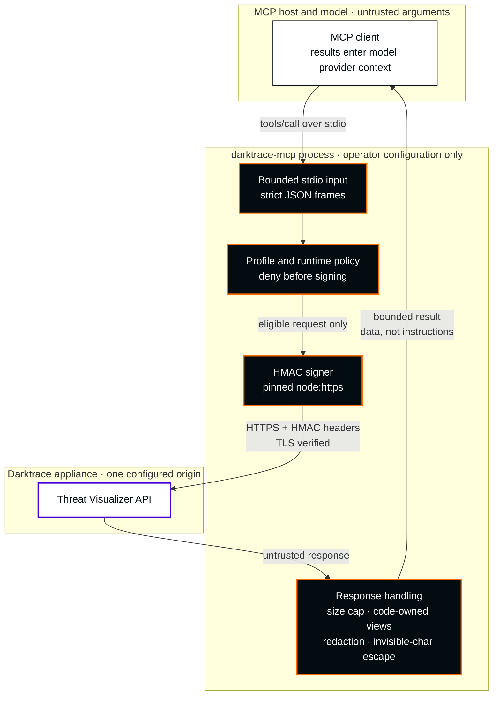
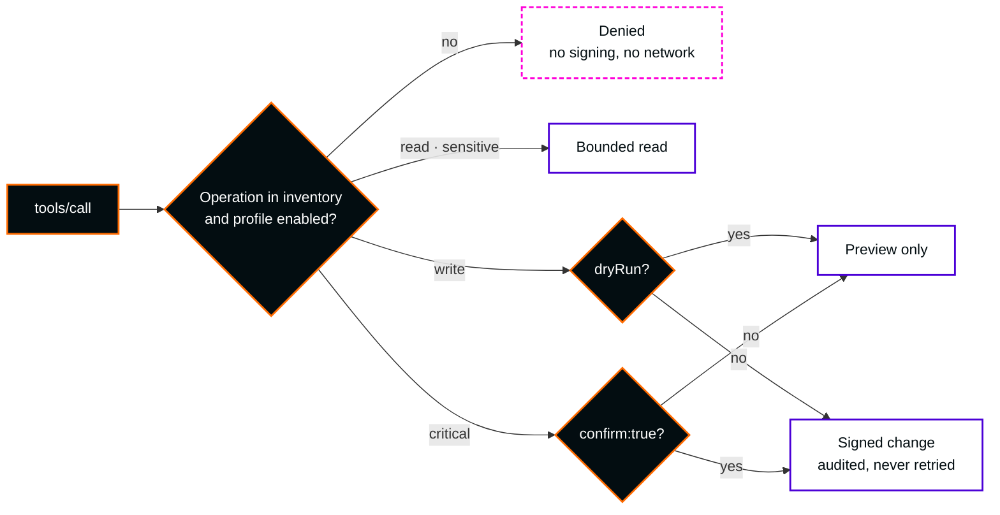
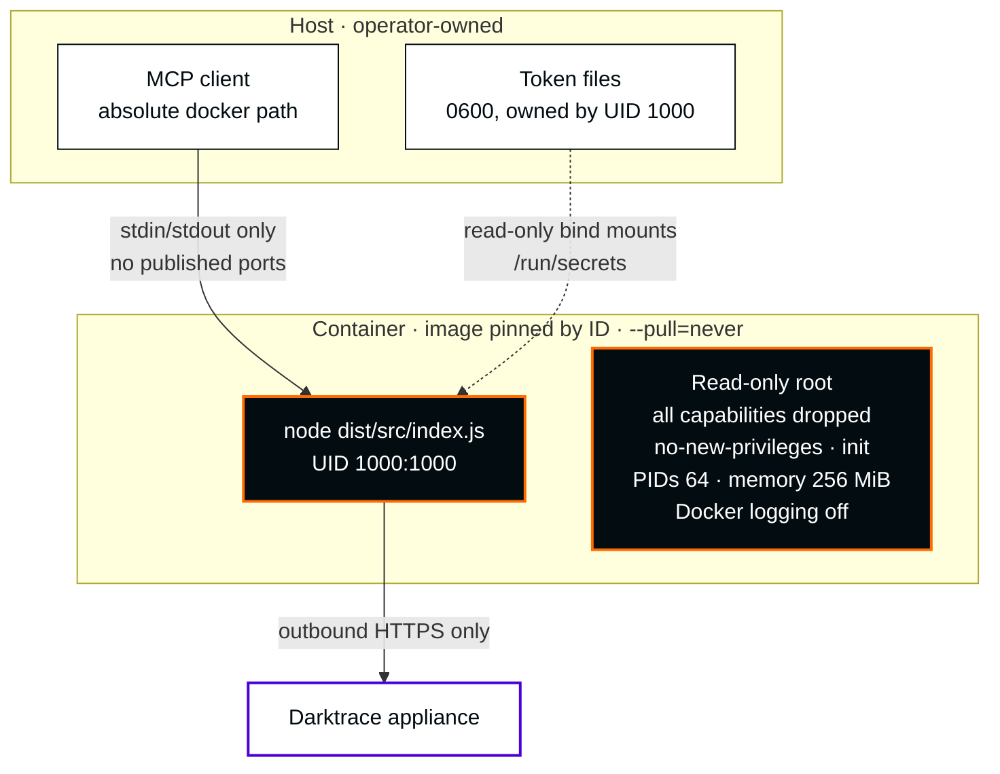
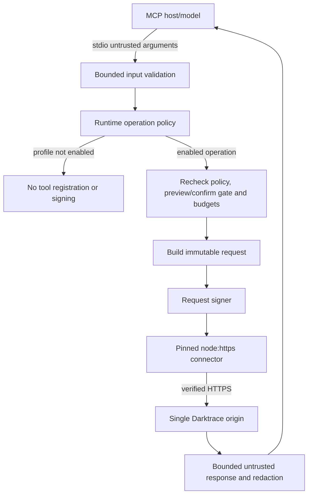

# Darktrace MCP server: architecture

[README](../README.md) · [Configuration](configuration.md) · [Tools](tools.md) · [Security overview](security.md)

This document explains how the server is built. Sections 1–4 describe the current design. Sections 5–15 are the original design baseline (2026-10-05), kept for reference: where they say writes are unavailable, list 15 tools / 19 selectors, or call the release read-only, they describe that earlier release, not today's behaviour.

Inputs: [OpenAPI 6.1](../openapi/darktrace-threat-visualizer.yaml), [SDK comparison](../openapi/DIFF-sdk-vs-docs.md), [API contract](api-contract.md), [79-operation inventory](operation-inventory.json), [independent review](security/design-review.md) and [design decisions](security/design-decisions.md). The lab target is Darktrace **7.1**; the documented API is **6.1**.

## 1. Decisions in one screen

| Area | Decision |
|---|---|
| Deployment | One HTTPS origin and credential pair per process; **stdio only**, no HTTP listener. |
| Surface | 78 of 79 catalogue operations, grouped into 51 tools ([tool reference](tools.md)). The deprecated `GET /aianalyst/incidents` is excluded. |
| Profiles | Set by the operator at startup with `DARKTRACE_PROFILES`: `read` (default), `sensitive`, `write`, `critical`, `all`. Tools outside the enabled profiles are not registered and are denied before signing. |
| Changes | `write` operations accept `dryRun:true` previews. `critical` operations return a preview unless the call carries `confirm:true`. Every write is audited. POST/DELETE are never retried. |
| Validation | 19 read operations passed a Darktrace 7.1.0 lab; all others are marked *not lab-validated*. |
| Canonicalization | Explicit `encoded` or `unencoded` query-signature mode; default `unencoded`; no fallback. |
| Network | Dedicated `node:https` connector, pinned initial DNS, hostname verification, `rejectUnauthorized:true`, proxies refused. |
| Budgets | §5.3 hard ceilings; configuration can only lower them. |
| Delivery | Source install with setup wizard, Claude Desktop `.mcpb`, or Docker (Alpine Node.js 24 with OpenSSL 3.5.9). |

### 1.1 Current implementation snapshot

The [79-operation coverage catalogue](../src/coverage/report.generated.json) and [tool groups](../src/api/tool-groups.json) define the operation-to-tool mapping. The generated [tool reference](tools.md) lists each operation with its tier, profile and lab status. Model or host approval is never authorization: the operator's profiles and the appliance token's permissions are.

The first stable (1.0.0) exposed only 15 read tools covering 19 GET operations; that history is in [docs/history](history/README.md).

## 2. Runtime and dependency baseline

The implementation target follows the local [package manifest](../package.json): ESM TypeScript, Node **22+**, with Node 22 and 24 in the intended CI matrix. Runtime dependencies are exactly `@modelcontextprotocol/server` **2.3.0** and `zod` **4.2.0**. Development dependencies include `@modelcontextprotocol/client` **2.3.0**, TypeScript **5.9.3**, `@types/node` **24.0.0**, and `yaml` **2.9.1** for build-time spec parsing. Tests use built-in **`node:test`**, compiled with `tsc`. These are project pins, not independently rechecked claims about current registry releases.

`serveStdio` and the server factory own MCP transport state. SDK annotations are hints only, never authorization. Explicit input limits apply before SDK/tool parsing; an SDK default buffer is not the security limit. Stdout carries protocol frames only. SDK behavior and host compatibility require offline/stdio evidence for the actual pinned versions.

## 3. System overview

Three compact views follow, plus the internal execution order. They describe the design the source implements; security evidence for source `eadfe117…` is dated 2026-10-05 and summarized in [corrections acceptance](security/mcp-corrections-acceptance.md). That evidence is synthetic and offline. It is not a certification, an appliance validation or a promise about every host or model. Diagram colors follow [visual identity §Diagrams](visual-identity.md#diagrams-and-badges); every meaning is also written in the labels.

### 3.1 Request and return path



The server never asks the model for credentials, origins or policy. Returned results can leave the organization through the host's model provider; assess that egress before any deployment (§8.3). Default ceilings are 2 MiB per upstream response and 60,000 characters per tool result; configuration can only lower them (§5.3). Escaping invisible characters is a presentation defense: it does not stop a host from following text it chooses to trust.

### 3.2 Profiles and trust boundaries



Only the operator sets profiles, at startup. The model cannot enable a profile, and its approval is not authorization; appliance token permissions remain authoritative. `confirm:true` should reflect an explicit user decision after reading the preview.

### 3.3 Docker runtime



The runtime image is `scratch` plus 22 signed, hash-pinned Alpine 3.24 packages: Alpine-maintained Node.js 24.18.1 linked to shared OpenSSL 3.5.9, with no shell or package manager. A Node 22 stage is used only to build. Fresh scans retain a zlib High match (library affected; an independent review found its vulnerable code is not in the application path) and an `ada` Medium name collision; this document claims no clean scan. See the [Docker guide](docker.md#current-candidate-at-a-glance).

### 3.4 Internal execution order



Policy denies before builder/signer/network. Registration is a usability filter, not an authorization boundary. The API/client stay independent of MCP result types. Response text cannot change policy, credentials, origins or schemas.

## 4. Repository responsibilities

`src/config/` validates operator-only startup state; `src/server/` handles bounded stdio input and lifecycle; `src/tools/` defines curated tools; `src/policy/` enforces the operator's profiles; `src/api/` contains static spec-derived descriptors and validation; `src/client/` handles canonicalization and the pinned HTTPS connector; `src/shape/` minimizes and redacts output; `src/observability/` owns diagnostics. `scripts/` may generate static catalogue data from the local spec at build time. No production module fetches schemas or code from an appliance. Sections 5–15 below are the original design baseline, kept for reference.

## 5. Module interfaces

> **Design baseline (history).** Sections 5–15 are the 2026-10-05 design record. Current behaviour: §1 and [configuration](configuration.md).

### 5.1 Configuration and credentials

Configuration is validated strictly at startup from an operator-owned file/environment. Unknown or unsupported bypass fields fail closed. Production config has no `compat.assumeVersion` (test-only injection may supply a version), no HTTP host/port/bearer tokens and no export writer settings. `transport.kind`, if present, accepts only `stdio`; `transport.http` and `bearerTokens` are rejected. `DARKTRACE_PROFILES` accepts only `read`; `read,write` is rejected. Requesting `email` or `export` is also an error.

| Field | Required semantics |
|---|---|
| `instance.baseUrl` / `DARKTRACE_URL` | Exactly one HTTPS origin; normalized hostname or canonical IP and valid port; no userinfo, query (even empty), fragment, backslash or path other than `/`. Reject alternate numeric IP forms before URL normalization. |
| `instance.destinationAllowlist` | Optional operator-only array of canonical IPv4/IPv6 addresses, exact IP matches only; CIDRs are unsupported and rejected. All initial DNS answers must satisfy it. No model-supplied destinations. |
| `instance.timeoutMs` / `DARKTRACE_TIMEOUT_MS` | Total call deadline, at most 30,000 ms including queue, pages, attempts and waits. |
| `auth.querySignatureEncoding` / `DARKTRACE_QUERY_SIGNATURE_ENCODING` | `encoded` or `unencoded`; default `unencoded`, chosen once at startup. |
| `auth.dateFormat` / `DARKTRACE_DATE_FORMAT` | `compact` (default UTC) or `spaced`; invalid header characters rejected. |
| `profiles.read` | Always true. |
| `profiles.write` / `DARKTRACE_PROFILES=read,write` | Any attempt to enable write is rejected at startup; the immutable release capability is read-only. |
| `profiles.writeCritical` / `DARKTRACE_WRITE_CRITICAL` | Any attempt to enable critical capability is rejected at startup; no critical preview or execution is exposed. |
| `profiles.sensitiveRead` / `DARKTRACE_SENSITIVE_READ` | False by default; either setting preserves the same 15 tools / 19 GET ceiling. |
| `limits.*` | Bounded integers; only lower the ceilings in §5.3, never raise them. |

The finalized configuration field contract is below; source implementation is in progress, so these names and bounds are requirements rather than an assertion of enforcement. The listed maxima are hard ceilings; configuration can only lower them and must reject noninteger, negative or above-ceiling values.

| Exact field | Maximum |
|---|---|
| `instance.timeoutMs` | 30,000 ms total |
| `limits.maxResponseBytes` | 2,097,152 bytes, independently wire and decoded |
| `limits.maxToolInputBytes` | 65,536 bytes |
| `limits.maxToolInputDepth` | 8 |
| `limits.maxToolInputElements` | 5,000 |
| `limits.maxToolOutputChars` | 60,000 |
| `limits.maxConcurrentRequests` | 4 |
| `limits.maxQueuedRequests` | 16 |
| `limits.maxPages` | 10 |
| `limits.rateLimitPerMinute` | 120 attempts |
| `limits.maxGetRetries` | 2 |
| `limits.maxRetryAfterMs` | 2,000 ms; maximum acceptable server wait, never a truncation permission |


Tokens are never accepted in argv. Both `DARKTRACE_PRIVATE_TOKEN_FILE` and `DARKTRACE_PUBLIC_TOKEN_FILE` are required supported configuration interfaces (operators may choose file or token sources); prefer files for both, under identical secure-file rules; mutually exclusive token/file sources avoid ambiguity. Token files are opened with `O_NOFOLLOW | O_NONBLOCK`, then checked on the **open handle**: regular file, at most **4,096 bytes**, owner is current UID, mode **0600 or stricter** (no group/world bits or executable/special bits). Bound reads even if the file grows; reject symlinks, nonregular files, insecure ownership/mode and unsupported secure-open semantics; do not silently omit either secure-open flag. Accept only a nonempty token with at most one terminal newline stripped and no remaining CR/LF. Failures are sanitized. The operator controls the parent directory and OS.

All operator JSON configuration files, including nonsecret policy-only files selected by `DARKTRACE_CONFIG_FILE`, require the same file-integrity mechanism as token files: open with `O_NOFOLLOW | O_NONBLOCK`, then verify the **open handle** is a regular file owned by the current UID, mode **0600 or stricter**, with no group/world, executable or special bits; the parent directory must be operator-trusted. The JSON file ceiling is **65,536 bytes (64 KiB)**, distinct from the **4,096-byte (4 KiB)** token-file ceiling. Enforce the JSON ceiling during a bounded read even if the file grows, before any JSON parsing. Symlinks, FIFOs/nonregular files, insecure ownership/mode, oversize or unsupported secure-open semantics deny startup before signer, DNS or network; never silently omit either flag. Inline `auth.publicToken` and `auth.privateToken` are allowed only in JSON that passes these checks; strict direct-token/environment versus token-file source mutual exclusivity remains unchanged. Never log raw config/token values or include them in configuration diagnostics. `--check-config` and `doctor` apply this identical file policy, including to nonsecret JSON policy files.

TLS verification cannot be disabled. Private CA trust uses `NODE_EXTRA_CA_CERTS`. Refuse startup on insecure TLS flags/config or `NODE_TLS_REJECT_UNAUTHORIZED=0`; refuse `NODE_USE_ENV_PROXY` when set, `--use-env-proxy`, and ambient proxy variables (`HTTP_PROXY`, `HTTPS_PROXY`, `ALL_PROXY`, `NO_PROXY`, and `http_proxy`, `https_proxy`, `all_proxy`, `no_proxy`, even if empty). The dedicated connector must not inherit a global agent/proxy. `NODE_OPTIONS` is trusted operator code-execution configuration: reject known TLS/proxy bypass flags there too, but arbitrary preloads can subvert all process controls and are outside this boundary. Do not claim the environment parser can sandbox hostile preload code. On corporate hosts, remove the offending proxy variables from the **MCP server process environment only**, using the host launch environment or a scoped launcher; do not alter global shell/system proxy settings. A rejection identifies only the offending variable name (for example `HTTPS_PROXY`), never its value, credentials, URL or raw environment. Do not echo `NODE_OPTIONS` contents.

### 5.2 Signer and request shapes

`createHttpClient(cfg, { operations, ...testDependencies })` constructs its signer internally from startup auth settings. The code-owned operation descriptor fixes method, route, classification, allowed parameter names and shape. Runtime request surface:

```ts
request({ operationId, pathParams, query, body, contentType, signal })
// query: ordered readonly [string, string][]; repeated keys preserve order.
// No arbitrary URL, method, headers, credentials, profile or byte-budget input.
```

HMAC-SHA1 uses the local spec's `<path+query>\n<public>\n<date>` message and hex digest. Build once, serialize JSON/form once, freeze/copy the result and send those exact bytes. Percent-encode values on wire; the startup mode determines encoded versus unencoded query values in the signature. Preserve query ordering; reject CR/LF; never try another mode on 401. Default unencoded follows the SDK evidence in [API S1](api-contract.md#3-authentication-and-signing-ambiguities) and is **lab-unverified**. A Date header may support a sanitized clock diagnostic, never clock adjustment, tolerance widening or replay.

S4 query+JSON, S5 DELETE+query and S6 base64-in-GET-path are **blocked before build/sign/network**. No quirk flag, startup signing mode, tool argument or version response enables them. Advanced Search POST is deferred and ineligible in this release, including with sensitiveRead; its source design does not grant release access. Email S9 is blocked. Future lab evidence alone does not change production gates without reviewed code/design changes.

### 5.3 Dedicated HTTPS connector and budgets

Use `node:https` with a dedicated agent/connector, never global `fetch` or a global dispatcher. Before the first eligible upstream call signs or opens a socket, an injectable lazy resolver obtains **all A/AAAA** answers, normalizes IPv4-mapped IPv6, validates every result and freezes the address snapshot. An explicit canonical-IP-only allowlist must contain every normalized answer; reject CIDR entries at config load. Attempt initialization once per process, sharing it across concurrent first calls. Only a fully validated snapshot is frozen as success. A resolution/validation failure **or caller abort while shared initialization is pending** is cached as a terminal failure until process restart: the initial, concurrent and all subsequent eligible calls deny with zero signer/socket attempts and no further resolver calls. In particular, cancellation of the first caller cancels the shared resolver and denies concurrent waiters; later calls remain denied even if DNS would now succeed. Never cache partial success, retain a partial snapshot, or send a credential-bearing request after failed initialization. Automatic safe-GET retries must not retry DNS initialization failure; only a restarted process (a new client instance in isolated tests) may attempt fresh initialization under the same validation rules. Without an explicit allowlist, the operator trusts the initial validated DNS snapshot. Authorized private RFC1918/ULA addresses are valid; reject loopback, link-local/metadata, multicast, unspecified and malformed addresses in production. Inject resolver/connector only through test construction, not production config or tool arguments.

Reject entire IPv6 transition prefixes `::/96` (IPv4-compatible), `::ffff:0:0/96` (IPv4-translated), `64:ff9b::/96` (NAT64 WKP), `64:ff9b:1::/48` (NAT64 local-use NSP), `2002::/16` (6to4) and `2001::/32` (Teredo), even when an operator allowlist names an address inside one. IPv4-mapped IPv6 is instead canonicalized to IPv4 and checked by the IPv4 rules; RFC1918 and ULA remain valid. Arbitrary NAT64 prefixes cannot be reliably inferred, so use an exact-IP allowlist for additional control.

Every initial/reused/retried connection must reach a pinned address; custom lookup returns only that snapshot and never performs a later unchecked lookup. Preserve the configured hostname for SNI (DNS names) and certificate hostname verification, including IP SAN checks for literal IP origins. Set `rejectUnauthorized:true` explicitly on connections. Refuse all redirects, including same-origin; never fetch response links. Bootstrap DNS poisoning remains a residual risk without an explicit allowlist even with TLS. A restart creates a new snapshot, not permission to trust arbitrary destinations.

| Resource | Hard ceiling (defaults at ceiling unless a lower operation bound applies) |
|---|---|
| Total call duration | **30,000 ms**, starts at admission, includes queue, retries/backoff, all pages, body receipt and cancellation work; each attempt gets at most remaining deadline, never a fresh 30 s. |
| Input | **65,536 bytes (64 KiB)** before parsing; maximum depth **8**, maximum **5,000** elements. |
| Response | **2,097,152 bytes (2 MiB) on wire AND decoded**, counted cumulatively across attempts/pages per call. Send `Accept-Encoding: identity`; reject unexpected compression rather than accepting decompression expansion. |
| Tool output | **60,000 characters** after shaping, across all result representations; mark truncation. |
| Scheduler | **4** concurrent upstream requests, **16** queued; reject overflow and expire queued calls at their original deadline. |
| Pagination | At most **10 pages** and always within the same byte/output/deadline/rate budgets; repeated/unknown cursors terminate; no automatic URL fetch. Without a documented pagination contract return a bounded single page. |
| Rate | **120 upstream attempts/minute/process**, including retries and explicit status-tool requests; delay only within the original deadline or deny. |
| Retry | At most **2 retries** (3 total attempts) for descriptor-allowlisted safe GET only; eligible 429/502/503/504 or pre-response transient network failures. All attempts count. |
| Retry wait | If supplied `Retry-After` is invalid, or its parsed seconds/date delay exceeds **2,000 ms** (or lower configured maxRetryAfterMs) **or** the remaining deadline, **do not retry**. Never truncate a server-requested wait to retry early. Missing header permits only own backoff/jitter within the configured 2,000 ms maximum and remaining deadline. |

For an accepted server delay, wait at least that delay within the original deadline; if no time remains for another attempt, stop. A rejected Retry-After returns a sanitized `rate_limited` error with a local correlation ID and safe reason, never the raw header value. `Retry-After: 60` causes zero additional attempts.

No POST/DELETE retry, including read-via-POST. No retries on authentication failure, policy/shape denial, terminal DNS initialization failure, TLS failure or size-limit violation. After possible mutation dispatch, timeout/cancellation/network failure is `unknown` outcome; never claim no effect. Abort on deadline, EOF or cancellation and remove queued work. Tool arguments never raise byte/time limits; any internal lower cap is clamped. Descriptor-owned future binary export budgets are a separate gate (§8.1), not an override for ordinary responses. Query ranges/counts require operation-specific finite schema bounds; unknown units or unsafe unconstrained forms remain blocked pending review.

### 5.4 API operations

`callOperation(op, input, ctx)` resolves `operationId` against the immutable code-owned catalogue and inventory. It validates bounded input and performs §5.6 policy again before build/sign. A caller cannot inject its own descriptor, alias, method, path or headers. Schema gaps produce conservative typed/minimized output or rejection, never a generic passthrough proxy. The [API inventory](api-contract.md#2-operation-inventory) preserves all 79 documented operations, including blocked ones. Tool-level `operation` selects the trusted descriptor; the internal client receives its `operationId`.

### 5.5 Version detection and quirks

There is **no automatic startup status probe**. The baseline starts with version unknown. Only an explicit bounded `get_status` tool call requests `GET /status`; its response is untrusted compatibility data, not automatic enablement. Quirks may warn, narrow an allowed parameter set, or disable operations. They **never** change signing mode, routes to new destinations, risk/profile requirements, schema trust, or resource ceilings; they cannot enable blocked shapes. No automatic `alter_request` substitution (such as silently dropping `hours` for a broader query). Unknown/unavailable version retains conservative gates, and no production `assumeVersion` bypass exists. `documentedIn:6.1` and actual `validatedOn:7.1` evidence remain separate; a reported version is not validation.

### 5.6 Runtime policy and deferred write-design material

**Current release behavior:** the immutable release-capability gate permits only the 19 validated GET selectors. It denies every write and critical operation before registration or signing; there is no dry-run preview, write audit flow or configuration switch that enables one. The numbered write/preview flow below is retained as future design material only and does not describe a capability available in this release.

0. At dispatch **and** inside operation execution, re-resolve trusted descriptors and enforce current operator profiles, compatibility restrictions, sensitivity and unconditional email/export/deprecated/shape gates. Unknown or forbidden operations yield zero signer/network calls. Registration filters the same rules but is not sufficient.
1. Validate bounded arguments and reject unsupported fields such as `confirm`. Non-email critical descriptors may be used only to produce metadata previews under write+writeCritical; no request is built for them. Email never registers even for preview.
2. Medium/high writes default to `dryRun:true`; explicit `dryRun:false` can execute only with operator write permission and all other gates satisfied. Any accepted dry-run is resolved before request building or signing.
3. Return **exactly** `{dryRun:true, operationId, method, parameterNames}`. Names are allowlisted field names, never values. No path template, URL, target, body, token, header, signature, canonical string or extra fields. Critical always returns this preview for eligible calls, even if `dryRun:false`; there is no critical execution branch.
4. For eligible executing medium/high writes, await `audit.record(operationId, 'start', requestId)` before build/sign; it returns `Promise<void>` and rejects on unavailable sink. A rejected pre-audit yields zero signer/network calls. Recheck policy at execution before dispatch.
5. Send within §5.3 budgets, shape bounded output, then await post-audit. A post-audit failure reports audit failure plus effect `completed` if known or `unknown` if uncertain, with correlation ID; never retry the operation. A preview cannot emit a successful execution audit event.

Preview and denial audit records are **optional, best-effort**: if emitted, use `preview` for an accepted preview and `error` for a denial, never `ok` or `start`. There is no `denied` enum member. Use only the fixed `AuditRecord` metadata below; operationId must be code-owned or a fixed unknown-operation marker, never raw caller input. Optional sink failure must not block an unsigned preview or enable a denied operation; it cannot bypass the mandatory awaited fail-closed pre-audit for an executing write.

```ts
type AuditOutcome = 'start' | 'ok' | 'error' | 'preview' | 'unknown';
interface AuditRecord {
  audit: true;
  ts: string;          // generated UTC timestamp
  requestId: string;   // generated if omitted by caller; never missing in stored record
  operationId: string;
  outcome: AuditOutcome;
}
interface Audit {
  record(operationId: string, outcome: AuditOutcome, requestId?: string): Promise<void>;
}
```

`Audit.record` is the asynchronous command API; `AuditRecord` is the exact stored allowlist it constructs. The execution layer supplies the same locally generated requestId to pre/post records; an omitted ID must be generated by the recorder, never omitted in storage. `start` is an attempt and `ok` is completed execution; `unknown` means uncertain effect. The tool error's `completed` label describes effect, not an extra audit enum member. No tier, separate event, target metadata, parameter values or payload fields are part of this contract. The inspected source already exposes the three-argument Promise API; record completeness and omitted-ID generation are required implementation work, not validated behavior.

### 5.7 Tool definitions and output

This release exposes consultation operations only; write actions are unavailable. The current release registers no critical tools; catalogue metadata for future tools must not be described as an available preview. Sensitive search remains explicitly operator-gated and not lab validated. `readOnlyHint`, `destructiveHint`, `idempotentHint` and `openWorldHint` reflect semantics but never authorize execution or retries. Results use bounded text/structured data and sanitized `isError` failures with correlation IDs. Treat comments, hostnames, Markdown, HTML and error text as untrusted data. No execution, auto-fetch, schema generation or policy mutation from responses.

Response minimization uses code-owned, schema-backed views (AD-03), not caller-selected or response-defined field maps. The projection omits unknown properties and reduces unknown/unmodeled structures to a fixed summary; the Advanced Search `@message` field is excluded, while the `@fields` slot carries only a fixed summary and never copies its dynamic protocol fields. This minimization is independent of token redaction. Redaction (AD-01) replaces configured token literals and a finite set of one-step UTF-8 representations: JSON-escaped text, standard/base64url with or without padding, percent-encoded URI forms with hex-case variants, and hexadecimal for tokens of at least four bytes. It does not promise detection of arbitrary transforms, recursive/double encoding, or prefixed/wrapped encodings. See ST-02 sink and ST-09 minimization tests.

### 5.8 Server lifecycle

The baseline validates local config, URL syntax, credential files and forbidden environment/flags at startup; failures abort startup with sanitized diagnostics. It does not make an automatic status request or require appliance availability to list tools. DNS initialization is lazy before the first eligible signer/socket operation (§5.3); a DNS/allowlist initialization failure is terminal for the process and denies that and every later eligible call with zero signer/socket attempts and no DNS retry until restart. A TLS connection must authenticate the pinned origin before any signed HTTP request bytes are sent; certificate failure denies the call without an HTTP request or destination fallback. Unknown version and ordinary status-tool/connectivity failures keep conservative policy and produce safe tool errors, never enable capabilities.

`--check-config` and `doctor` are equivalent offline diagnostics: apply the same local configuration, token and environment validation as startup, including identical secure-file rules for config/token sources, and perform zero DNS lookups, network/socket calls or signing. Print only fixed sanitized status/error messages (an offending environment variable name is permitted, never its value), without secrets, paths, raw configuration or exception details. Diagnostic success establishes only local validation, not appliance reachability, credentials acceptance or security approval; these CLI modes exit without starting a protocol session.

The existing read-only-inspected mechanism is `process.stdin.pipe(boundedInput(...))` from [src/server/input.ts](../src/server/input.ts), then `new StdioServerTransport(input, process.stdout, {maxBufferSize:65536})`, injected into `serveStdio(..., {transport, ...})` in [src/server/stdio.ts](../src/server/stdio.ts). The wrapper bounds raw newline-delimited frames **before its own JSON.parse and before SDK JSON parsing**; the SDK buffer is a second guard, not the sole limit. The 64 KiB ceiling includes the line delimiter; lower maxToolInputBytes must lower the wrapper/transport limit too. Depth/element limits are checked before dispatch. Existing source establishes the wrapper/injection mechanism, not a claim that configurable lowering, every error path or memory bounds have passed tests.

On an oversized complete or partial frame, close the stdio session, abort pending work and emit only a fixed sanitized stderr event (for example `protocol_error`); never echo any partial input or fabricate a JSON-RPC reply from an unparsed ID. ST-11 must verify chunks without newlines, multiple frames per chunk, exact boundary and overflow, zero SDK parser/handler entry on oversized frames, bounded accumulation and sanitized termination. EOF, SIGINT/SIGTERM and cancellation abort queued/active work and close the dedicated agent. No fallback endpoint, HTTP listener or unbounded startup/network retry.

### 5.9 Observability

Stdout is protocol only. Structured logs/audit go to redacted stderr or an operator-provisioned sink with observable asynchronous write failures. Never log raw request/response bodies, even at debug. Audit stores exactly the `AuditRecord` allowlist in §5.6: audit marker, generated timestamp, mandatory correlation ID, operationId and outcome; no tier, separate event, target metadata, secrets or payload values. Local records are not immutable evidence and do not establish human identity.

## 6. Tool catalogue (curated)

> The current, generated list is the [tool reference](tools.md). The catalogue below is the original design plan.

Current counts are in [§1.1](#11-current-implementation-snapshot); this section is the original design catalogue. Naming: `darktrace_<verb>_<object>`. Tier and annotations follow `operation-inventory.json`. Operations column uses the spec's `operationId`s. This is a design catalogue, not a claim of implemented or registered tool counts. Current runtime input uses a fixed `operation: operationId` enum for multi-operation tools with strict `path`, `query` and `body` groups; a single-operation tool defaults its operation. Descriptions below do not promise separate ergonomic aliases. Broader catalogue validation remains deferred; only the 19 current permitted recipes have native/Docker 7.1.0 evidence. Registration and execution are filtered by §5.6, including shape gates.

### 6.1 Read catalogue: 28 tools, 42 operations

| Tool | Operations covered | Notes |
|---|---|---|
| `darktrace_get_status` | `get_status` | Explicit status tool only; no automatic startup probe and no policy enablement from its response. |
| `darktrace_list_model_breaches` | `get_modelbreaches`, `get_modelbreaches_pbid` | Choose the fixed operation ID and its documented path/query group; no caller route override. |
| `darktrace_get_model_breach_comments` | `get_modelbreaches_pbid_comments`, `get_mbcomments` | Select the path-specific comments operation or the separate recent-comments operation. |
| `darktrace_list_ai_analyst_incidents` | `get_aianalyst_incidentevents`, `get_aianalyst_groups` | Select events or groups by fixed operation ID; replaces deprecated `/aianalyst/incidents`. |
| `darktrace_get_ai_analyst_incident_comments` | `get_aianalyst_incident_comments` | |
| `darktrace_get_ai_analyst_stats` | `get_aianalyst_stats` | |
| `darktrace_list_ai_analyst_investigations` | `get_aianalyst_investigations` | Sends `investigationId` with documented casing. |
| `darktrace_list_antigena_actions` | `get_antigena`, `get_antigena_summary` | Select summary by fixed operation ID; read-only view of RESPOND. |
| `darktrace_search_devices` | `get_devicesearch` | |
| `darktrace_get_devices` | `get_devices` | By `did`, `ip`, `mac`, `sid`, `seensince`. |
| `darktrace_get_device_summary` | `get_devicesummary` | Carries the SDK #37 warning (HTTP 500 with API tokens) in its description until validated on 7.1. |
| `darktrace_get_device_info` | `get_deviceinfo` | |
| `darktrace_get_similar_devices` | `get_similardevices` | `did` required in the tool even though the spec table omits it. |
| `darktrace_get_cves` | `get_cves` | |
| `darktrace_get_endpoint_details` | `get_endpointdetails` | |
| `darktrace_get_connection_details` | `get_details` | Medium sensitivity; output truncated and paginated by `count`. |
| `darktrace_get_network_stats` | `get_network` | |
| `darktrace_get_metric_data` | `get_metricdata` | Only documented schema parameters; a metric1..N array alias is not implemented and needs separate contract review. |
| `darktrace_list_metrics` | `get_metrics`, `get_metrics_mlid` | |
| `darktrace_list_models` | `get_models`, `get_models_pid` | `uuid` or `pid`. |
| `darktrace_list_components` | `get_components`, `get_components_cid` | |
| `darktrace_list_subnets` | `get_subnets` | |
| `darktrace_list_tags` | `get_tags`, `get_tags_tid`, `get_tags_entities`, `get_tags_tid_entities` | Select tags or entities by fixed operation ID. |
| `darktrace_get_intel_feed` | `get_intelfeed` | |
| `darktrace_get_summary_statistics` | `get_summarystatistics` | A reported version can disable unsupported `hours`; it cannot rewrite or broaden the request. |
| `darktrace_get_reference_data` | `get_enums`, `get_filtertypes` | |
| `darktrace_advanced_search` | `get_advancedsearch_api_search_query`, `post_advancedsearch_api_search`, `get_advancedsearch_api_analyze_field_analysis_query`, `get_advancedsearch_api_graph_graphmode_interval_query` | Only POST search is eligible with `profiles.sensitiveRead:true` (default false); it is not lab validated. All three GET/base64 forms are blocked by S6. Passes bounded `size` through; minimized output and provider eligibility notice required. |
| `darktrace_list_pcaps` | `get_pcaps` | Lists captures only; download is blocked by the baseline export gate. |

### 6.2 Historical write catalogue: 9 tools, 16 operations (not exposed)

The table preserves source-catalogue design accounting only. None of these tools or operations is registered in the current first-stable release; the immutable release gate denies non-read tiers, and no write profile, preview or execution path is available. A later release requires a new reviewed activation and authorization gate.

| Tool | Operations covered | Tier | destructiveHint | idempotentHint |
|---|---|---|---|---|
| `darktrace_acknowledge_model_breach` | `post_modelbreaches_pbid_acknowledge`, `post_modelbreaches_pbid_unacknowledge` | medium | false | true |
| `darktrace_comment_model_breach` | `post_modelbreaches_pbid_comments` | medium | false | false |
| `darktrace_acknowledge_ai_analyst_incident` | `post_aianalyst_acknowledge`, `post_aianalyst_unacknowledge` | medium | false | true |
| `darktrace_pin_ai_analyst_incident` | `post_aianalyst_pin`, `post_aianalyst_unpin` | medium | false | true |
| `darktrace_comment_ai_analyst_incident` | `post_aianalyst_incident_comments` | medium | false | false |
| `darktrace_create_ai_analyst_investigation` | `post_aianalyst_investigations` | medium | false | false |
| `darktrace_update_device` | `post_devices` | high | true | true |
| `darktrace_manage_tags` | `post_tags`, `post_tags_entities`, `delete_tags_entities` **blocked (S5)**, `post_tags_tid_entities`, `delete_tags_tid_entities_teid` | high | true | partly |
| `darktrace_request_pcap` | `post_pcaps` | high | false | false |

### 6.3 Historical critical catalogue: 6 tools, 6 operations (not exposed)

The table preserves source-catalogue design accounting only. No critical operation or preview is registered in the current release; write and critical settings are rejected at startup, and all non-read operations are denied before signing. A later release needs a separate reviewed activation gate. `destructiveHint:true` is descriptive, never an authorization mechanism.

| Tool | Operation | Why critical |
|---|---|---|
| `darktrace_antigena_action` | `post_antigena` | Activates, extends or clears RESPOND actions. |
| `darktrace_antigena_manual_action` | `post_antigena_manual` | Manual quarantine or block. |
| `darktrace_update_intel_feed` | `post_intelfeed` | `removeall` wipes the list; `iagn` can trigger RESPOND. |
| `darktrace_update_subnet` | `post_subnets` | `excluded`/`modelExcluded` remove monitoring coverage. |
| `darktrace_delete_tag` | `delete_tags_tid` | Tags scope models and RESPOND. |
| `darktrace_email_action` | `post_agemail_api_ep_api_v1_0_emails_uuid_action` | Acts on mail; body schema unknown. Blocked by the unconditional email gate. |

### 6.4 Export profile: 2 tools, 2 operations

Future catalogue only: `export` is a configuration error and both operations are denied before signing. The future writer gate in §8.1 must be separately implemented and reviewed; it would return only path, size and SHA-256 metadata, never raw bytes.

| Tool | Operation | Notes |
|---|---|---|
| `darktrace_download_pcap` | `get_pcaps_filename` | Future descriptor-owned binary budget; no caller override. |
| `darktrace_download_email` | `get_agemail_api_ep_api_v1_0_emails_uuid_download` | Blocked by the unconditional email gate. |

### 6.5 Email module (status blocked): 6 read tools defined, 12 operations, none registered

| Tool | Operations covered |
|---|---|
| `darktrace_email_dashboard` | `get_agemail_api_ep_api_v1_0_dash_action_summary`, `..._dash_dash_stats`, `..._dash_data_loss`, `..._dash_user_anomaly` |
| `darktrace_email_search` | `post_agemail_api_ep_api_v1_0_emails_search` (read via POST) |
| `darktrace_email_get` | `get_agemail_api_ep_api_v1_0_emails_uuid` |
| `darktrace_email_reference_data` | `..._resources_tags`, `..._resources_actions`, `..._resources_filters`, `..._system_audit_eventTypes` |
| `darktrace_email_decode_link` | `get_agemail_api_ep_api_v1_0_admin_decode_link` |
| `darktrace_email_audit_events` | `get_agemail_api_ep_api_v1_0_system_audit_events` |

All 14 email operations are blocked, including the action and download placed in other catalogue buckets. `email` in `DARKTRACE_PROFILES` or an enabling configuration field is a startup error, not a warning. Code presence never enables this module. Any future proposal requires reviewed, committed schemas from a pinned instance spec, resolution of S9, offline policy evidence and a new design review. Runtime schema generation or fetching an instance schema as executable policy is forbidden. Lab retrieval itself needs separate authorization.

### 6.6 Excluded: 1 operation

`get_aianalyst_incidents` (`GET /aianalyst/incidents`): deprecated since 5.2 and absent from the SDK. Tracked in the matrix with status `excluded` and reason; never registered.

### 6.7 Totals

The totals below are historical catalogue accounting, not shipping capability or enabled-tool counts.

| Bucket | Tools | Operations |
|---|---|---|
| read | 28 | 42 |
| write (medium + high) | 9 | 16 |
| write + critical | 6 | 6 |
| export | 2 | 2 |
| email read (blocked) | 6 | 12 |
| excluded | 0 | 1 |
| **Total defined** | **51** | **79** |
| historical non-email-read catalogue buckets (not shipping counts) | 45 | 66 |
| of which blocked (email read) | 6 | 12 |
| of which excluded | 0 | 1 |

Operations: each of the 79 spec operations appears in exactly one historical catalogue row. The two email operations with a write or binary nature are placed by tier, not by module: `post_..._emails_uuid_action` is in the critical row and `get_..._emails_uuid_download` in the export row, so the email row holds the remaining 12. Check: 42 + 16 + 6 + 2 + 12 + 1 = 79. By tier this equals `docs/operation-inventory.json`: read 57 = 42 + 2 + 12 + 1, medium 9 + high 7 = 16, critical 6.

Tools: 51 conceptual definitions preserve inventory accounting. This does not imply 51 or 45 registered tools. The current release registers 15 read tools covering 19 GET selectors in either profile; every write and critical operation is denied, no preview is available, export and email remain blocked, and S6 GET forms plus the deprecated operation remain excluded. A tool can cover several operations. Coverage must record each blocked operation even when another operation in its catalogue tool is eligible.

## 7. Coverage tracking

Keep exactly one policy row for each of the 79 local-spec `(method,path,operationId)` entries. Totals are read **57** (including two read-via-POST), medium **9**, high **7**, critical **6**. Tests compare the local YAML, inventory, descriptors and tool mappings, including blocked/excluded operations; method alone never implies permission. The deprecated `get_aianalyst_incidents` has an explicit exclusion reason. Code-owned generated data is reviewed/committed and regenerated only at build time. A blocked operation remains counted, never silently disappears.

Before release, the coverage report must enumerate **every operation and each accepted or blocked parameter**, including path/query/body location, units, finite numeric/string/array/time-window bounds, omitted/default behavior, bound provenance and whether enforced or still pending. Unknown units or unbounded unsafe ranges must have an explicit blocked-form/parameter entry and reason; a generic claim of conservative validation is insufficient. The report must distinguish code enforcement from design requirements and identify incomplete rows as release blockers. No required coverage/bound evidence is claimed complete here. `delete_tags_entities` has a mandatory `blocked (S5)` operation row, independent of other manage-tags operations. API §4.6/4.9 gaps must each map to those explicit entries rather than disappearing under tool-level counts.

Coverage status and compatibility evidence are separate: implementation status does not set `validatedOn`; no nonempty 7.1 validation entry without authorized, dated, per-operation evidence. A generated report must distinguish discovery, preview and executable operations; conceptual catalogue totals in §6 are not enabled-tool counts.

## 8. Profiles and security boundaries

### 8.1 Export gate and filesystem design

**Export is rejected in the baseline**, with zero signer, network or filesystem writes. The following is a future design gate, not activatable configuration: operator-owned **0700** destination directory opened and held by trusted directory handle; generated filenames only; creation relative to that handle using **O_EXCL|O_NOFOLLOW**, mode **0600**. Validate ownership/type on open handles; prohibit parent traversal and symlink/directory-swap races. Path-string resolve/containment checks alone do not satisfy this gate. If the target platform cannot supply secure handle-relative semantics, export remains unavailable.

The future binary descriptor alone may specify a distinct byte ceiling: **200,000,000 bytes per file**, **1 GiB (1,073,741,824 bytes) aggregate**, **100 files**, **1 concurrent export**. Reserve/check quotas atomically including in-progress files and pre-existing retained files; ordinary tools and arguments cannot use this budget. Keep wire/decoded accounting, deadline and cancellation bounds explicit under that future review. Delete partial files on error/cancel, verify cleanup failures are reported without disclosing content, and never delete completed retained files automatically. Retention/deletion is the operator's responsibility, with no network upload and metadata-only results. Full ST-09/10/11 evidence and a new reviewed activation design are required.

### 8.2 Profile matrix

| Setting | Default | Baseline behavior |
|---|---|---|
| read | true | Registers 15 tools covering the exact 19 validated GET selectors. |
| write | false | Any attempt to enable write is rejected; no write operation or preview is exposed. Writes are deferred to a later release. |
| writeCritical | false | Any attempt to enable critical capability is rejected; no critical operation or preview is exposed. |
| sensitiveRead | false | Does not change the 15 tools / 19 GET selectors; Advanced Search stays excluded. |
| export / email | unsupported | Configuration error; unconditional runtime denial. |
| HTTP | unsupported | Configuration error; no listener. |

### 8.3 Model-provider egress and residual risks

**Operator notice:** tool results enter the MCP host/model context and may leave the organization for its model provider. Before enabling any deployment, the operator must assess that provider's data processing, retention, residency and organizational eligibility for appliance data. `sensitiveRead` cannot grant excluded operations, certify provider eligibility or substitute for authorization. Default views minimize fields; raw captures/mail stay blocked. The README/distribution owner must reproduce this notice before release (ST-09/TM-17).

Residual risks include bootstrap DNS trust without an explicit allowlist, remote signature replay tolerance, host semantic prompt injection, same-user/OS compromise, trusted NODE_OPTIONS preloads, aggregate load from multiple processes and supply-chain compromise. No residual risk acceptance is recorded. The [threat model](security/threat-model.md) specifies controls and tests, not claims of effectiveness.

## 9. Transport plan

### 9.1 Baseline stdio

One host process/pipe, one configured origin and credential pair. No inbound socket. The model cannot select transport, credentials or origin. Stdio possession is the caller context; the adapter cannot infer a human identity from it.

### 9.2 Future HTTP gate

HTTP is outside this baseline and has no enabling field or handler example here. A separate threat model, authenticated authorization design and tests for Origin/Host, sessions, tenant isolation and DNS rebinding must precede any proposal to add it. ST-16 checks baseline refusal and absence of listeners.

## 10. Installation and packaging

### 10.1 Private package and actual dependency tree

The package is published as `@nuoframework/darktrace-mcp` on npm from the release workflow only (trusted publishing, provenance), with `dist/src/index.js` as the bin and MCPB entry point. `npx` serves only as a one-time bootstrap for `setup`, which installs a fixed copy and writes absolute paths; a client configuration never launches `npx`. Do not document a version before its tag has been published.

An exact top-level package version does not pin transitives. Build with committed lock metadata and `npm ci --ignore-scripts`; future distributed tarballs must include **npm-shrinkwrap.json** locking the actual runtime tree (or a separately reviewed fully bundled equivalent). ST-15 installs the packed artifact into a clean isolated directory, inspects its dependency tree and integrity against that shrinkwrap, and rejects drift. `package-lock.json` in a source tree alone is insufficient distribution evidence. Verify `files` allowlist, actual pack contents and image layers; exclude secrets, `.env`, raw portal material and build-only sources. No install lifecycle scripts.

Future private release artifacts require independently verified SHA-256 checksums, SBOM and GitHub artifact attestations before distribution; these are pending artifacts, not existing guarantees. Retrieve authenticated private assets first, verify checksum/attestation and then install locally with scripts disabled. A future npm/npx route requires a separate publication decision and the same artifact checks.

### 10.2 Docker secret mount

Use a non-root runtime image pinned by digest, a read-only filesystem and dropped capabilities; build/install dependencies with scripts disabled and no embedded credentials. Default secret provisioning is a **read-only mounted token file**, not plaintext private-token environment or `--env-file`:

```sh
# Illustrative only: use the ID of your locally built and inspected image and existing secure files.
docker run -i --rm --init --pull=never --log-driver=none \
  --read-only --cap-drop=ALL --security-opt=no-new-privileges \
  --pids-limit=64 --memory=256m --user 1000:1000 \
  --mount type=bind,src=/secure/darktrace-public,dst=/run/secrets/public-token,readonly \
  --mount type=bind,src=/secure/darktrace-private,dst=/run/secrets/private-token,readonly \
  -e DARKTRACE_URL=https://appliance.example \
  -e DARKTRACE_PUBLIC_TOKEN_FILE=/run/secrets/public-token \
  -e DARKTRACE_PRIVATE_TOKEN_FILE=/run/secrets/private-token \
  -e DARKTRACE_PROFILES=read \
  sha256:<local-image-id>
```

No image is published to a registry. The [Docker guide](docker.md) and [Docker client example](../examples/docker.mcp.json) are the operational references.

Files must be readable by and owned by the container's non-root UID with mode 0600 or stricter; a read-only mount does not waive ownership/mode checks. Host provisioning must arrange that ownership. No export mount is active in the baseline. Current image identities, platforms and runtime results are in the [Docker guide](docker.md#current-candidate-at-a-glance).

## 11. Testing plan

The normative oracle is [ST-01–16](security/security-test-plan.md#traceable-test-matrix). Use `tsc` plus `node:test`, synthetic fixtures and deterministic clock/DNS/connector seams. Real child-process stdio and isolated loopback **TLS** connector tests are required; production cannot enable loopback test overrides. Ordinary offline tests deny external networking and never load lab secrets. All acceptance tests here are requirements, not reported results.

Critical assertions for the current release: every denied non-read call has **zero registration, signer and network calls**; hidden operations cannot bypass runtime checks; all critical operations remain unavailable. Future write-preview/audit flows require a new reviewed activation and tests before they can be described as current behavior. Verify exact budgets at boundary and +1, actual pinned sockets/SNI/certificates and SDK stdio framing/EOF. Catalogue and fixture checks cannot prove live 7.1 compatibility. Build fixtures for blocked forms only to test refusal, not to enable them.

## 12. Release plan

Release remains gated on exact-commit offline/security evidence, dependency review, installed-tree verification and actual tarball/image inspection (ST-15). A green build or documentation matrix is not security validation. Keep package pins from §2 exact in the manifest and shrinkwrap; reviewed updates regenerate and recheck the actual installed tree. Publication or pushing images requires a separate authorized release workflow. No release occurs as part of this document change.

Record commit, runtime/OS, command, fixture provenance, budgets, outcome and evidence location for each ST ID. A skipped check is not passed. Compatibility claims must explicitly separate local spec 6.1 from authorized 7.1 results. The current release denies writes and has no preview path; any later medium/high or critical capability needs a new reviewed runtime gate, action-specific lab authorization and release approval. No operator profile or lab result alone can enable it.

## 13. Decisions closed and external gates

A1–A8 are decided in [design-decisions](security/design-decisions.md#baseline-decisions). Final budgets tighten the review's proposed A8 to 30 s total and a 2 s maximum acceptable Retry-After (longer/invalid values mean no retry, never earlier replay); sensitiveRead is explicit opt-in and node:https is the chosen pinned connector. This supersedes proposals in the unchanged historical review without rewriting its evidence.

External validation remains: S1 and other eligible canonicalization against an authorized 7.1 lab; separately scoped S4/S5/S6 research; S9 and reviewed pinned email schemas; 7.1 error/ACL/units/partial-update behavior; actual offline security evidence; model-host/provider eligibility; export writer/platform safety evidence; and real package/image integrity/provenance. None is resolved by a version string or by this matrix. No runtime flag promotes a blocked shape, email, export or critical execution after a lab result.

## 14. Implementation acceptance backlog

| Owner | Required acceptance before release/activation |
|---|---|
| Config/network | Strict startup schema, secure token files, explicit signing mode, env refusal, pinned node:https and all ceilings; ST-01–05/11/12. |
| Policy/API | Inventory completeness, dispatch/execution rechecks, immutable read-only release gate, denied-operation zero registration/sign/network, sensitivity gate, restrictive quirks; ST-06–09. |
| Observability/server | Awaited audit fail-closed, bounded sanitized results, stdio EOF/frames/no listener; ST-02/13/14/16. |
| Release | Exact pins, shrinkwrap and actual installed tree, private artifact and Docker mount evidence; ST-15. |
| Separate future work | Export writer ST-09/10/11; pinned email contract/S9; HTTP threat review; separately reviewed trusted host approval outside this baseline. |

## 15. Evidence scope

Local-spec citations and counts are preserved in [API contract](api-contract.md). This revision read source/manifest only to align interfaces; it is not a code audit. The immutable [design-review](security/design-review.md) records the earlier contradictions; [closure matrix](security/design-decisions.md#closure-matrix) points to exact replacement sections and planned test oracles. No appliance was contacted and no security or lab test outcome is asserted.
