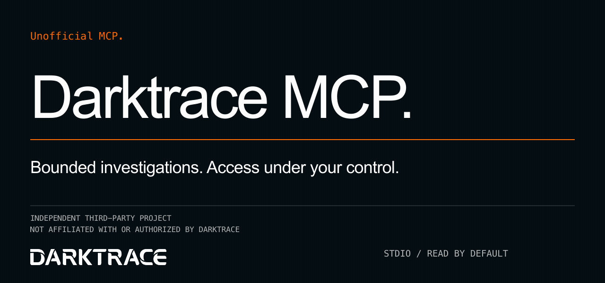
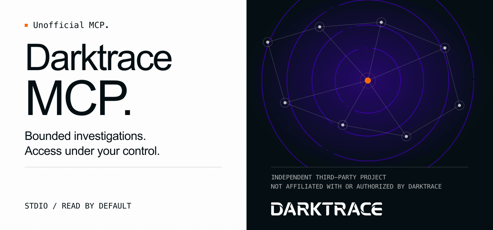
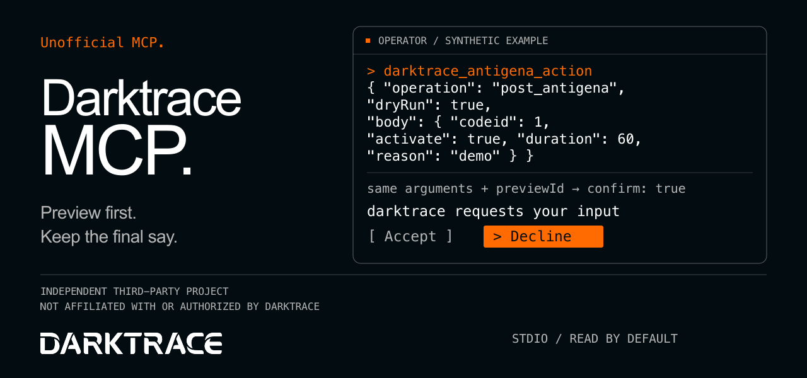

# Banner alternatives / Variantes de portada

**Selected: B — Network / Red**, by owner decision on 2026-10-06. Both READMEs now use its desktop and mobile SVGs; the other alternatives and previous hero remain available for comparison.

**Unofficial MCP. Developed by an independent third party, unaffiliated with Darktrace and without authorization from Darktrace.**

**MCP no oficial. Desarrollado por un tercero ajeno a Darktrace, sin afiliación ni autorización de Darktrace.**

The wordmark identifies the integrated product only; it does not imply endorsement or official status. These alternatives follow the [visual identity](../../visual-identity.md) and [official asset rules](../brand/darktrace/README.md).

## 0 — previous hero

The original Trace composition is retained unchanged: desktop [EN](../readme-banner-en.svg) / [ES](../readme-banner-es.svg), mobile [EN](../readme-banner-en-mobile.svg) / [ES](../readme-banner-es-mobile.svg).

## A — Minimal / Tipográfica

Large, quiet typography and a thin orange rule put the project name and access-control message first.



[Spanish PNG preview](preview/a-es.png) · Desktop SVG: [EN](a/readme-banner-en.svg) / [ES](a/readme-banner-es.svg) · Mobile SVG: [EN](a/readme-banner-en-mobile.svg) / [ES](a/readme-banner-es-mobile.svg)

## B — Network / Red (selected)

A light editorial panel balances a subtle Blurple node-link graph and radar rings, suggesting investigation without depicting a real network.



[Spanish PNG preview](preview/b-es.png) · Desktop SVG: [EN](b/readme-banner-en.svg) / [ES](b/readme-banner-es.svg) · Mobile SVG: [EN](b/readme-banner-en-mobile.svg) / [ES](b/readme-banner-es-mobile.svg)

[Selected mobile PNG preview at 600 px](preview/b-en-mobile.png) · [Selection rationale and brand checks](../../visual-identity.md#selected-hero-variant-b-2026-10-06)

## C — Operator / Operador

A monospace terminal makes the real tool name, preview parameters, and final approval choice the visual focus.



[Spanish PNG preview](preview/c-es.png) · Desktop SVG: [EN](c/readme-banner-en.svg) / [ES](c/readme-banner-es.svg) · Mobile SVG: [EN](c/readme-banner-en-mobile.svg) / [ES](c/readme-banner-es-mobile.svg)

C is a **synthetic illustration**, not a terminal recording or a claim that a request executed. It uses the real `darktrace_antigena_action` tool and `post_antigena` operation. The first call has `dryRun: true`; only a subsequent call with the same arguments, its returned `previewId`, and `confirm: true` reaches the illustrated approval prompt. The selected choice is Decline. JSON field and operation names stay unchanged in Spanish. See the [tool reference](../../tools.md) and [approval configuration](../../configuration.md#human-approval).

## Dimensions and brand treatment

- All desktop SVGs and desktop PNG previews: **1280 × 600**, matching the previous desktop hero.
- All mobile SVGs: **640 × 900**, matching the previous mobile hero and its `max-width: 600px` picture source. The mobile compositions reflow the content rather than shrinking the desktop design.
- Each SVG is below **150,000 bytes**, self-contained, and has a localized accessible title and description. Text uses system font stacks; no external fonts, images, scripts, or network requests are required.
- The white wordmark's official path elements are copied **verbatim**, with uniform translation and scale only, onto solid DT Dark. All copies are 288 canvas units wide, with at least 30.24 units (one D width) of clear space. The mark renders at 135 px at the 601 px desktop breakpoint and 154 px in a 343 px mobile column, above the 127 px minimum.
- The project name stays separate from the official wordmark. The unofficial label and independence caption remain visible in both languages. The full notices also remain in each SVG's accessible description and above in this index.
- A uses DT Dark as the approved dark navy field. B uses the existing Blurple (`#4B00D7`) blue-purple accent without adding a new brand color. Its graph is original decorative artwork, not the official Trace. C uses the neutral palette and DT Orange.

## Rebuild and review

Run from the repository root with Python 3, `rsvg-convert`, and `ffmpeg` installed:

```sh
python3 docs/assets/banner-variants/generate.py
```

[generate.py](generate.py) recreates all twelve SVGs, six desktop PNGs and the selected 600 px mobile PNG from the checked-in, unmodified official logo. It checks XML parsing, literal logo inclusion, and the size limit. PNG previews use an indexed palette to keep them below 150,000 bytes too; the SVGs retain the original vector colors. Inspect both languages at an 896 px desktop width and a 343 px mobile width, including the monospace code and independence captions. The selected B sources are used in the README picture elements; the unofficial alt text is preserved.
