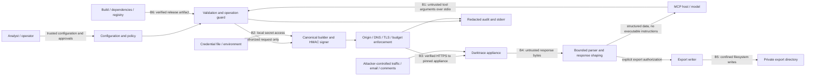

# Phase 2 initial threat model

Status: **proposed controls, not implemented or security-tested**. Snapshot: 2026-10-05. No live lab was contacted. Scope is the first stdio server, read-only by default, with write and export capabilities disabled. HTTP hosting is a separate future security gate.

## Evidence and assumptions

Repository inputs: [OpenAPI 6.1](../../openapi/darktrace-threat-visualizer.yaml), [API contract](../api-contract.md), [operation inventory](../operation-inventory.json), and the concurrently evolving [architecture](../architecture.md). These are design inputs, not proof of server behavior. The intended lab is Darktrace **7.1**; compatibility with the documented **6.1** API remains unvalidated. All 79 operations declare 200/400/401/403; undocumented errors still require safe handling. No external protocol or package-version claims are independently validated here.

Architecture assumptions awaiting reconciliation:

| ID | Assumption or required decision | Consequence until settled |
|---|---|---|
| A1 | One appliance and credential pair per process; operator-owned configuration; stdio only initially. | No model-supplied origins, credentials, profiles or proxy configuration; no listening HTTP socket. |
| A2 | The 57 read and 22 write operation classifications are the current baseline; read-via-POST exists. | Enforce operation-level permissions, never infer permission solely from HTTP method; unknown operations fail closed. |
| A3 | HMAC ambiguities S1–S7 in the API contract need reviewed fixtures and eventual 7.1 validation. | Unresolved request forms remain blocked or explicitly experimental and documented; no automatic signing fallback. |
| A4 | Local export directory is the proposed destination; retention, aggregate quota and host authorization integration are pending. | Export remains off until these controls and tests exist. |
| A5 | Trusted host/operator authorization independent of model arguments is not yet specified. | A model-provided `confirm:true` is not human approval; critical execution remains disabled until a trusted approval mechanism exists. |
| A6 | Coordinator clarified: dry-run includes only operationId/method/parameterNames; no TLS_INSECURE; private CA via NODE_EXTRA_CA_CERTS. Architecture corrections are underway. | No values, signed strings, headers or signatures in previews; verified HTTPS is mandatory. |
| A7 | `/agemail` schemas and authentication are incomplete in the portal spec. | A feature flag alone cannot enable email calls; reviewed instance contract and offline policy tests are prerequisites. |
| A8 | Architecture limits are proposed values, not appliance capacity measurements. | Adopt finite budgets, test enforcement offline, and tune only after authorized lab work. |

## Assets and actors

Assets: private signing key, public token and reusable signatures; appliance identity and trust anchors; device/user identifiers, network topology, detections, comments and searches; raw PCAP and email; integrity of RESPOND, monitoring exclusions, tags and threat intelligence; local filesystem and audit records; host/model context; appliance and MCP availability; release artifacts and dependency integrity.

Actors: an authorized analyst; an operator controlling deployment and policy; the MCP host and model (may generate unsafe arguments); attackers supplying observed DNS names, network payloads, email, comments or threat-intelligence content; a malicious caller with access to the stdio pipe; a network/DNS adversary; a compromised appliance; and a compromised dependency, build runner or publisher. The operator and host OS are trusted for credential provisioning and process isolation. A compromised same-user host can read process memory or alter configuration; this cannot be solved inside the MCP adapter.

## Data flow and trust boundaries

B1 is an authorization boundary even on stdio: possession of the pipe is the caller identity; there is no independent end-user identity unless the host supplies one through a trusted mechanism. B2 separates secrets from model-visible results. B3 must bind both the logical origin and actual connection destination. B4 remains untrusted even when TLS authenticates the appliance. B5 protects files and data recipients. B6 is code execution trust. Audit records are locally accountable records, not proof of human identity or tamper-proof evidence.

## Mandatory control details

### Request construction and HMAC

The local spec defines hex HMAC-SHA1 with the private token as key and `<path+query>\n<public_token>\n<date>` as message; POST form/JSON is incorporated into that first component as documented. Retain SHA-1 only for wire compatibility with this protocol, not as a general-purpose security choice. Host and method are absent from the documented signed message, making fixed-origin TLS and fixed operation/method routing essential.

Use a single immutable request description and serialize JSON/form once; transport must send the exact reviewed bytes. Keep ordered query pairs, repeated keys and encoding explicit. Do not double decode, sort implicitly, normalize paths after signing, or let a fetch helper reserialize bodies. Reject CR/LF in header inputs. Test spaces, Unicode, quotes, plus signs, percent escapes, empty values, repeated keys, JSON ordering, DELETE queries and Advanced Search base64 `+/=`. The global encoded-query rule conflicts with `/devicesearch`'s unencoded-signing note; query-plus-JSON and email authentication are also unresolved. Do not try alternate signatures automatically on 401, especially on writes. Dates use a controlled clock; never adjust the machine clock or replay based on an untrusted response header. The documented ±30-minute server tolerance is a replay exposure, not verified 7.1 behavior. Dry-run stops before signing and network access, returning only `operationId`, fixed `method` and allowlisted `parameterNames`, without parameter values.

The agreed client accepts `request({operationId, pathParams, query, body, contentType, signal})` against trusted static operation descriptors; `query` is ordered entries. The descriptor fixes method, path template and policy classification. The signer is internal. Injected fetch is a constructor dependency for offline testing, never a tool argument.

### Private-network-compatible SSRF and redirects

Allow the operator to configure exactly one HTTPS origin (scheme, normalized hostname or literal IP, explicit port) and optionally an explicit set of appliance IPs or narrow destination CIDRs. If no explicit destination allowlist is configured, resolve the configured appliance once at startup and pin that address snapshot for the process lifetime; this initial stdio mode trusts bootstrap DNS and retains that residual risk. Private RFC1918 and IPv6 ULA destinations are valid when authorized: a blanket private-IP ban would break this deployment. Do not use an entire internal network as the default allowlist. Reject userinfo, query/fragment in base URLs, unexpected base paths, unsupported schemes, alternate numeric IP forms and caller-supplied absolute or scheme-relative URLs. Route only through fixed operation templates; encode each path parameter as a segment and reject traversal/double-decoding escapes.

Resolve all A/AAAA results and normalize IPv4-mapped IPv6. With an explicit allowlist, reject if any result lies outside it; otherwise validate every result against the forbidden-address rules and freeze the startup snapshot. Bind each actual connection/reconnection to a validated address (avoid a second unchecked DNS lookup), retaining hostname verification and SNI for TLS. DNS rebinding cannot expand the destination set after startup; a restart without an explicit allowlist trusts DNS again. Deny metadata/link-local, multicast and unspecified addresses; deny loopback in production. A loopback TLS mock belongs only in an isolated test configuration, never a model-controlled bypass. Private CA bundles are supported; hostname and certificate verification stay enabled. Ambient proxy variables must not change routing; a future explicit proxy needs its own reviewed trust and destination policy.

Reject **all** redirects, including same-origin 301/302/303/307/308, with zero follow-up requests. Do not forward signatures to a redirect target. Treat response download links, decoded email links and pagination URLs as data: never fetch them directly; validate opaque cursors and rebuild known operations on the configured origin.

### Permissions, disclosure and resource limits

Enforce profiles both when registering tools and at dispatch/operation execution. Read-only credentials at the appliance add defense in depth. All 22 writes require explicit operator opt-in; the six critical operations identified in the API contract additionally need approval bound to the normalized operation, exact target, arguments, instance and short expiry, with single-use enforcement outside model control. An altered request needs new approval. Generic HTTP tools and caller-controlled headers are out of scope. PCAP creation is a write even if its purpose is later download. Read-only does not mean nonsensitive: raw PCAP/email download requires export authorization, while sensitive search/email views need minimization and separate eligibility review.

Return bounded structured data; never promote retrieved text into instructions, tool definitions or authorization. Do not execute HTML, Markdown links, shell text or email attachments. The host remains responsible for resisting semantic prompt injection; labels alone cannot guarantee it. Strong server authorization limits its consequences.

Generate export filenames, ignore server filenames for local paths, create files exclusively with owner-only permissions in an operator-owned directory, and use no-follow/handle-relative safeguards against symlink and directory-swap races. Bound per-file size, total bytes, file count and concurrent exports; clean partial files on error/cancel, and document operator-controlled retention. Return only approved metadata, not raw binary or automatic external uploads.

Proposed initial budgets from architecture: 30-second request timeout, 2,000,000 response bytes, 60,000 output characters, 5,000 input elements, 120 requests/minute and 200,000,000 bytes/export. Additionally require finite total deadline, input bytes/depth, decompressed bytes, concurrency, queue, pagination, query window and aggregate disk limits before implementation is accepted; final values are pending A8. Retry only explicitly safe GET operations, at most three total attempts, within one deadline with capped jitter/backoff and bounded `Retry-After`. Never automatically retry POST/DELETE, including read-via-POST until separately reviewed. A timed-out write has unknown outcome; do not claim it failed without effect or replay it.

## STRIDE threat register

Severity is inherent impact for this deployment: Critical permits disruptive appliance action or broad credential compromise; High permits sensitive disclosure or boundary escape; Medium affects scoped integrity, attribution or availability. Residual risks assume the proposed controls are implemented and pass their tests; no risk is marked accepted. S = spoofing, T = tampering, R = repudiation, I = information disclosure, D = denial of service, E = elevation of privilege.

| ID | STRIDE / severity | Threat and boundary | Required control | Residual risk / decision | Observable tests |
|---|---|---|---|---|---|
| TM-01 | S,T / High | Ambiguous canonicalization signs a different request or fails authentication (B3). | Immutable builder; reviewed HMAC vectors; fixed methods; unresolved forms gated; no signature fallback. | Offline vectors cannot prove 7.1 acceptance; A3. | ST-01 |
| TM-02 | I,S / Critical | Tokens, signatures or canonical text leak through dry-run, logs, exceptions or package content (B2/B6). | Secret-file/env provisioning; no argv; no signing in previews; allowlisted output and recursive redaction at all sinks; package allowlist. | OS owner, debugger and host environment can access secrets. | ST-02, ST-15 |
| TM-03 | S,T / High | MITM or captured signed request is reused within the date window (B3). | Verified TLS/private CA; no downgrade; fresh dates; no auth retries; least-privilege tokens; local single-use approval for actions. | Client cannot add server-side nonce protection to this protocol; remote replay window remains. | ST-03, ST-08 |
| TM-04 | S,I,E / Critical | SSRF reaches metadata or another private service via input, DNS or proxy (B1/B3). | Exact origin plus pinned startup DNS snapshot or explicit destination allowlist; socket-bound validation; fixed templates; no ambient proxy. | Bootstrap DNS is trusted when no explicit IP allowlist is set; verified TLS mitigates impersonation but does not prove the intended IP. Compromised operator policy or appliance remains trusted. | ST-04 |
| TM-05 | I,S / High | Redirect/download URL sends credentials or fetches attacker content (B3/B4). | Reject every redirect; never auto-fetch returned links; rebuild pagination locally. | Approved appliance sees authenticated requests. | ST-05 |
| TM-06 | T,E,I / Critical | Indirect prompt injection in telemetry/email tricks host into actions or exfiltration (B4/B1). | Treat all retrieved text as data; no execution/auto-fetch; independent action/export authorization. | Host can still misinterpret data or misuse other installed tools. | ST-06, ST-08, ST-09 |
| TM-07 | E,T / Critical | Hidden-tool invocation, operation aliases or method heuristics bypass read-only (B1). | Deny by operation at runtime; inventory-backed policy; least-privilege appliance token; unknown/email operations fail closed. | Operator can deliberately enable broad privileges; upstream ACLs unvalidated. | ST-07 |
| TM-08 | E,R,T / Critical | Model sets `confirm:true`, reuses approval or changes a target for RESPOND/configuration changes (B1). | Trusted approval bound to request and single-use expiry; critical default dry-run; no execution until mechanism exists. | Authorized human may approve a harmful action; A5. | ST-08 |
| TM-09 | I / High | Read/export reveals raw PCAP, email or bulk search to an unauthorized recipient (B4/B5). | Independent export profile; minimized field views and bounds; no raw binary in model output or external uploads; email blocked. | Authorized host stores/transmits returned data under its own policy; A4/A7. | ST-09 |
| TM-10 | T,E,I / High | Export filename, traversal or symlink overwrites/reads unrelated local files (B5). | Generated names, exclusive owner-only creation, confined directory handles, no-follow, quota and partial cleanup. | Same-user attacker controlling the directory/OS is outside process isolation. | ST-10 |
| TM-11 | D / High | Huge input, compressed response, pagination or slow stream exhausts memory/disk/appliance (B1/B3/B5). | Pre-parse limits, streaming/decompression caps, deadlines, bounded concurrency/queue/pages and disk budget; cancellation. | Multiple processes can exceed a per-process rate limit; deploy aggregate controls. | ST-11 |
| TM-12 | D,T / High | Retry storm or ambiguous write timeout duplicates expensive/disruptive actions (B3). | Safe GET allowlist; three-attempt cap; total deadline; bounded Retry-After; no mutation retries; unknown-outcome audit. | Host can submit duplicate calls; upstream idempotency unverified. | ST-12 |
| TM-13 | R,I,T / Medium | Missing/spoofed audit records hide changes; raw errors expose data (B1/B4). | Redacted structured records before/after writes and exports; deny if pre-action audit fails; sanitize control characters; correlation IDs and unknown outcomes. | Local stderr is not immutable and cannot identify a human independently. | ST-13 |
| TM-14 | T,I,D / High | Malformed upstream output, permissive schemas or stdout contamination corrupts protocol (B4/B1). | Bounded schemas and shaping; errors as data; stdout protocol only; stderr redacted; unvalidated email disabled. | Schema compatibility remains pending; false rejection possible. | ST-14 |
| TM-15 | T,E,I / Critical | Dependency, package, image or CI compromise executes with appliance credentials (B6). | Exact dependency/lock and image-digest pins; reviewed updates; minimized scripts; artifact allowlist/scans; provenance/SBOM; isolated least-privilege release jobs. | Pins/scans do not prove benign code or prevent all publisher compromise. | ST-15 |
| TM-16 | S,E,I / Critical | Future HTTP listener exposes tools without identity/origin controls (new boundary). | No listener in initial stdio scope; require a separate authenticated HTTP threat review before enabling. | HTTP authorization/session risks are not solved by this model. | ST-16 |

## Acceptance and follow-up

The [security test plan](security-test-plan.md) supplies measurable oracles for every threat. Implementation owners must attach evidence before calling any control effective. Security review must resolve A3/A5/A6 before affected functionality ships and A4/A7 before export/email activation. Operator acceptance of residual risk must be explicit and dated; none is recorded here. Revisit this model when the architecture stabilizes, operation inventory changes, HTTP or multiple instances are introduced, or authorized 7.1 lab results become available.
