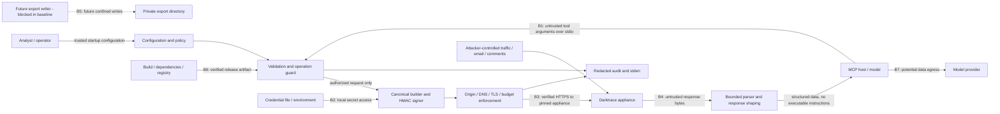

# Phase 2 initial threat model

Status: **design baseline; implementation IN PROGRESS, not security validated**. Snapshot: 2026-10-05. No live lab was contacted. Scope is the first stdio server, read-only by default, with write and export capabilities disabled. HTTP hosting is a separate future security gate.

## Evidence and assumptions

Repository inputs: [OpenAPI 6.1](../../openapi/darktrace-threat-visualizer.yaml), [API contract](../api-contract.md), [operation inventory](../operation-inventory.json), and the concurrently evolving [architecture](../architecture.md). These are design inputs, not proof of server behavior. The intended lab is Darktrace **7.1**; compatibility with the documented **6.1** API remains unvalidated. All 79 operations declare 200/400/401/403; undocumented errors still require safe handling. No external protocol or package-version claims are independently validated here.

Baseline decisions A1–A8 are closed in [design-decisions](design-decisions.md#baseline-decisions). They are design commitments, not accepted risks or test results. The unchanged [review](design-review.md) remains historical evidence; final A8 ceilings are stricter than its proposal.

| ID | Fixed baseline | External gate |
|---|---|---|
| A1 | Single HTTPS origin/credential pair/process; stdio only; HTTP config rejected. | Separate HTTP review; no listener now. |
| A2 | Inventory-backed 79-operation policy; read 57, medium 9, high 7, critical 6; dispatch and execution checks. | Reviewed inventory changes; method never grants access. |
| A3 | Explicit startup encoded/unencoded signing, default unencoded per SDK, lab-unverified; no fallback; S4/S5/S6 blocked. | Authorized lab evidence plus reviewed future shape changes. |
| A4 | Export profile rejected; future writer requires handle-relative no-follow exclusive creation and fixed quotas. | ST-09/10/11 and separate activation review. |
| A5 | Critical permanently preview-only in baseline; email critical entirely blocked; no confirm input or execution path. | Trusted host approval is a separate future design, never a baseline flag. |
| A6 | Exact unsigned four-field preview before build/sign; mandatory TLS with env/flag bypass refusal. | Invariants cannot be relaxed. |
| A7 | Email profile and all 14 email operations rejected regardless of schema code presence. | Reviewed committed pinned schemas, S9 resolution and new review. |
| A8 | 30 s total, 64 KiB input/depth8/elements5000, 2 MiB wire AND decoded, 60k output chars, concurrent4/queue16/pages10/rate120, two safe-GET retries; excessive/invalid Retry-After denies retry, own backoff at most 2 s. | Settings only lower ceilings; no increases without new review. |

## Assets and actors

Assets: private signing key, public token and reusable signatures; appliance identity and trust anchors; device/user identifiers, network topology, detections, comments and searches; raw PCAP and email; integrity of RESPOND, monitoring exclusions, tags and threat intelligence; local filesystem and audit records; host/model context; appliance and MCP availability; release artifacts and dependency integrity.

Actors: an authorized analyst; an operator controlling deployment and policy; the MCP host and model (may generate unsafe arguments); attackers supplying observed DNS names, network payloads, email, comments or threat-intelligence content; a malicious caller with access to the stdio pipe; a network/DNS adversary; a compromised appliance; and a compromised dependency, build runner or publisher. The operator and host OS are trusted for credential provisioning and process isolation. Trusted operator `NODE_OPTIONS` can preload arbitrary code and bypass process controls; known TLS/proxy bypass flags must still be refused. A compromised same-user host can read process memory or alter configuration; this cannot be solved inside the MCP adapter.

## Data flow and trust boundaries

B1 is an authorization boundary even on stdio: possession of the pipe is the caller identity; there is no independent end-user identity unless the host supplies one through a trusted mechanism. B2 separates secrets from model-visible results. B3 must bind both the logical origin and actual connection destination. B4 remains untrusted even when TLS authenticates the appliance. B5 protects files and data recipients. B6 is code execution trust; B7 covers disclosure to a host/model provider outside the organization. Audit records are locally accountable records, not proof of human identity or tamper-proof evidence.

## Mandatory control details

### Request construction and HMAC

The local spec defines hex HMAC-SHA1 with the private token as key and `<path+query>\n<public_token>\n<date>` as message; POST form/JSON is incorporated into that first component as documented. Retain SHA-1 only for wire compatibility with this protocol, not as a general-purpose security choice. Host and method are absent from the documented signed message, making fixed-origin TLS and fixed operation/method routing essential.

Use a single immutable request description and serialize JSON/form once; transport must send the exact reviewed bytes. Keep ordered query pairs, repeated keys and encoding explicit. Do not double decode, sort implicitly, normalize paths after signing, or let a fetch helper reserialize bodies. Reject CR/LF in header inputs. Test spaces, Unicode, quotes, plus signs, percent escapes, empty values, repeated keys, JSON ordering, DELETE queries and Advanced Search base64 `+/=`. The global encoded-query rule conflicts with `/devicesearch`'s unencoded-signing note; startup `auth.querySignatureEncoding` explicitly chooses encoded/unencoded, default unencoded per local SDK evidence and lab-unverified. S4 query+JSON, S5 DELETE+query and S6 GET/base64 shapes are blocked before build/sign/network. Email S9 is also blocked; no mode or version enables these shapes. Do not try alternate signatures automatically on 401, especially on writes. Dates use a controlled clock; never adjust the machine clock or replay based on an untrusted response header. The documented ±30-minute server tolerance is a replay exposure, not verified 7.1 behavior. Dry-run stops before signing and network access, returning exactly `{dryRun:true, operationId, method, parameterNames}`, without parameter values, URLs, path templates or signatures. Medium/high writes default to dry-run and critical never advances beyond preview.

The agreed client accepts `request({operationId, pathParams, query, body, contentType, signal})` against trusted static operation descriptors; `query` is ordered entries. The descriptor fixes method, path template and policy classification. The signer is internal. Injectable resolver and connector are test-only constructor dependencies, never tool arguments or production bypass fields. Use dedicated `node:https`, not global fetch/agent; explicitly set `rejectUnauthorized:true` and preserve SNI/hostname checks against the configured origin while connecting only to the pinned address.

### Private-network-compatible SSRF and redirects

Allow the operator to configure exactly one HTTPS origin (scheme, normalized hostname or literal IP, explicit port) and optionally an array of canonical IPv4/IPv6 appliance addresses with exact-IP matching. CIDRs are unsupported and rejected at config load. If no explicit destination allowlist is configured, resolve the configured appliance lazily before the first eligible signer/socket operation and pin the validated address snapshot for the process lifetime; this initial stdio mode trusts bootstrap DNS and retains that residual risk. Private RFC1918 and IPv6 ULA destinations are valid when authorized: a blanket private-IP ban would break this deployment. Do not use an entire internal network as the default allowlist. Reject userinfo, query/fragment in base URLs, unexpected base paths, unsupported schemes, alternate numeric IP forms and caller-supplied absolute or scheme-relative URLs. Route only through fixed operation templates; encode each path parameter as a segment and reject traversal/double-decoding escapes.

Lazy initialization resolves all A/AAAA results and normalizes IPv4-mapped IPv6; concurrent first calls share one initialization. Only a fully validated snapshot is frozen as success. DNS/allowlist initialization failure **or caller abort while shared initialization is pending** is cached as terminal until process restart: initial, concurrent and subsequent eligible calls deny before signer/socket, with no partial/unvalidated snapshot, no credential-bearing request and no further resolver calls. Aborting the first caller cancels the shared resolver and denies concurrent waiters; later calls remain denied even if DNS would now succeed. Automatic GET retry never retries initialization failure; only restart (a new isolated test instance) permits another validated initialization attempt. With an explicit allowlist, reject if any result lies outside it; otherwise validate every result against the forbidden-address rules and freeze the initial snapshot. Bind each actual connection/reconnection to a validated address (avoid a second unchecked DNS lookup), retaining hostname verification and SNI for TLS. DNS rebinding cannot expand the destination set after successful lazy initialization; a new process without an explicit allowlist trusts DNS again when first resolving. Deny metadata/link-local, multicast and unspecified addresses; deny loopback in production. Also deny the entire `::/96` IPv4-compatible, `::ffff:0:0/96` IPv4-translated, `64:ff9b::/96` NAT64 WKP, `64:ff9b:1::/48` NAT64 local-use NSP, `2002::/16` 6to4 and `2001::/32` Teredo prefixes regardless of allowlist; normalize IPv4-mapped addresses and apply IPv4 policy. Arbitrary NAT64 prefixes are not inferred; use an exact-IP allowlist for additional control. Private RFC1918 and ULA destinations otherwise remain allowed. A loopback TLS mock belongs only in an isolated test configuration, never a model-controlled bypass. Private CA bundles are supported; hostname and certificate verification stay enabled. Refuse startup with `NODE_TLS_REJECT_UNAUTHORIZED=0`, any set `NODE_USE_ENV_PROXY`, `--use-env-proxy`, insecure TLS flags and ambient HTTP_PROXY/HTTPS_PROXY/ALL_PROXY/NO_PROXY and http_proxy/https_proxy/all_proxy/no_proxy (even if empty); inspect known bypass flags in trusted NODE_OPTIONS too. Private CA trust uses NODE_EXTRA_CA_CERTS only. Corporate deployments must unset offending proxy variables only in the MCP server process launch environment, not globally. Startup errors name only the offending variable, never its value, proxy URL or credentials. A future explicit proxy needs its own reviewed trust and destination policy.

Reject **all** redirects, including same-origin 301/302/303/307/308, with zero follow-up requests. Do not forward signatures to a redirect target. Treat response download links, decoded email links and pagination URLs as data: never fetch them directly; validate opaque cursors and rebuild known operations on the configured origin.

### Permissions, disclosure and resource limits

Enforce profiles both when registering tools and at dispatch/operation execution, always before signer/network. Unknown, alias-substituted or blocked operations cannot reach the signer. Read-only appliance credentials add defense in depth. Medium/high writes require operator write opt-in, default `dryRun:true`, and execute only on explicit `dryRun:false` plus all gates. writeCritical=true without write=true is a startup error. ST-07/12/13 approval is a procedural release gate, not checked at runtime; an operator can activate eligible writes before validation. All six critical operations are permanently non-executable in this baseline; five non-email operations may preview with write+writeCritical, while the sixth is blocked email. No confirm field or trusted-approval execution path exists here. Version/status data only narrows compatibility; never relax signing mode, policy tier, profiles or limits, rewrite to broader requests, or enable blocked shapes. Production has no assumeVersion.

For executing writes, `Audit.record(): Promise<void>` is awaited and rejects on unavailable sink. Required pre-write audit failure blocks before build/sign; post-write audit failure reports `completed` if effect is known or `unknown` otherwise, with correlation ID and no retry. Preview/denial audit is optional, best-effort: if emitted, outcome is preview for accepted previews or error for denials, never ok/start; denied is not an enum member. Optional audit failure cannot block an unsigned preview or enable a denied operation; mandatory awaited fail-closed executing-write pre-audit is unchanged. Use only fixed metadata, with code-owned operationId or a fixed unknown-operation marker, never raw caller input. The stored AuditRecord allowlist is exactly audit:true, generated ts, mandatory requestId, operationId and outcome (start/ok/error/preview/unknown). The asynchronous command API is record(operationId,outcome,requestId?):Promise<void>; omitted requestId must be generated, and execution supplies one shared ID to pre/post calls. No tier/event/target metadata or request/response values are stored, even at debug; completeness is a required control, not proven source behavior.

Generic HTTP tools and caller-controlled headers are out of scope. PCAP creation is a write; PCAP/email download is blocked with export/email profiles rejected at load. POST Advanced Search requires explicit operator `profiles.sensitiveRead` (default false), field minimization and provider eligibility notice. All GET/base64 search/analyze/graph forms stay blocked under S6.

Response shaping uses code-owned, schema-backed views (AD-03); response properties cannot extend the projection. Unknown properties are omitted and unknown/unmodeled shapes become a fixed summary. Advanced Search `@message` is excluded, and `@fields` carries only a fixed summary rather than its dynamic protocol values. This field minimization is separate from token redaction. Redaction (AD-01) removes configured token literals plus a bounded one-step UTF-8 set: JSON-escaped, standard/base64url padded or unpadded, percent-encoded URI variants with hex-case variants, and hexadecimal for tokens at least four bytes long. It makes no guarantee for arbitrary transforms, recursive or double encoding, or prefixed/wrapped encodings; ST-02 sink and ST-09 minimization tests define the exercised cases.

Return bounded structured data; never promote retrieved text into instructions, tool definitions or authorization. Do not execute HTML, Markdown links, shell text or email attachments. The host remains responsible for resisting semantic prompt injection; labels alone cannot guarantee it. Strong server authorization limits its consequences.

Future export (not selectable now) must use an operator-owned 0700 directory and handle-relative file creation with O_EXCL|O_NOFOLLOW and 0600 permissions. Never trust filenames/paths from the model or appliance, never rely solely on resolve/containment checks. Descriptor-owned binary limits: 200,000,000 bytes/file, 1 GiB aggregate, 100 files, 1 concurrent export, including reservations/partial/pre-existing retained files. Ordinary callers cannot select that higher budget. Delete failed/cancelled partial files; report cleanup failure. Retention of completed files and deletion belong to the operator, no automatic deletion or upload. Unsupported secure directory-handle semantics keep export disabled (ST-10).

Hard baseline limits are [architecture §5.3](../architecture.md#53-dedicated-https-connector-and-budgets): **30,000 ms total** including queue, all pages, attempts/backoff; attempt at most remaining time; input **65,536 bytes**, depth **8**, **5,000 elements**; **2,097,152 wire bytes AND decoded bytes** cumulative per call; **60,000 output characters**; **4 concurrent requests**, **16 queued**, at most **10 pages**, **120 attempts/minute**. Send Accept-Encoding: identity; reject compressed responses. No unbounded pagination or query window: require finite operation-specific schema bounds or reject unsafe forms. Before release, coverage must identify every accepted/blocked parameter, location, units, finite bound, default/omission behavior, provenance and enforcement status; implementation/coverage evidence is pending, and unknown-unit/unbounded unsafe forms need explicit blocked entries. Lower-only configuration; cancellation/EOF propagates and stops queues/streams.

Only descriptor-allowlisted safe GETs may retry, at most **2 retries / 3 attempts**, with every attempt charged to rate/deadline/response budgets. If a supplied Retry-After seconds/date delay is invalid, above **2,000 ms** (or a lower configured maximum) or above the remaining deadline, **do not retry**; never shorten it to retry early. An acceptable server delay is respected in full. Missing header permits own backoff/jitter at most 2,000 ms within the deadline. Retry-After:60 causes zero further attempts; return sanitized rate_limited without the raw header. No retries for POST/DELETE (including read-via-POST), authentication/TLS/size/policy failures or terminal DNS initialization failure. Ambiguous writes return unknown outcome without replay. Multiple processes still require operator aggregate controls.

Both DARKTRACE_PUBLIC_TOKEN_FILE and DARKTRACE_PRIVATE_TOKEN_FILE must be supported with identical rules: O_NOFOLLOW plus O_NONBLOCK open, handle-verified regular type, maximum 4,096 bytes including bounded read during growth, current UID ownership, mode 0600 or stricter, and sanitized errors; reject unavailable secure-open semantics. Never accept tokens in argv. Docker uses a read-only mounted file with matching runtime UID, not a private token in environment or env-file.

All operator JSON configuration files, including nonsecret policy-only DARKTRACE_CONFIG_FILE inputs, use the same secure-open integrity checks: O_NOFOLLOW plus O_NONBLOCK, open-handle regular type/current UID/0600-or-stricter validation, no group/world/execute/special bits, and an operator-trusted parent directory. Bound JSON reads under growth to **65,536 bytes (64 KiB)** before parsing, versus **4,096 bytes (4 KiB)** for token files. Reject invalid files or unsupported semantics at startup before signer/DNS/network; never omit either flag. Inline auth.publicToken/auth.privateToken is accepted only from protected JSON; strict direct-token/environment versus token-file mutual exclusivity is unchanged. Startup, --check-config and doctor share this policy, and raw config/token values never appear in logs or diagnostics. These controls protect policy integrity as well as token confidentiality; nonsecret policy files have no exemption.

### Lifecycle and pre-parse boundary

Local config/origin syntax, credentials and forbidden environment/flags are startup checks. There is no automatic status probe: unknown version is conservative, and an explicit status tool error remains an ordinary sanitized tool error. Lazy DNS validation precedes signing/socket creation; TLS authentication of the pinned origin precedes signed HTTP bytes. Network failure denies the call without fallback or policy enablement, while the stdio server may remain available. Do not conflate availability of tools/list with successful appliance validation. Offline --check-config and doctor run the same local config/token/environment validation and secure-file rules as startup, with zero DNS, network/socket or signer calls; they exit without a protocol session and emit only fixed sanitized status/errors (variable names allowed, never values, paths, raw config or exception details). Success is local validation only. Terminal DNS initialization failure remains cached until restart and denies subsequent eligible calls without another lookup.

Raw stdin first enters boundedInput from src/server/input.ts, which limits newline-delimited frames before its own JSON.parse and SDK parsing; StdioServerTransport receives that stream with maxBufferSize at most 65,536 and is injected into serveStdio. Lower configured limits must apply there too. Oversized complete/partial frames terminate the session with sanitized stderr only, never echoed partial content. Depth/element checks precede dispatch. Inspection establishes the wrapper's presence; ST-11/14 evidence for complete behavior is pending.

### Model-provider egress

**Operator notice:** every returned appliance result may enter host/model context and be sent to an external model provider. Before deployment, assess organizational eligibility, data-processing terms, retention and residency for that provider. Default output minimizes fields, binary/email stays blocked and Advanced Search needs separate sensitiveRead opt-in. This notice must be reproduced in release README/operator guidance; the flag is not proof of approval or data-protection compliance. No provider eligibility decision or residual risk acceptance is recorded here. Test disclosure/minimization/opt-in via ST-09; actual provider and host behavior requires external validation.

## STRIDE threat register

Severity is inherent impact for this deployment: Critical permits disruptive appliance action or broad credential compromise; High permits sensitive disclosure or boundary escape; Medium affects scoped integrity, attribution or availability. Residual risks assume the proposed controls are implemented and pass their tests; no risk is marked accepted. S = spoofing, T = tampering, R = repudiation, I = information disclosure, D = denial of service, E = elevation of privilege.

| ID | STRIDE / severity | Threat and boundary | Required control | Residual risk / decision | Observable tests |
|---|---|---|---|---|---|
| TM-01 | S,T / High | Ambiguous canonicalization signs a different request or fails authentication (B3). | Immutable builder; reviewed HMAC vectors; fixed methods; unresolved forms gated; no signature fallback. | Offline vectors cannot prove 7.1 acceptance; A3. | ST-01 |
| TM-02 | I,S / Critical | Tokens, signatures or canonical text leak through dry-run, logs, exceptions or package content (B2/B6). | Secure O_NOFOLLOW plus O_NONBLOCK, open-handle current-UID 0600-or-stricter regular files: tokens 4 KiB, all operator JSON 64 KiB before parse with bounded growth reads; protected inline auth only; no argv; no signing in previews; allowlisted output and recursive redaction at all sinks; package allowlist. | OS owner, debugger and host environment can access secrets. | ST-02, ST-15 |
| TM-03 | S,T / High | MITM, tampered JSON security policy, or captured signed request reused within the date window (B3/R4-01). | All JSON policy files require the secure-file checks above, including nonsecret files; invalid or unsupported files deny startup before signer/DNS/network (ST-02). Verified TLS/private CA; no downgrade; fresh dates; no auth retries; least-privilege tokens; critical execution excluded and eligible mutation policy enforced. | Client cannot add server-side nonce protection to this protocol; remote replay window remains. | ST-02, ST-03, ST-08 |
| TM-04 | S,I,E / Critical | SSRF reaches metadata or another private service via input, DNS or proxy (B1/B3). | Exact origin plus lazily pinned initial DNS snapshot and optional canonical-IP-only allowlist (no CIDR); socket-bound validation; fixed templates; no ambient proxy. | Bootstrap DNS is trusted when no explicit IP allowlist is set; verified TLS mitigates impersonation but does not prove the intended IP. Compromised operator policy or appliance remains trusted. | ST-04 |
| TM-05 | I,S / High | Redirect/download URL sends credentials or fetches attacker content (B3/B4). | Reject every redirect; never auto-fetch returned links; rebuild pagination locally. | Approved appliance sees authenticated requests. | ST-05 |
| TM-06 | T,E,I / Critical | Indirect prompt injection in telemetry/email tricks host into actions or exfiltration (B4/B1). | Treat all retrieved text as data; no execution/auto-fetch; independent mutation authorization; export denied in baseline. | Host can still misinterpret data or misuse other installed tools. | ST-06, ST-08, ST-09 |
| TM-07 | E,T / Critical | Hidden-tool invocation, operation aliases or method heuristics bypass read-only (B1). | Deny by operation at runtime; inventory-backed policy; least-privilege appliance token; unknown/email/export operations fail closed; version quirks only restrict, never relax policy/signing/limits; no production assumeVersion. | Operator can deliberately enable broad privileges; upstream ACLs unvalidated. | ST-07 |
| TM-08 | E,R,T / Critical | Model sets `confirm:true`, reuses approval or changes a target for RESPOND/configuration changes (B1). | All six critical operations non-executable permanently in baseline; five non-email previews gated by write+writeCritical, email denied; no confirm input; zero signer/network. | Future trusted host approval needs a separate design; A5 does not enable it. | ST-08 |
| TM-09 | I / High | Read/export reveals raw PCAP, email or bulk search to an unauthorized recipient (B4/B5). | Export/email configuration rejected and runtime denied; sensitiveRead default false; minimized field views and bounds; no raw binary in model output or external uploads; email blocked. | Authorized host stores/transmits returned data under its own policy; A4/A7. | ST-09 |
| TM-10 | T,E,I / High | Export filename, traversal or symlink overwrites/reads unrelated local files (B5). | Export denied in baseline; future gate requires generated names, exclusive owner-only creation, confined directory handles, no-follow, quotas and partial cleanup. | Same-user attacker controlling the directory/OS is outside process isolation. | ST-10 |
| TM-11 | D / High | Huge input, compressed response, pagination or slow stream exhausts memory/disk/appliance (B1/B3/B5). | Pre-parse limits, streaming/decompression caps, deadlines, bounded concurrency/queue/pages and disk budget; cancellation. | Multiple processes can exceed a per-process rate limit; deploy aggregate controls. | ST-11 |
| TM-12 | D,T / High | Retry storm or ambiguous write timeout duplicates expensive/disruptive actions (B3). | Safe GET allowlist; three-attempt cap; total deadline; excessive/invalid Retry-After means no retry, never earlier retry; no mutation retries; unknown-outcome audit. | Host can submit duplicate calls; upstream idempotency unverified. | ST-12 |
| TM-13 | R,I,T / Medium | Missing/spoofed audit records hide changes; raw errors expose data (B1/B4). | Redacted structured records before/after writes and exports; await rejecting async pre-action audit and deny on failure; report completed/unknown on post-audit failure without retry; sanitize control characters; correlation IDs and unknown outcomes. | Local stderr is not immutable and cannot identify a human independently. | ST-13 |
| TM-14 | T,I,D / High | Malformed upstream output, permissive schemas or stdout contamination corrupts protocol (B4/B1). | Bounded schemas and shaping; errors as data; stdout protocol only; stderr redacted; unvalidated email disabled. | Schema compatibility remains pending; false rejection possible. | ST-14 |
| TM-15 | T,E,I / Critical | Dependency, package, image or CI compromise executes with appliance credentials (B6). | Exact pins and distributed npm-shrinkwrap actual-tree integrity checks; private repo/no npm publication; image-digest pins; reviewed updates; minimized scripts; artifact allowlist/scans; provenance/SBOM; isolated least-privilege release jobs. | Pins/scans do not prove benign code or prevent all publisher compromise. | ST-15 |
| TM-16 | S,E,I / Critical | Future HTTP listener exposes tools without identity/origin controls (new boundary). | No HTTP fields/handler/listener in baseline; unsupported config fails; require a separate authenticated HTTP threat review before enabling. | HTTP authorization/session risks are not solved by this model. | ST-16 |
| TM-17 | I / High | Appliance results leave organizational boundaries through host/model-provider context (B7). | Deployment eligibility assessment and operator/README notice; minimized output; sensitiveRead false by default; binary/email blocked. | Provider retention/residency and host forwarding require operator verification; no eligibility or residual risk accepted here. | ST-09 |

## Acceptance and follow-up

The [security test plan](security-test-plan.md) supplies measurable oracles for every threat. Implementation owners must attach evidence before calling any control effective. A1–A8 design choices are fixed, but offline evidence and external lab/provider/artifact gates remain pending. Critical execution is not an activation target in this baseline; future email/export require separate reviewed changes, not a flag or source-presence check. Operator acceptance of residual risk must be explicit and dated; none is recorded here. Revisit this model when the architecture stabilizes, operation inventory changes, HTTP or multiple instances are introduced, or authorized 7.1 lab results become available.
